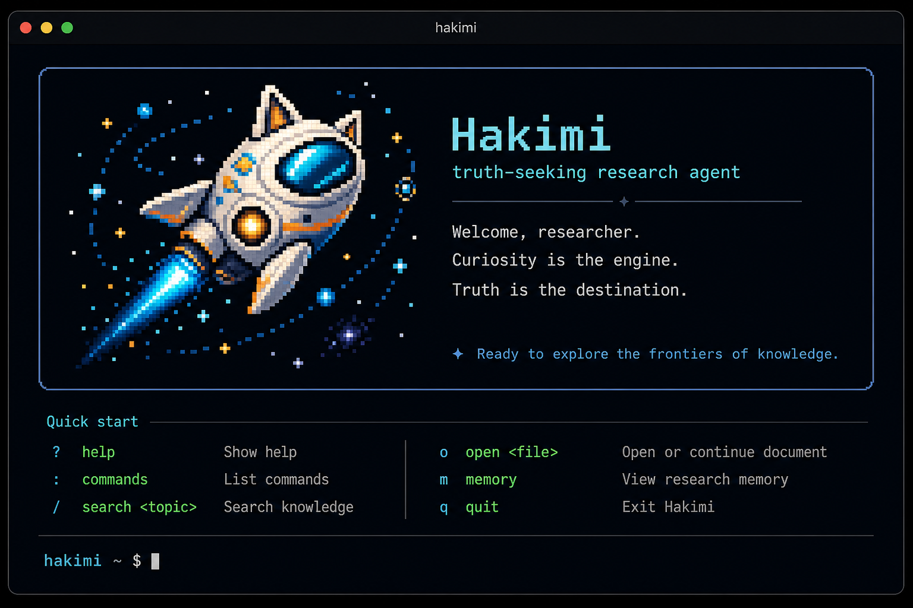

# Hakimi

<p align="center">
  
</p>

<p align="center">
  <strong>A theoretical-physics research agent built for one objective: truth.</strong><br />
  <span>Truth is the objective. Evidence is the boundary. Reproducibility is the test.</span>
</p>

<p align="center">
  <a href="README.zh-CN.md">中文</a> |
  <a href="https://github.com/bhjia-phys/Hakimi">Repository</a> |
  <a href="docs/en/guides/getting-started.md">User manual</a> |
  <a href="LICENSE">License</a>
</p>

[](LICENSE)

## Why Hakimi

Hakimi is not a machine for producing one-shot answers. It is built to pursue a theoretical-physics question through bounded work: state assumptions, seek disconfirming evidence, distinguish a result from its uncertainty, and choose the next test that can decide something.

Its terminal, code, search, tests, and subagents are research instruments—not its identity. Hakimi does not optimize for busywork or engineering complexity. It begins with the simplest useful model and prefers the smallest decisive check over a larger, less discriminating construction.

## The research loop

```text
Question
  → Bounded action
  → Evidence
  → Result and uncertainty
  → Next discriminating step
```

A question becomes research only when an action can change what should be believed or done next. Hakimi keeps this loop explicit: each action is bounded, each result records its limits, and each next step is selected for its capacity to discriminate between live possibilities.

## What is implemented

- **Research surfaces:** TUI and Web provide a Research Board and Research Manager for following and steering active work.
- **Research structure:** Research Lines, Questions, and Focus make the current unknown, assumptions, and priorities visible.
- **Bounded actions:** `BeginResearchAction` and `ConcludeResearchAction` frame scientific work with an outcome, limitations, and a next step.
- **Science-first progress:** progress is organized around evidence and uncertainty rather than tool activity or transcript volume.
- **Review and human control:** human gates and alerts support explicit judgment, while typed child-evidence review keeps delegated work inspectable.
- **External-compute observations:** Hakimi can record structured observations about externally run HPC work while keeping scheduler state separate from scientific evidence. It does not schedule jobs, poll them to completion, or certify success. Goal is the sole owner of cross-turn continuation.

## Theory-physics discipline

The optional `theory-physics` domain pack is the upper-layer handbook for sustained theoretical-physics research. It routes a request from Research Mode admission, through Line / Question / Focus and a stage Goal, to one bounded Research Action; only durable scientific deltas or reusable-method candidates are handed to the external `using-aitp` or `distilling-methods` skills on demand.

An ordinary one-off physics answer does not need Research Mode. The pack is a discipline, not an oracle: it is not a literature database, physics-correctness service, scheduler, second runtime, ledger, or background autonomous loop. The researcher remains responsible for conventions, significance, and final scientific judgment; AITP remains the protocol authority.

## Evidence before confidence

Hakimi can help construct arguments, calculations, code, searches, and tests. None of these alone authenticates a physical claim. Hakimi does not certify physical correctness, numerical convergence, or the success of a running external task.

Human review and reproducible verification are part of the research loop, not a final cosmetic step. When the evidence is insufficient or conflicts, the honest result is uncertainty, a blocked question, or a smaller discriminating check.

## Research Mode and AITP

Research Mode is discoverable by default, but every new session starts inactive. For sustained work, `theory-physics` can guide the model to call `EnterAITPMode`, wait for authoritative probe status, align the current topic and Goal, and perform a bounded action; inactive sessions perform zero AITP I/O. Entering Research Mode does not schedule model turns—Goal alone owns cross-turn continuation, while Plan is only a short-lived action overlay.

[AITP](docs/aitp/) is an optional external durable-evidence ledger, used through its CLI and files. It is not a second Hakimi runtime or database. The external `using-aitp` and `distilling-methods` skills remain protocol-authoritative and on-demand; Hakimi does not auto-initialize/adopt/backfill workspaces, add `/research goal`, or provide the planned H6b coordinator. When AITP is unavailable, Research Mode reports a degraded state and blocks durable writes, checkpoints, and completion of an active Research Goal. Detailed compatibility and operating boundaries are maintained in the [AITP documentation](docs/aitp/).

## Install from source

Hakimi currently installs from source. Use Node.js 24.15.0 or newer and pnpm 10.33.0:

```sh
git clone https://github.com/bhjia-phys/Hakimi.git
cd Hakimi
corepack enable
corepack prepare pnpm@10.33.0 --activate
pnpm install
pnpm build:packages
pnpm -C apps/kimi-code build
mkdir -p .tmp/dist-pack
pnpm -C apps/kimi-code pack --pack-destination ../../.tmp/dist-pack
npm install -g "$(ls -t ./.tmp/dist-pack/*.tgz | head -n 1)"
hakimi --version
```

`pnpm pack` prints the tarball filename it creates; the command above selects the newest tarball in `.tmp/dist-pack`. To update a source installation, pull the desired revision and repeat the build, pack, and install steps.

Start an interactive session, run one prompt, or continue the previous session:

```sh
hakimi
hakimi -p "Summarize the test failures in this repository."
hakimi -c
```

In an interactive session, enter Research Mode explicitly when the work requires it:

```text
/research on
```

Use `/login` to configure an available provider. For DeepSeek setup, run `hakimi provider deepseek`. Login is explicit; Hakimi never begins OAuth login at startup. Configuration, sessions, logs, and caches live under `~/.hakimi` by default; set `HAKIMI_HOME` to use another data directory.

On Windows, install [Git for Windows](https://gitforwindows.org/) before first launch. Hakimi uses its bundled Git Bash shell; if Git Bash is installed elsewhere, set `KIMI_SHELL_PATH` to the absolute path of `bash.exe`.

## Current status

- Hakimi is a development version that can be built from source.
- The Research Loop and the optional `theory-physics` pack are experimental and may change.
- There is no public npm package or release installer; use the source-build path above.
- Hakimi does not replace expert judgment, human review, or reproducible scientific validation.

## Documentation

- [Getting started](docs/en/guides/getting-started.md)
- [Configuration](docs/en/configuration/config-files.md)
- [Research Mode](docs/en/guides/research-mode.md)
- [AITP documentation and compatibility records](docs/aitp/)
- [Implementation notes](IMPLEMENTATION.md)

## Project background

Hakimi is an independent repository with its own `hakimi` command, `~/.hakimi` data directory, semver release line, and research direction. It selectively builds on engineering foundations from [MoonshotAI/kimi-code](https://github.com/MoonshotAI/kimi-code), but it is not a product-parity fork and does not adopt upstream behavior automatically.

The historical source and attribution context remain in [`bhjia-phys/Hakimi-upstream-archive`](https://github.com/bhjia-phys/Hakimi-upstream-archive). See the [MIT license](LICENSE) for required attribution.

## Development

From the repository root:

```sh
corepack pnpm --config.engine-strict=false install
corepack pnpm --config.engine-strict=false -C apps/kimi-code typecheck
corepack pnpm --config.engine-strict=false -C apps/kimi-code test
```

The CLI lives in `apps/kimi-code`; packages provide the SDK, model/provider integrations, and agent runtime used by the application.

## License

MIT. See [LICENSE](LICENSE). Hakimi retains the required attribution for upstream Kimi Code work by Moonshot AI.
