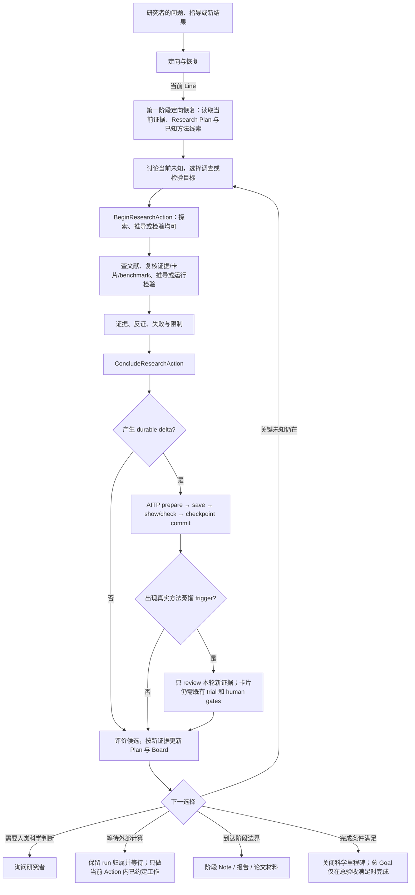
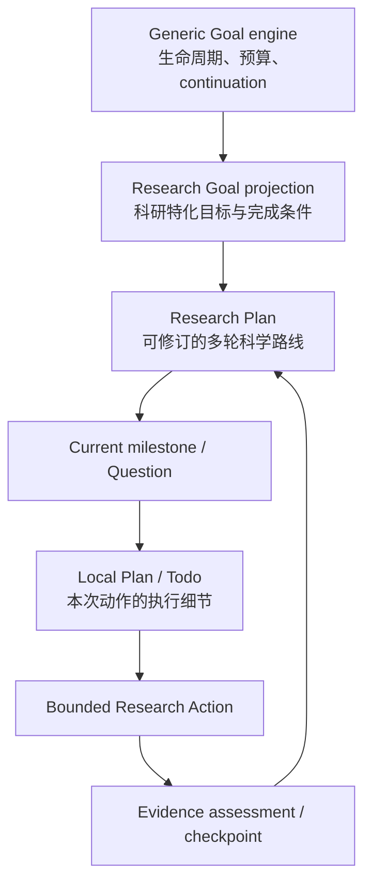
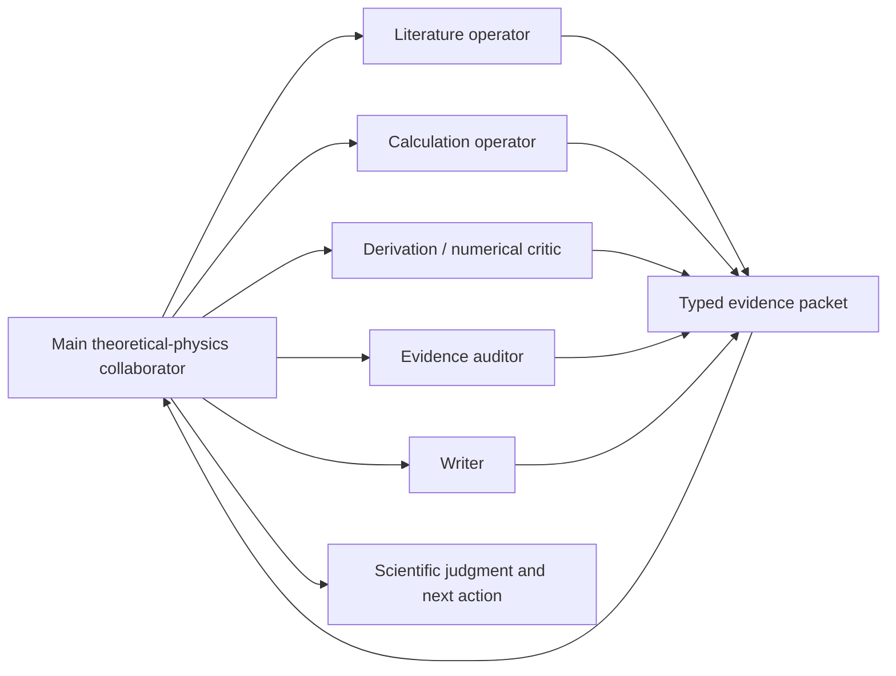
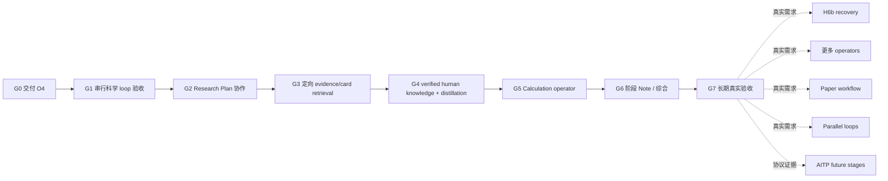

# Hakimi × AITP 理论物理合作者总体规划

> 状态：面向未来的产品总纲与分阶段实施计划，2026-09-05。
>
> 本文不是运行时、wire schema、AITP canonical Entry/Note，也不宣称下列未来能力已经实现。已关闭的 S0–S10 基础程序仍以 [`unified-research-mode-program.md`](unified-research-mode-program.md) 为准；详细机制与历史决策见 [`theory-research-agent-design.md`](theory-research-agent-design.md)。本文只回答三个问题：最终要得到怎样的理论物理合作者、现状离它还差什么、接下来怎样在一个有限总 Goal 内以有独立验收条件的里程碑实现。
>
> 本规划由一个有终点的总 Goal 驱动，G0–G7 是其内部串行里程碑，不是八个彼此割裂的 Goal。每个里程碑仍必须单独验收、记录证据并允许按真实结果微调下一阶段；C1–C5 逐项做 trigger review，trigger 不成立就以可审计 no-op 关闭并保持 `planned / unavailable`。总 Goal 只有在最终真实课题验收通过且没有未处置的高严重度 harness 缺陷时才完成，因此它是有限交付 Goal，不是“完成全部未来愿景”的无限 Goal。

## 1. 最终效果

目标不是让研究者操作一台科研状态机，而是让 Hakimi 表现为一位可靠的理论物理合作者：

- 能与研究者把模糊问题收敛为可证伪的当前问题和候选解释；
- 会先查当前课题的 AITP 证据、相关方法卡和必要文献，再选择最小判别性检验；
- 能维护一份随证据演化的 Research Plan，而不是机械执行一次性 roadmap；
- 每次工具工作都有明确目的、预期证据和停止条件；一个科学 loop 可以串行包含探索、推导和检验等多个 bounded Research Actions；
- 可以自己工作，也可以按需调用 literature、calculation、derivation、numerical critic、evidence auditor 或 writer operator；
- 会区分人类提供的线索、工具观察、外部来源和经过验证的科学结论；
- 在有 durable delta 时自动走 AITP 的可靠持久化边界，在没有 delta 时零写入；
- 只在真实、非 trivial、可能复用的工程或方法经验出现时做一次条件性知识蒸馏 review；
- 在阶段边界整理 Working Note、阶段总结或论文草稿，而不是每轮强制写文档；
- 用简洁 Board 告诉研究者课题做到哪里、这一轮在判别什么、现在唯一需要注意什么、下一步是什么；
- 有 Goal 时可以在明确边界内持续推进，没有 Goal 时仍能自然进行交互式 Research Loop；
- 内部工程审计仍然严格，但 hash、receipt、revision、adapter contract 等细节默认留在 audit view，不占据物理研究叙事。

成功的衡量标准不是“调用了多少工具、跑了多少轮、写了多少 Entry”，而是：新证据是否改变了候选解释、下一检验、限制或停止判断，并且这个变化能被研究者理解、恢复和审计。

## 2. 一个完整的用户故事

研究者进入一个理论物理项目，输入 `/research`。Hakimi 恢复当前 Program、Line、Question、Research Goal、Research Plan 和最近可靠证据；健康的 adapter 与历史审计细节保持折叠。

研究者提出：“Si 的 QSGW head-wing 为什么在第一轮发散？”Hakimi 不立即把“跑一个计算”当成答案。它先做以下事情：

1. 读取当前 Line 的 AITP handoff、相关 Entries/Notes 和适用的方法卡；
2. 区分已验证事实、人类新提示、历史失败和仍待验证的推断；
3. 必要时与研究者讨论 convention，或者定向检索文献、推导和既有 benchmark；
4. 给出少量候选解释，例如 Fourier convention、错误的 WFC reader 路径或数值不稳定；
5. 更新可修订的 Research Plan，说明每个候选需要什么判别证据；
6. 选择成本最低、区分度最高的一项检验，建立 bounded Research Action；
7. 主 Agent 自己做物理分析；编译、输入、输出、运行 provenance 和常见故障由 calculation operator 参考经过验证的方法卡处理；
8. 主 Agent 评价结果，说明支持了什么、否定了什么、还不能声称什么；
9. 如果结果是 durable delta，自动经 AITP CLI 保存并核验，包括有价值的失败、反证和负结果；只有没有新增可保留证据或判断变化时，才只更新本地进度；
10. 如果出现可复用 procedure 或关键 failure+workaround，只把本轮新证据交给 `distilling-methods` 做一次条件性 review；
11. Board 更新为下一项物理问题，而不是显示一墙内部状态；
12. 若 Goal 仍未达到且没有需要人类判断的边界，Goal engine 安排下一轮；否则等待研究者、外部计算或明确结束。

若研究者开启 `dreaming` 并设置 Goal，Hakimi 可对低成本、可逆、scope 内的细节作出明确记录的假设，连续推进多个 Research turns。若只开启 Research Mode 而没有 Goal，完全相同的科研认知 loop 仍适用于自然对话，但不会自行排入下一轮模型调用。

## 3. 科研主循环

这是一组认知职责，不是一组要求研究者手动推动的 UI phase。科学 loop 围绕一个问题形成和评价候选；Action 是其中一次有界取证或执行；turn 是一次模型会话轮次。三者不一一对应：一个 loop 可含多个串行 Actions，一个 Action 可跨多个 turns，纯讨论可以没有工具 Action。不要用 Research turns 的计数冒充完成的实验或科学 loops。

探索本身是合法 Action：尚无猜想时，可以先声明“调查哪些解释与已知证据相容”，再查文献、读代码、推导或检验。Action 的结束可以得到更准确的问题、反例或未决边界，不要求预先承诺一个答案。纯对话和宿主当前状态恢复不必登记成实验；模型发起的新工具工作仍须有对应归属。



### 3.1 定向与候选解释

`问题 → 猜想` 往往是科研中最重的一段，不能缩成一次无证据的模型猜测。检索有两个按需时机：候选形成前恢复 current Line 的现状与已知方法线索；候选形成后按需要精确复核适用卡片、Skill、反例与 benchmark。已有可靠上下文足够时不重复查找；这不是每个 turn 两次强制扫描。它允许：

- 与研究者讨论问题、物理 convention、真正关心的 observable 和可接受的近似；
- 回读当前 Line 已提交的 AITP evidence、failure、decision、working Note 与 handoff；
- 只检索与当前缺口相关的方法卡，而不是扫描全库或建立 registry；
- 定向搜索原始论文、官方文档和可信 benchmark；
- 做推导、量纲分析、极限检查、对称性分析和数量级估计；
- 让多个 perspective operator 独立提出支持证据、反例或判别实验。

这一段的产物是少量候选解释、各自的可证伪预言、当前证据和关键未知。若候选之间还没有可区分的观测，下一步可执行任务就是澄清假设、寻找判据或证明当前信息不足；不能以“计划尚未完整”为由禁止必要探索。

### 3.2 最小判别性检验

每轮优先选择最能改变判断的最小动作，而不是最完整或最昂贵的动作。选择次序是：

1. 能否用已有证据、量纲、极限或小型解析推导判别；
2. 能否用已有输出做只读后处理；
3. 能否运行局部单元或最小输入；
4. 能否做一个短 diagnostic run；
5. 只有前面不足时才运行完整计算、参数扫描或远程作业。

Action 必须提前说明 purpose、expected evidence、stop condition 和所需 capability。`BeginResearchAction → 实际工作 → ConcludeResearchAction` 是正常路径；同一结论不再额外调用 `RecordResearchProgress` 重复记录。

### 3.3 评价与下一轮

Conclude 不等于“工具成功”。主 Agent 必须回答：

- 观测本身是什么，来源和验证层级是什么；
- 它支持、削弱或排除了哪个候选；
- 哪些替代解释仍成立；
- 误差、收敛、近似和物理有效性边界是什么；
- 是否改变 Research Plan、Question assessment 或停止判断；
- 下一步为什么比其他动作更有判别力。

运行失败也可能是有价值的科研证据，但 scheduler `COMPLETED`、程序退出 0、文件存在或哈希一致都不自动等价于科学成功。

## 4. Goal、Research Goal、Plan 与 Action



| 对象 | 回答的问题 | 拥有 | 明确不拥有 |
|---|---|---|---|
| Generic Goal | 何时继续、暂停或完成？ | objective、completion criterion、budget、pause/resume/cancel、跨 turn continuation | 科学证据、工具 capability、AITP Topic |
| Research Goal | 这个 Goal 在科研语境中具体要完成什么？ | 同一 `goalId` 的科研 scope、criterion、guards 和 Program relation 投影 | 第二套 Goal engine 或第二个 scheduler |
| Research Plan | 目前认为怎样才能达到 Goal？ | 可修订 milestones、候选路线、needed evidence、assumptions、decision/replan/stop conditions | 不可变 roadmap、Goal completion、AITP ledger |
| Plan Mode | 怎样与人共同形成或修订计划？ | 一次交互式规划界面；把讨论结果转成或更新 Research Plan | Research Loop、continuation 或科学权威 |
| Local Plan / Todo | 当前 Action 的细节顺序是什么？ | 临时步骤、工具顺序、局部验证 | 科研状态、durable evidence、Goal |
| Research Action | 这一轮要判别什么？ | purpose、expected evidence、stop condition、capability、conclusion boundary | 整个课题或无限执行权 |
| Question / Line | 当前未知属于哪条研究线？ | 科研组织、优先级、assessment 和 next action | AITP workstream identity 的自动推断 |

Research Plan 可以一开始是猜测性的。它随着文献、推导、运行和人类修正逐渐清晰；每次只在新证据改变路线时修订。Plan Mode 可以在 Research Mode 中用于深入共同规划，但退出 Plan Mode 后仍由同一个 Research Loop 执行，不产生另一条生命周期。

规划深度随问题复杂度增加。无 Goal 的自然探索用当前 Question 和 bounded Action 即可；有跨轮依赖、资源承诺或多阶段目标时才使用完整 Research Plan。Local Plan/Todo 按执行需要使用，不应为读几篇论文或一次小推导强制走多层计划审批。G2 首个修正已让 `planned` Action 可仅绑定 finalized、approved 的 local Action Plan，不强制创建 Goal/Research Plan；已有 draft/active Research Plan 时仍须同时绑定 active milestone。小型可逆 Action 使用 minimal binding，不必进入 Plan Mode。该开发切片尚未完成真实对话验收。

## 5. 三种正交控制：Research、dreaming 与 auto

### 5.1 Research Mode

`/research` 是进入或退出联合科研能力的直接 toggle。进入后，自然 user turn 与合法 Goal continuation 都使用 Research Loop；退出不删除 Goal 或 AITP 记录。

Research Mode 决定“是否按科研 loop、evidence 和 Action 归属工作”。它不自行创建 Goal，也不自动产生下一 model turn。

### 5.2 collaborative 与 dreaming

它们是 Research planning policy：

- `collaborative`：只在会改变 Goal、Research Plan、关键 convention、代价或结论的 consequential uncertainty 上询问研究者；普通可验证细节由 Agent 自己调查。
- `dreaming`：Goal、scope 和 completion criterion 明确后，对低成本、可逆、scope 内的未知作出显式假设并继续；这些假设写入 Research Plan，后续证据可推翻。

两种策略都必须停在以下边界：Goal/scope 的实质改变、影响结论的 convention 歧义、昂贵或不可逆操作、外部权限、AITP human decision、Method-card approval/publication 以及证据不足却要作正式结论。

### 5.3 auto permission

`auto` 只处理常规工具风险确认。它不授予 Research Action capability、不替代 Goal、不回答 human gate，也不改变科学权威。

因此 `Goal + dreaming + auto` 表示：Goal 负责连续推进，dreaming 减少非必要科研提问，auto 减少常规工具确认；三者组合仍受已约定的科学、资源和人类决策边界约束。

## 6. AITP 在循环中的精确位置

AITP 是 local-first、canonical、可审计的科研记忆，不是思考引擎、planner 或计算平台。

### 6.1 轮次开始与恢复

Research Mode 进入、active session 冷恢复或真正需要当前证据时：

1. 用 AITP public CLI 观测 Topic、handoff 与 health；
2. 只在 current Line 有 explicit confirmed workstream binding 时做 scoped 读取；
3. 检查将要依赖的具体证据，而不是相信旧 prompt、roadmap 或 Board 摘要；
4. 按当前问题定向查找相关 Working Note、theory Note 和 `> method-card:`；
5. 将 canonical evidence 与 Hakimi local working state 对齐。

正常回答前只做轻量 reconciliation。可以机械证明的 stale period、历史无写入 checkpoint、重复 cleared alert 或 Action/phase 漂移由系统修复；Goal↔Program、Line↔workstream、科学 convention 和人类 decision 不能自动猜测。

### 6.2 Action 结束与 durable boundary

- `no_durable_delta`：只更新 Hakimi working state 和 Board；不写 AITP、不扫描卡片、不阻塞 continuation。
- `durable_delta`：生成一个 checkpoint candidate，经现有 `record prepare → draft → record save → show/scoped check → CommitResearchCheckpoint` 保存。
- AITP save 必须使用当前 0.9.0 `--expected-topic` + `--exact-workstream` compare-and-save contract；Hakimi 不直接写 canonical `.aitp` 文件。
- 同一结论只有一个 progress/durability boundary；`state_updated` 不产生新的 Method-card trigger。
- 保存失败、receipt 不清楚或 revision/binding stale 时 fail closed，不把本地状态展示成 canonical fact。

### 6.3 人类提供的信息

人类的话可能是目标、约定、经验、推断或已经验证的事实，不能混成同一 authority：

1. 原始指导先保留 attribution 和上下文；
2. 若它会影响科学结论，设计最小验证或查找可追溯来源；
3. 将“人类断言”“工具/来源观察”“Agent 评价”分开；
4. 只有经过检验并产生 durable delta 时才成为相应 Entry/Note 候选；
5. 人类 decision 只能由明确的人类选择产生，模型不能把验证结果伪装成 `authority: human`。

### 6.4 Method card、Skill 和工具

三层职责保持固定：

```text
工具：执行真实命令、读取文件、跑计算或检索来源
方法卡：记录经过证据支持、可复用的 procedure、适用范围、检查和停止条件
Skill：在合适场景检索卡片、指导执行、review trigger，并处理人机决策顺序
```

Method card 继续使用现有 AITP theory Note 规则；不新增 card schema、registry、catalog、dispatcher、INDEX 或 vector DB。卡片只在当前 Line/workstream 和任务语义相关时定向检索。

正式 trigger、`basis_refs`、post-card exact `sha256:` trial、revision、两步 human decision 和 publication 完全由当前 `distilling-methods` Skill 决定。Hakimi 只负责在新 durable Entry 首次 commit 后进行一次 bounded handoff；不能自动 approval、publish、跨 Topic 传播或用卡片解决 failure。

当前 same-turn handoff 是 best-effort，不是 exactly-once。只有真实会话再次证明 crash/resume 会稳定漏掉高价值 review，才启动 native H6b 的独立设计 Goal。

## 7. 内置 operator，而不是新的执行平台

Operator 是 Research Mode 中按需使用的 bounded specialist preset。实现上可以使用子 Agent，但它不是持续运行的独立智能体，也没有自己的 Goal engine、ledger 或科学决策权。



所有 operator：

- 只接受当前 Action 的 bounded question、input cursor、allowed tools 和 stop condition；
- 返回 typed evidence packet，包含 observation、refs、limitations、contradictions 和 verification；
- 不直接修改 Question/Line/Goal，不直接写 AITP，不替研究者作决定；
- 结果由 main Agent 串行综合，跨 Line 结果先进入 review，不异步改变当前结论。

### 7.1 Calculation operator

Calculation operator 的目的正是把工程负担从主物理合作者的前景中移开。它使用现有 workspace、Bash、SSH、scheduler 或已有 Hakimi 工具，并参考经过验证的 AITP 方法卡；当前不建设独立 runner、daemon、scheduler lifecycle、artifact database 或新执行平台。

对 ABACUS/LibRPA，知识应按以下六层组织，但都仍是现有 theory Note/Method card：

1. 总览：方法解决的问题及适用/不适用体系；
2. 编译环境：源码、依赖、命令、环境和真实常见错误；
3. 输入与参数：体系、泛函、赝势、基组、k-point、cutoff 和收敛选择；
4. ABACUS–LibRPA 流程：输入输出、目录关系、顺序和中间结果；
5. 后处理：observable、单位、解析和物理检查；
6. 诊断：错误、未收敛、不兼容、体系越界和停止条件。

只有真实执行过的命令、输入、错误、workaround 和验证依据可以入卡。主 Agent 默认只看：物理问题、输入科学假设、observable、数值质量、失败分类和结论边界；hash、binary identity、RPATH 和 receipt 在 operator evidence packet 与 audit view 中保留。

### 7.2 Literature、derivation 与 critic operator

- Literature operator：寻找原始来源、版本、关键假设和相互矛盾的结论，不生成无出处综述。
- Derivation operator：独立推导、检查符号、规范、极限、量纲和对称性。
- Numerical critic：检查离散化、收敛、误差传播、条件数、有限尺寸和 benchmark。
- Evidence auditor：只评估 provenance、claim-evidence 对应和遗漏的 falsifier，不替主 Agent 写结论。

这些 preset 一次只增加一个，并以真实重复需求为前置证据；不能预先建立一个庞大 agent zoo。

## 8. Research Board

默认 Board 只回答四个问题：

| 区域 | 默认内容 | 不默认展示 |
|---|---|---|
| Project | 当前 Research Goal/milestone、Line、距 completion criterion 的主要缺口 | 完整 Program、所有 Line、schema/revision |
| Current cycle | 当前 Question、候选解释、最小检验及处于思考/执行/评价/记录/等待哪一段 | 原始 phase 名和全部历史 action |
| Attention | 现在真正阻止判断或 continuation 的至多一项 | cleared、historical、其他 Line 的 warning 墙 |
| Next | 一个可执行 bounded action，或明确的等待/人类判断/阶段完成 | 多个互相竞争的内部 next 字段 |

Expanded audit 才展示 adapter version、Goal alignment、Line binding、receipt、hash、revision、historical alerts、checkpoint history 和完整 evidence refs。

### 8.1 warning 的处置规则

| 情况 | 回答前行为 | Board 行为 |
|---|---|---|
| 可机械证明且无科学语义的漂移 | 幂等自动修复 | 不打扰用户，audit 留痕 |
| 可由窄 recovery 操作安全恢复 | 自动恢复或给出一个明确 recovery next | 只显示当前 blocker |
| 涉及 Goal/Program、Line/workstream 或科学 decision | 不猜测，不自动确认 | 用自然语言显示唯一需要研究者判断的事项 |
| 历史失败已被新 retry supersede | 保留审计，不重新阻塞 | 默认隐藏 |
| AITP read 可用但 scoped write 不可用 | 按具体缺口保留可用读取与有界临时研究，待记录结果不能标为已持久化；degraded 用户回合探索已按 §19.7 修复并定向测试，真实体验待验收 | 显示“记录待绑定/恢复”，不说整个 adapter 坏了 |
| 外部计算等待 | 保存 run observation；不伪装成无进展或完成 | 显示等待对象、判断条件及当前 Action 内可做的工作 |

Board 是同一 Research snapshot 的投影，不是第二份人工维护的状态。多个 Line 可以保存在一个 Topic 中，但当前 session 只有一个 foreground Line、Question、Action 和 persistence boundary；默认 Board 只消费该 Line，防止 NiO、Si 或其他课题串线。

## 9. Note、项目总结与论文

Method card 不是所有知识产物的替代品：

| 产物 | 用途 | 触发 | 位置与权威 |
|---|---|---|---|
| Working Note | 跨 session 恢复当前判断、限制和下一步 | durable state 落后于真实进展 | AITP Note，经 public CLI 保存 |
| Theory Note | 推导、概念结构、阶段性综合 | 推导已足够稳定且值得长期复用 | AITP theory Note |
| Method card | 可复用 procedure 和验证锚点 | 严格遵循 `distilling-methods` trigger | AITP theory Note，始终先 agent draft |
| Stage report | 一个 milestone 的问题、方法、证据和边界 | 阶段完成或方向切换 | 研究 workspace 文档，可由 AITP Entry/Note pin |
| Paper draft | 面向发表的叙事、图表、推导和引用 | 科学结果达到研究者认可的完整度 | workspace/manuscript；必须人类审阅，不自动投稿 |

等待外部计算时，先在当前 Action 范围内整理证据或继续相关思考。切换到独立 Action 前，必须有已验证的 run 归属保存和恢复路径；当前只有一个 foreground Action/Run，尚不能把自由切换声明为可用。G1/G2 需给出最小串行恢复方案，不增加多 loop 调度器。文档生成必须从已验证 evidence refs 出发，不能用 Board 摘要代替来源。

## 10. 真实架构与职责

```text
Hakimi App
└── Workspace scope
    └── Session scope
        ├── AITP adapter / lifecycle coordinator
        │   └── 只调用 AITP CLI + files contract
        └── Main Agent scope
            ├── Research Mode admission / turn boundary
            ├── Research Goal projection + generic Goal bridge
            ├── Research Plan / Line / Question / Focus
            ├── Action ownership policy
            ├── Board projection
            └── bounded operator children

AITP Topic
├── canonical Entries / Notes / evidence pins
├── explicit workstream membership
├── health / handoff / checkpoint evidence
├── Method cards and trials
└── human decisions
```

职责划分：

- AITP：protocol、canonical ledger、Entry/Note、evidence pins、Method card、trial、human decision。
- Hakimi：Research Loop、Goal continuation、Research Plan、Question/Line/Focus、session orchestration、工具调用、human interaction、恢复和 UX。
- Operator/tool 层：真实文献检索、推导、编译、输入、运行、后处理和诊断；只返回 evidence packet。
- 研究者：课题目标、关键物理 convention、资源与不可逆动作、方向归属、最终科学判断、卡片 approval/publication 和论文发布。

不能把 AITP parser、validator 或 ledger 复制进 Hakimi，不能直接写 canonical `.aitp` 文件，不能把 Hakimi Goal/Line binding 写成伪 AITP 事实。

## 11. 当前事实与缺口

以下状态必须在每个阶段开始时以当前 HEAD、dirty status、version、CLI/help、schema、contract、fixtures、tests 和两侧 handoff 重新核验。

| 能力 | 2026-09-05 事实层级 | 说明 |
|---|---|---|
| Interactive Research turn 与 Goal continuation 分离 | 已有基础 | Research Mode 可在无 Goal 时交互；Goal 是唯一跨 turn continuation owner |
| Research Goal 投影、Research Plan v2、local Plan binding | 已有基础 | 不增加第二个 Goal engine；plan 可 revision |
| collaborative / dreaming | 已有基础 | 与 permission `auto` 正交 |
| Line/Question/Focus、单 foreground Action | 已有基础 | 多 Line 串行切换，不是并发 loop scheduler |
| exact Topic/workstream checkpoint save | 已有基础 | 依赖 AITP 0.9.0、adapter-contract 0.2 |
| `ConcludeResearchAction` durable candidate | 已有基础 | no-delta 零写入；durable delta 走 commit barrier |
| same-turn distillation handoff | 已有基础但 best-effort | 不是 exactly-once，不拥有 Skill 语义 |
| O4 executor Action ownership、historical discard、gate repair、warning 去重、bare `/research` toggle | G0 开发交付完成：`93c5954` 已推送并从 clean worktree 本地安装 | CLI 仍报 0.21.0（changesets 未消费）；真实科研体验由 G1/G7 另行验收 |
| Board 是否在真实长会话中足够清楚 | 部分完成 | 已有四区投影，需要三份 export replay 和 fresh/cold-session 使用验收 |
| 每轮自动找到恰当 evidence/card 并指导物理选择 | 部分/主要依赖 Skill guidance | 没有 native contextual router；不应建 registry/vector DB |
| 人类指导经验证后进入 durable evidence 与 card review | 流程组件存在，端到端体验未验收 | 必须区分 human assertion 与验证来源 |
| ABACUS/LibRPA calculation operator | planned / unavailable | 先使用现有工具；需重复真实需求后实现薄 preset |
| Literature/derivation/auditor/writer presets | planned / unavailable | 一次一个，自然需求驱动 |
| H6b crash-safe/exactly-once distillation coordinator | planned / unavailable | 需要真实漏交付证据和 reviewed contract；当前 S7 不足以声称实现 |
| 自动阶段 Note / paper workflow | planned / unavailable | 不等于 Method card；不能自动发表 |
| Parallel Research Loops | planned / unavailable | 串行 loop 先通过真实验收 |
| OS-level Research sandbox | unavailable | executor policy 只能约束模型工具调用；shell 仍依赖 host sandbox/permission |
| AITP M2/M3/M4、cross-topic catalog/collaborator protocol | planned / unavailable | 只由各自 natural-demand evidence 启动，不能由本规划抢跑 |

## 12. 总 Goal 的分阶段实施计划

### 执行原则

- 下列每一项都是总 Goal 内部有独立完成条件的里程碑；一次实施一个 slice，依赖解决后推进。可因真实证据调整顺序，例如先解除 G2 规划阻塞再完成 G1 真实场景，不把模块编号当固定科研顺序。
- 每个里程碑开始前重新核验两个仓库，并列出本轮 exact allowed files。
- 每个相关 slice 先用真实会话情景和 targeted tests 验收；形成可用交付后安装并运行真实模型。最终仍须在指定课题中做端到端科研验收，不能用 mock 替代。
- 如果现有实现已满足验收，阶段可以以证据充分的 no-op 关闭。
- 任何阶段若要求新 AITP schema/CLI、改变 human authority 或建设新平台，立即停止，先做独立设计与授权。
- 里程碑细节可以随真实证据调整，但不得暗中删除最终完成条件、扩大权限或把 `planned / unavailable` 伪装成已实现。

### G0：交付并验收当前 O4 恢复与 Action 归属切片

2026-09-05 开发交付已完成：`93c5954`，定向测试、各端类型检查、可重现 Web assets、文档构建、push 和 clean-build 安装通过。下面的真实长会话行为与“用户可理解”条目仍由 G1/G7 验收；交付不证明 agent 行为优越性。

**Objective**

将当前隔离工作树中已经实现的 O4 作为一个完整 Hakimi release slice 审查、提交、推送、本地重装，并证明三份真实 debug export 的 bypass、stale checkpoint、human-gate drift 和 warning storm 不再复现。

**Completion criterion**

- staged paths 精确属于 O4、bare `/research` toggle、对应文档/测试/changesets 和生成资产；
- 开始交付前重新 fetch 并记录 live `origin/main`；若它已推进，只在新的 clean integration worktree 中做非破坏性合并和冲突审计，不覆盖原 dirty worktree；
- targeted tests、typecheck、import lint、web assets check、docs build 与 diff check 通过；
- commit/push 后从 clean delivery worktree 构建并重装；
- fresh session 与一个 cold-restored anonymized fixture 中：被拒绝 Begin 后 Web/workspace/shell 不执行，安全 historical checkpoint 被清理，含 receipt 的模糊 checkpoint 保留，gate 恢复后可 resolve，Board 只显示一个 current attention；
- 用户可直接 `/research` toggle，并确认默认 Board 可理解。

**Scope**

Hakimi-only：现有 O4 runtime、public transport、TUI/Web、docs、tests、changesets 和由官方脚本生成的 web assets。

**Non-goals**

不新增科学 loop 节点、operator、AITP 能力、卡片 router、H6b、parallel loop 或 OS sandbox。

**允许修改**

仅 Hakimi 当前 O4 已触及的 allowlist；AITP checkout 与 GW/LibRPA export 只读。最终 allowlist 必须在提交前从 diff 生成并人工审查。

**验证命令**

```sh
pnpm exec vitest run packages/agent-core-v2/test/features/aitpResearch
pnpm exec vitest run apps/kimi-code/test/tui/commands/research.test.ts
pnpm exec vitest run apps/kimi-web/test/slash-menu.test.ts
pnpm -C packages/agent-core-v2 typecheck
pnpm -C packages/agent-core-v2 lint:imports
pnpm -C apps/kimi-code typecheck
pnpm -C apps/kimi-web typecheck
pnpm run build:web-assets -- --check
pnpm -C docs build
git diff --check
```

**停止条件**

dirty authorship 无法区分、upstream merge 冲突无法与用户改动安全分离、allowlist 不精确、AITP contract 事实冲突、生成资产不可复现、相关测试失败或安装源不是刚推送 commit 时停止。

### G1：用真实会话验收“科学叙事优先”的串行 Research Loop

**Objective**

让自然对话在 Research Mode 中稳定表现为“问题/候选解释 → 最小检验 → 证据评价 → 下一步”，内部 phase 不再成为用户或模型的操作负担。

**Completion criterion**

- 三份 debug export 被匿名化为 replay/acceptance scenarios，而不是复制科研数据；
- 无 Goal 的自然对话、active Goal continuation、外部 run 等待、失败后重试、纯讨论五种场景均能得到正确的 loop guidance；
- 尚无候选时允许先声明探索 Action；一个科学 loop 可以包含多个取证 Actions，不能要求完成猜想后才查文献；
- 模型不会为纯记账问题打断用户，也不会在没有 bounded Action 时做新科研工作；
- 每轮 Board 明确当前候选、检验、评价或等待位置，且只给一个 next；
- Project 和 Current cycle 先显示物理内容；turn 计数不占据科学摘要；`state_updated` 无待持久化时显示已评价/下一步，不误示为“正在记录”；
- 无需新增 public phase、wire schema 或 AITP contract 即通过验收；若现有 Skill/injection 已满足则以 no-op 关闭。

**Scope**

优先修改 `theory-physics` domain Skill、Research context presenter、derived Board copy 和 replay tests；只在代码证据表明缺口无法由现有字段表达时讨论更小接口。

**Non-goals**

不新增状态机 phase、每阶段强制工具、每阶段 AITP check/Note、自动科学判断或多 loop 并发。

**允许修改**

Hakimi theory-physics plugin/Skill、AITP Research injection/presenter、Board 纯投影及对应 tests/docs；AITP 只读。

**验证命令**

```sh
pnpm exec vitest run packages/agent-core-v2/test/features/aitpResearch
pnpm exec vitest run apps/kimi-code/test/tui/commands/research.test.ts
pnpm exec vitest run apps/kimi-web/test --pool=forks --maxWorkers=1
pnpm -C packages/agent-core-v2 typecheck
pnpm run build:web-assets -- --check
pnpm -C docs build
git diff --check
```

**停止条件**

若方案要求让 UI 推断科学结论、自动 complete/abandon Action、创建新的 phase machine、修改 AITP schema 或无法从真实 replay 证明用户收益，则停止并报告。

### G2：收敛 Research Plan、Plan Mode 与 dreaming 的协作体验

**Objective**

让 Research Plan 真正成为可演化的科学路线：不确定时在 collaborative 下与人讨论，在 dreaming 下记录低风险假设并推进；Plan Mode 只作为共同规划入口。

**Completion criterion**

- 从模糊课题到 provisional plan、从新证据到 replan、从人类修正到 revised plan 三个场景通过；
- Plan 明确列出候选路线、判别证据、assumptions、milestones、replan/stop conditions；
- local Todo 只包含当前 Action 的执行细节，不出现在 evidence 或 Research status 中；
- collaborative 只询问 consequential unknown，dreaming 对每项默认判断留痕；
- 无 Goal 的探索不以完整 Research Plan 为前置；按问题复杂度使用轻量 action plan 或长期 Research Plan，不强制每个 Action 都经过 Plan Mode；
- 外部等待、局部 persistence 不可用及重复无进展各有明确归属、恢复/重规划路径，普通维护不要求研究者反复操作；
- Goal/scope、关键 convention、昂贵/不可逆行为与 human decision 始终停下。

**Scope**

现有 ResearchPlanV2、planning policy、AskUserQuestion broker、Plan Mode bridge、model injection 和 Board plan summary。

**Non-goals**

不创建第二个 planner/Goal engine，不让 Plan 自动完成 Goal，不自动确认 Goal↔Program 或 Line↔workstream。

**允许修改**

Hakimi Research planning service、Plan Mode bridge、injection、TUI/Web plan views、protocol 表面仅在现有字段确实不足且六端同步可同阶段完成时；AITP 只读。

**验证命令**

```sh
pnpm exec vitest run packages/agent-core-v2/test/features/aitpResearch
pnpm exec vitest run packages/agent-core-v2/test/agent/goal
pnpm exec vitest run packages/kap-server/test/research.test.ts
pnpm exec vitest run packages/klient/test/facade.test.ts
pnpm -C packages/agent-core-v2 typecheck
pnpm -C apps/kimi-code typecheck
pnpm -C apps/kimi-web typecheck
git diff --check
```

**停止条件**

若需要改变 generic Goal ownership、Plan Mode 全局语义、human gate authority 或无法保持 REST/WS/SDK/klient/TUI/Web 一致，则先停止做独立接口设计。

### G3：实现 current-Line 的定向 evidence 与 Method-card retrieval

**Objective**

在候选解释和 Action plan 形成前，自动但轻量地查找当前 Line 真正相关的 AITP evidence、working/theory Note 和方法卡，并把适用条件与验证锚点注入当前科研上下文。

**Completion criterion**

- retrieval 只在 Research turn 且与当前 Question/Action 相关时发生；
- 只通过 AITP public read contract、`rg "^> method-card:"` 和现有 Skills 工作；
- current Line 有 binding 时严格 scoped，无 binding 时不冒充 scoped completeness；
- 零相关卡、已有卡完全覆盖、AITP unavailable 或 no-delta 时安静 no-op；
- no-delta 只免除蒸馏/重复维护，不能禁止下一项新调查需要的证据读取；两阶段 retrieval 是按需时机，不是固定检查次数；
- 不扫描全库、不建立 index/registry/catalog/vector DB、不把卡片当作工具自动执行；
- ABACUS/LibRPA 六类知识卡用真实已有 evidence 验证 retrieval，但不凭空补卡。

**Scope**

Skill-first 的 Hakimi routing、现有 AITP adapter read calls、current-Line context injection 和 targeted tests。

**Non-goals**

不新增 AITP CLI/schema，不改卡片规则，不自动 draft/approve/publish，不做跨 Topic 推荐。

**允许修改**

Hakimi theory-physics/using-aitp invocation seam、Research injection/coordinator 及 tests/docs；若 AITP 当前 contract 不够，停止而不是修改 AITP。

**验证命令**

```sh
pnpm exec vitest run packages/agent-core-v2/test/features/aitpResearch
pnpm -C packages/agent-core-v2 typecheck
pnpm -C packages/agent-core-v2 lint:imports
pnpm -C docs build
git diff --check
```

另用临时只读 fixture 验证：一张适用卡、一张 out-of-scope 卡、零卡、AITP degraded 和 legacy unscoped store。

**停止条件**

出现跨 Line 泄漏、需要语义 registry/vector DB、需要解析/复制 AITP validator、或 retrieval 无法给出 exact source refs 时停止。

### G4：贯通“人类指导 → 验证 → durable evidence → 条件性蒸馏”

**Objective**

用真实对话证明研究者提供的经验只有在经过检验后才进入可靠记录，并在满足原有 trigger 时立即得到一张本地 Method-card candidate 或明确 no-op。

**Completion criterion**

- 至少覆盖：正确的人类 workaround、被实验否定的人类猜测、已有卡已覆盖、一次新失败但 trigger 不足四种路径；
- human assertion、tool/source evidence、agent assessment 和 human decision authority 在 packet/Entry 中不混淆；
- 正常路径只有一次 `Begin → work → Conclude` 和一次 durable boundary；
- exact Topic/workstream save、show/check 和 checkpoint commit 完成后才 handoff；
- `distilling-methods` 对本轮 exact Entry 进行一次 review，trigger 不成立时 no-op；
- 不自动 approval、publish、cross-Topic propagate 或解决 failure。

**Scope**

现有 S6/S7、external `distilling-methods` Skill、AITP 0.9.0 contract 和真实 ABACUS/LibRPA 小型证据链。

**Non-goals**

不实现 H6b recovery，不新增卡片 schema/marker parser/registry，不批量扫描旧库，不伪造第二个 trial。

**允许修改**

优先 Hakimi tests/fixtures/Skill invocation glue 和 docs；AITP 规则只读。若发现 contract 缺口，先提交 evidence + minimal interface proposal，不直接实现。

**验证命令**

```sh
pnpm exec vitest run packages/agent-core-v2/test/features/aitpResearch
pnpm -C packages/agent-core-v2 typecheck
git diff --check
```

在 AITP 临时 store 中再执行当前 CLI 的 `enter`、`check`、`record prepare/save`、`show` 和 scoped `check`；不得修改用户科研 store。

**停止条件**

任何需要模型冒充 human authority、需要直接写 `.aitp`、证据不是实际执行所得、或无法证明 exact touched Entry 时停止。

### G5：实现一个薄的 ABACUS/LibRPA Calculation operator preset

**Objective**

让主 Agent 专注物理问题，把重复的编译、输入准备、流程、输出检查和诊断交给一个 bounded calculation operator，并返回可评价的 evidence packet。

**Completion criterion**

- 从真实重复任务中选一个最小 slice，例如“验证现有 binary + 固定 input + 解析一个 observable”，而非 `prepare/submit/collect` 全套 API；
- operator 能查适用方法卡、执行现有工具、记录输入/输出/error/units/convergence/provenance，并遵守 Action capability；
- main Agent 默认得到科学摘要、数值质量和限制；工程 hashes 进入 audit packet；
- failure packet 能区分 environment/input/runtime/postprocess/scientific invalidity；
- 失败只要带来可保留证据就可独立形成 durable Entry；不需要等待稳定 workaround 或 Method-card trigger 才记录；
- operator 不写 AITP、不修改 Research state、不拥有 continuation；
- 一个真实 calculation replay 和一个 failure+workaround replay 通过。

**Scope**

Hakimi theory-physics plugin 中一个 preset、现有 subagent/tool infrastructure、typed child evidence packet 与当前 ABACUS/LibRPA cards。

**Non-goals**

不建设 daemon、runner service、scheduler lifecycle、artifact DB、campaign schema、远程资源平台或自动参数推荐系统。

**允许修改**

Hakimi plugin/preset、child evidence contract 的既有扩展点、tests/docs；科研仓库只在专门 scratch/fixture 中执行，AITP runtime 不改。

**验证命令**

```sh
pnpm exec vitest run packages/agent-core-v2/test/features/aitpResearch
pnpm -C packages/agent-core-v2 typecheck
pnpm -C packages/agent-core-v2 lint:imports
pnpm -C docs build
git diff --check
```

另需一个真实、低成本、可重放的 operator acceptance packet；不能只用 mock 宣称科研可用。

**停止条件**

若一个薄 preset 无法完成且必须先建新平台、新 scheduler API、新 artifact schema，或真实步骤尚未重复证明需求，则阶段 no-op/blocked，不扩张范围。

### G6：阶段 Note 与项目综合

**Objective**

在 milestone、方向切换或 closeout 时，从已提交 evidence 自动准备一份可审阅的 Working/Theory Note 或 stage report，同时保持 Method card、科学总结和论文材料的边界。

**Completion criterion**

- 只有 meaningful boundary 触发，不是每轮强制写 Note；
- 每个主要 claim 可回到 exact Entry/source/run/code-change ref；
- 明确 assumptions、negative results、limitations、open questions 和 next milestone；
- AITP Note 使用 public prepare/save/check；workspace report 由 AITP record pin；
- 人类可以编辑/拒绝，不自动发布或改写历史 Note。

**Scope**

现有 AITP Note contract、theory-physics writer guidance、Research Plan milestone 和 evidence projection。

**Non-goals**

不生成无证据论文、不自动投稿、不把 Board 当来源、不让 Method card 替代项目总结。

**允许修改**

Hakimi writer preset/Skill guidance、existing Note flow、tests/docs；AITP schema 不改。

**验证命令**

```sh
pnpm exec vitest run packages/agent-core-v2/test/features/aitpResearch
pnpm -C packages/agent-core-v2 typecheck
pnpm -C docs build
git diff --check
```

用一个已关闭 milestone fixture 核验每个 claim 的 ref 和零证据时 fail closed。

**停止条件**

若需要新 Note schema、无法追溯 claim、会覆盖旧 Note 或绕过人类审阅，则停止。

### G7：真实长期科研验收与简化

**Objective**

用至少一个真实连续课题验证系统确实帮助科研，而不是只让 harness 更复杂，并删除或折叠无价值的状态噪声。

**Completion criterion**

- 覆盖自然对话、collaborative Goal、dreaming+auto Goal、等待计算、失败/重试、verified human guidance、跨 session 恢复和多 Line 切换；
- 衡量 evidence-driven next-action change、重复动作、premature completion、无必要提问、Board 理解时间和遗漏持久化；
- 研究者能在 compact Board 下说清项目位置、当前检验和下一步；
- 所有 durable claims 可从 AITP 恢复；no-delta turn 不产生多余记录；
- 形成一次 reviewed closeout，决定哪些后续 conditional goals 获得真实需求。

**Scope**

真实使用评估、replay harness、文档和小范围简化；不边评估边引入大平台。

**Non-goals**

不以 tool count、Entry count 或 loop count 作为成功代理，不宣称优于普通文件，当前 dormant external conformance suite 未评分前不作 superiority claim。

**允许修改**

Hakimi tests/docs/UX 小修；AITP 只通过现有 CLI 保存真实 evidence/feedback。任何协议变化另开 Goal。

**验证命令**

复跑 G0–G6 的相关 deterministic gates、两仓 `git diff --check`、AITP unchanged ledger tests，以及一份人工审阅的真实会话 acceptance report。

**停止条件**

研究者无法区分当前科学问题与内部状态、Board 仍需阅读大量 audit 才能理解、或 durable claims 不能可靠恢复时，不宣布总体串行体验完成。

## 13. 总 Goal 内的条件性能力审查

这些能力都必须在 G7 前后逐项审查，但实现与否取决于真实 trigger。trigger 成立且不违反 AITP gate 时，作为总 Goal 中新的有界里程碑实现；trigger 不成立时，保存证据充分的 no-op 结论并保持 `planned / unavailable`。它们不因被列出就成为必须开发的 runtime。

### C1：native H6b crash/recovery distillation coordinator

只在真实使用再次出现“checkpoint 已 commit，但 same-turn Skill handoff 因 crash/cold restore 丢失”且具有可复用价值时启动。需要先冻结最小 receipt/recovery contract，保持 Skill 为唯一 trigger authority。不能先假装 exactly-once。

### C2：更多 operator presets

Literature、derivation/numerical critic、evidence auditor 和 writer 必须各自有至少两次独立真实需求，再一次只实现一个。优先复用 Skill 与 typed evidence packet，不建立 preset zoo。

### C3：论文草稿 workflow

只有 stage reports 已稳定、claim-to-evidence 链可审计且研究者明确要求时启动。论文是 workspace artifact，AITP pin 其版本和依据；研究者拥有叙事、作者署名和发布决定。

### C4：并行假设 Research Loops

只有串行 loop 通过长期验收且真实课题证明并行候选能显著节约时间时启动。初始模型应保持一个 foreground authority：并行 children 使用 immutable input cursor 独立取证，返回 packets，由主 Agent 串行评价和提交；不能并发写 AITP，也不能让多个 Goal engines 争夺 continuation。

### C5：AITP M2/M3/M4 或新 adapter surface

reviewed artifacts、cross-topic links/catalog 和 collaborator protocol 继续由 AITP roadmap 的 natural-demand evidence 单独授权。Hakimi 发现缺口时先给出最小接口、真实失败证据、兼容矩阵和 non-goals；没有 shipped contract 就标记 `planned / unavailable`。

## 14. 依赖关系与建议顺序



G0 开发交付已完成。当前进入 G1，并按 G2 的实际依赖修正探索/规划体验；其余编号保留为验收范围，一次只实施一个 slice。用户已要求重新建立覆盖开发与真实课题测试的总 Goal，已完成的 G0 不重做，未完成的行为验收仍需补齐。

## 15. 端到端验收场景

最终串行体验至少要通过以下用户可见故事：

1. **自然对话、无 Goal**：研究者开启 `/research`，讨论并完成一个 bounded test；系统更新 Board/AITP，但不自动开启下一 turn。
2. **Collaborative Goal**：系统先问一个会改变路线的关键问题，Research Plan 形成后连续执行；普通细节不反复询问。
3. **Dreaming + auto Goal**：低风险假设被记录并自动推进；到关键 convention 或昂贵提交时停下。
4. **人类经验**：研究者给出 workaround；系统验证后记录来源，满足 trigger 才 review card，不满足时安静 no-op。
5. **关键失败**：失败被评价为环境、输入、数值或科学问题；稳定 workaround 复现前不凭空写卡。
6. **等待计算**：Board 显示等待对象和判断条件；系统可另做独立推导/证据整理，但不把 RUNNING 当结果。
7. **旧会话恢复**：历史无写入 checkpoint 可安全清理；含 receipt 的状态 fail closed；Board 不重复历史 warning。
8. **多个 Research Lines**：当前 Line 的 Question、alert、Action 和 AITP scope 不被其他 Line 污染。
9. **AITP degraded**：允许明确标注的临时探索，阻止 durable closure；恢复后从 canonical cursor 对齐。
10. **阶段完成**：completion criterion、evidence、limitations、Note 和 checkpoint 完整；Goal 才能 complete。

## 16. 全局非目标

本规划不授权：

- 新的 AITP card schema、registry、catalog、dispatcher、INDEX 或 vector DB；
- 复杂 `prepare/submit/collect` API、独立 runner、daemon、后台 service、scheduler lifecycle 或 artifact database；
- 直接写 `.aitp` canonical files 或复制 AITP parser/validator/ledger；
- 自动推断 Goal↔Program、Line↔workstream 或跨 Topic relation；
- 自动 human decision、Method-card approval/publication、论文投稿或科学结论；
- 每阶段强制 `aitp_check`、强制 Note、强制 method review、强制询问或额外 context injection；
- 把两个 marker 当两个独立实验，把阶段结论当 trial，或让卡片自动解决 failure；
- 在串行 loop 未通过真实验收前建设并行 loop；
- 把 executor tool policy 宣称为 OS-level sandbox；
- 为了 roadmap 完整而抢跑 AITP M2/M3/M4/H6b。

## 17. 全局完成判据

本规划中的“首个可用理论物理合作者”指同一有限总 Goal 内的 G0–G7 全部独立验收完成，并满足：

- 自然交互和 Goal-driven 两种路径都稳定使用同一科研认知 loop；
- Research Plan 会随证据更新，local Todo 不冒充科学状态；
- bounded Action 不能被通用工具绕过；
- AITP 读写、恢复和 scoped persistence 在用户层面顺畅但不喧宾夺主；
- verified human knowledge 和真实可复用经验能进入一次正确的 conditional distillation review；
- Calculation operator 至少在一个真实 ABACUS/LibRPA slice 中减轻工程负担；
- Board 的四个位置足以让研究者理解课题、当前检验、阻碍和下一步；
- 阶段 Note 能从 evidence refs 恢复；
- 真实长期使用没有未处置的高严重度 bypass、串线或 premature completion。

C1–C5 的审查是必做项，但代码实现不是无条件必做项。只有各自 trigger 成立、当前总 Goal 的授权与 AITP gate 都允许时才实现；否则以 no-op 证据关闭该项。这样既保留完整方向，也避免把愿景变成永远 active 的 Goal。

## 18. 与此前讨论的逐项对照

| 此前要求 | 本规划位置 | 当前处置 |
|---|---|---|
| Research Mode 下自然对话也走 Research Loop | §2、§3、§5 | 已有 turn 基础；G1 做真实体验验收 |
| Goal 不是 Research Loop 的前置，只负责自治 continuation | §4、§5 | 保持 generic Goal 唯一 owner |
| Research Goal 是科研特化 Goal | §4 | 采用同一 `goalId` projection，不建第二引擎 |
| Research Plan 指导 loop 且可随研究更新 | §3、§4、G2 | Plan Mode 只负责共同形成/修订 |
| collaborative 多讨论，dreaming 明确后自动推进 | §5、G2 | 与 `auto` permission 正交 |
| 猜想前可与人讨论、查文献、查 AITP 和卡片 | §3.1、G3 | 定向检索，不建 catalog/vector DB |
| 确认问题后再 plan、执行或分工 | §3、§7 | 一个 bounded Action；operator 按需 |
| 等待计算时整理 AITP 或深入思考 | §3、§9 | 必须是独立 bounded action，不伪造 run 结果 |
| 自动读写 AITP，但低冗余 | §6 | durable delta 才写；no-delta 零写入 |
| 人类指导经过检验后可成为知识 | §6.3、G4 | authority 分离后进入 evidence/review |
| 知识卡不能简单用 Skill 取代 | §6.4 | card 记录、Skill 路由、tool 执行 |
| 自动调用适用卡片/Skill | §6.4、G3 | current-Line、任务相关、bounded retrieval |
| 主物理 Agent 不被 hash/编译细节淹没 | §7.1、G5 | operator/audit 层承担，物理摘要前置 |
| Calculation operator 是内置 bounded subagent preset | §7 | 可以用 subagent 实现，但无独立 authority |
| Board 简洁、能看懂项目和当前 loop | §8、G1 | Project/Current cycle/Attention/Next |
| warning 和不自洽状态回答前轻量修复 | §6.1、§8.1、G0 | 机械状态自动修；语义关系不猜测 |
| 多课题线不能混 | §8、§10、验收 8 | 单 foreground Line；exact workstream binding |
| 阶段整理 Note，最终可形成文章 | §9、G6、C3 | 与 Method card 分离；论文需人类 review |
| 先串行 loop，以后再并行猜想 | §13 C4 | serial acceptance 是硬前置 |
| 不希望产品像状态机门禁 | §1、§3、§8 | 内部安全约束折叠，用户看到科学叙事 |
| 不使用实验性开关；`/research` 直接开关 | §5、G0 | G0 已交付；真实使用体验在 G1/G7 验收 |
| 交付前同步远程 main，但不破坏已有 dirty changes | G0 | fresh fetch + clean integration worktree + 精确 allowlist |

## 19. 当前执行顺序与最终真实验收

当前已按用户要求重新创建覆盖本文全部范围的有限总 Goal。核心 objective 是“交付首个可用串行理论物理合作者，并用指定真实课题继续科研、观察输出、修复和验收”。G0 的开发交付证据保留，后续执行 G1–G7；细节可按真实证据调整，C1–C5 做逐项 trigger review。

最终验收使用只读导入的 `/home/bhjia/physics/quantum_chaos/Power_Law_Heisenberg_Chain/kimi-debug-session_-20260904-182916.zip` 恢复 `yangian-power-law-heisenberg-chain` 课题。先核验该非 Git 工作区的 AITP Topic、现有证据、当前 Research Goal/Plan/Line/Question 和真实 debug 输出，再完成至少一个有科学意义且有明确判据的 bounded milestone。把其 fresh/cold restore、Board、warning、Action、AITP persistence、distillation 和 Note 输出加入回归；发现的 P0/P1 harness 缺陷必须修复、测试、推送、重装并重放，直到不再复现。昂贵或不可逆计算、科学 convention 歧义和 human decision 仍按总 Goal 的停止条件暂停相关里程碑，不自动扩大权限。

### 19.1 实施与验收台账

| 范围 | 当前证据与状态 | 下一交付要求 |
|---|---|---|
| G0 开发交付 | `93c5954` 已 push/clean install，原 dirty checkout 保留 | 不重做；旧会话真实模型 replay 未完成，不算行为通过 |
| G1 串行探索与 Board | 进行中；科学优先 Board、正确记录/等待投影、提示去重及 degraded 临时探索已有定向测试，整体行为未验收 | 继续模式入口与探索/Action 真实情景验收，不能把 UI 测试视作科研能力通过 |
| G2 Goal/Plan 协作 | 进行中；local-only reviewed Action Plan 路径已修复并测试 | 继续无 Goal 探索、按需计划、外部等待和无进展重规划的真实情景验收 |
| G3 定向检索 | 进行中；Note/marker 回读、post-commit 来源归属及 bounded Note Action 恢复已定向测试，整体模型行为未验收 | 按问题和当前 Line 检索；真实课题验收从所选证据重新 prepare，而不是复活旧 attention 权限 |
| G4 人类指导与蒸馏 | 进行中；六类 provenance 保存链与一次 handoff 回归通过，修复了 saved Entry 与 candidate 的身份漂移漏检 | 四类真实正反情景 + touched Entry 路径；结构测试不证明人类内容已经验证，卡片不足条件时不伪造 trial |
| G5 计算 operator | 进行中；Theory Physics 0.2.0 已加入一个既有 agent-profile 扩展点的 calculation-operator，安装/发现路径已测试 | 真实 ABACUS/LibRPA 工程步骤及 failure/workaround 验收，不以 profile/loader 测试声称科研可用 |
| G6 阶段综合 | 进行中；已有证据的 bounded Note Action 路径及冷恢复已定向测试，真实综合内容未验收 | 使用已有 Note contract，生成可回溯的阶段总结，区分论文材料与发表 |
| G7 真实课题运行 | 已完成安装版自然只读调查与 cold restore 复测，修复两个实际启动缺陷；未执行新科学里程碑 | 在确认的 Topic/workstream 下执行有限科学检验和必要记录，继续 §19.2 的其他真实情景 |
| C1–C5 | 本次需求审查 no-op，依据见 §19.13；不宣布未来能力可用 | G7 后续若出现新自然需求再审查，不凭重复回合或已有 roadmap 扩大范围 |

### 19.2 真实课题验收办法

先读指定 debug 包和项目当前状态，导出只作为历史观察，不把旧 Goal/Plan/结论强行写回 live session。恢复或 fork 使用现有 Hakimi API，并保留原会话；存在不同 Topic/Line、过期证据或未恢复认证时明确记录差异。先从现有代码、输入、输出及 AITP canonical 记录核验科学起点，再选择一项低成本且能改变判断的未决问题。

执行前记录该科学 milestone 的问题、候选解释、最小调查/推导/计算、允许文件和资源、结果判据、非结论及停止条件。有效反证和按预设诊断判据确定的未决边界可以是有效完成；不能仅以“程序运行成功”或“已写 Entry”完成科学 milestone，也不承诺解决该课题的全部开放问题。

验收分四类，报告中不得混用：

| 层次 | 保存的证据 | 通过判据 |
|---|---|---|
| 软件可靠性 | targeted tests、实际工具/恢复/持久化输出 | 被拒绝工作不执行、归属正确、证据不丢失、不提前完成 |
| 科研行为 | 真实模型提示与输出、来源、推导/计算结果及评价 | 能说明哪个候选受到支持/反驳、限制是什么、为什么选择下一步 |
| 使用体验 | compact Board、提问与重复动作实例 | 科学问题与下一步可见，常规维护不要求用户操作；理解时间由人评估，未测不填零 |
| 真实里程碑 | AITP refs、必要 Note/报告、可复查结果 | 满足事先定义的科学判据，结果可恢复，剩余未知如实列出 |

最低情景集合：自然交互无 Goal、Goal 连续推进、verified human guidance/反证、失败与 retry、外部等待、跨 session 恢复、多个 Line 隔离、durable/no-delta。能在目标课题自然发生的使用真实运行；其余用忠实 replay 验证并标注证据层级。不得为了凑场景启动无科学必要的计算或编造第二个 trial。

每次修复只重测受影响情景及必要回归。若重复相同动作而没有新证据，先调整方法、缩小问题或报告具体依赖；正常外部等待保持等待语义。验收中新发现的归属绕过、串线、证据丢失/误记、提前完成和阻断科研的恢复死锁必须修复并复测；不把无关低优先级需求不断加入本次完成条件。

最终报告给出固定情景的通过/失败/未测、科学结果与限制、相对旧导出的具体改进和仍存在的问题。历史导出与新运行的模型、任务或环境不同就明确说明，不能据此声称普遍科研能力提升。自动检查不能代替研究者对物理解释、Board 可理解性或论文质量的判断。

### 19.3 G1 首个实现切片（2026-09-05）

本切片只改显示与既有 context 的语义去重，不改变 Action/Goal/AITP 的权限和持久化事实。TUI/Web 在窄屏优先保留科学目标与当前工作；Goal 状态仍可见，turn 计数留在展开记录。`state_updated` 只有存在 pending checkpoint 才显示记录；`waiting` 来自现有 Goal continuation，而非从作业名推断。明确分类的历史失败退出当前 Attention，但展开记录原样保留；未分类的 legacy blocker 继续保守显示。

Research context 不再把 remaining-budget 或 researchRevision 的变化当成重述整个 brief 的理由，仍关注 objective、scope、completion criterion、continuation、预算上限和停止条件变化；新的 turn 继续获得 brief。验收完成条件和实际 continuation 也进入可读提示。没有添加注入通道、AITP check、自动 Note 或 Method-card trigger。

当前验证证据：core Research service + presenter 442 项、TUI Board 80 项、Web logic 131 项通过；core/TUI/Web typecheck 与 core import guard 通过。浏览器实际加载生产 Vue 组件，完成 light/dark、1000px/390px、hover/focus、展开历史审计以及 waiting/checkpoint 切换，截图和 smoke 输出保存在 `/tmp/hakimi-board-browser.y69NTU/`（临时诊断证据，不是科学 trial）。Web canonical build/check 的 521 个产物可重现。普通定向 lint 零问题；type-aware lint 的三个 warning 经 HEAD 核对为既存行，Web style check 的 28 个 baseline finding 无本次新项。新 changeset 仅声明 CLI patch；累积待发布的 CLI minor/SDK major 不由本切片改写。

这些测试验证投影和去重，不证明真实模型已正确探索、规划、持久化或蒸馏。G1 整体、G2–G7 和最终真实科学 milestone 保持未完成；本切片尚未提交、推送或重装。

### 19.4 G2 首个实现切片：独立小计划

发现并复现的阻塞是：无 Goal 的 Research 对话能够 prepare/finalize local Action Plan，但 `planned` Action 的 service 与模型工具校验仍强制要求完整 Research Plan。修正先用两个失败测试复现，再放开 existing optional parent binding，不添加 schema 字段或第二 planner。

当前规则：reviewed local Action Plan 的 ID、approved resolution、版本及 Line/Question/Program/Period context 必须仍有效；不存在未结束的 Research Plan 时可以独立执行，有 Goal 或无 Goal 均可。已有 draft/active Research Plan 时必须显式绑定其 active milestone，三个 parent 字段只可全有或全无。completed/discarded parent 不会被自动重新绑定；已有 parent 的 freshness、未授权工具拒绝和 stale plan 执行前撤权保持有效。这里没有自动批准 Plan，也不代表 alignment/persistence guard 已被解除。

定向验证：core service + presenter 共 456 项、protocol 43 项、server 30 项、klient 53 项及 SDK 的 planned-action forwarding 用例通过。core/klient/SDK typecheck 和 core import guard 通过；SDK 用例只证明转发，不伪装成真实模型运行。当前修改文件的普通 lint 为零 error，25 个 warning 均定位到未改动的旧行；没有顺手改动这些无关代码。两个 patch changeset 分别记录 Board 与小计划修复，未新增 major。

后续切片按 §19.5 对齐 `theory-physics` 指导与当前运行时；没有因此宣布 G1/G2 整体完成。外部等待、degraded 探索、定向检索、蒸馏、operator、阶段 Note 及真实课题运行继续按上述台账推进。所有新代码仍在隔离 worktree；原 Hakimi/AITP dirty changes 与真实科研项目未修改。

### 19.5 G1/G3 切片：探索指导与已记录知识回读

代码审查发现实际死路：Research executor 禁止所有 canonical 文件的直接 Read，但当前 AITP `show` 仅支持 Entry；Note/Method card 按 AITP Skill 必须读取文件。提交后的 Action 又已结束，导致 conditional review 无法读取 card 或执行通用 marker discovery。不能只改 Skill 来声称它能工作。

最小修复沿用 `aitp_show` 的 recorded-knowledge inspection 边界：mode ready 下，允许精确 workspace-relative `.aitp/topic/notes/note-<id>.md` 的 `Read`，以及指定 Topic/notes/entries 目录中固定通用 marker、仅文件名输出的 `Grep`，不要求 live Action。其余读取、搜索、编辑、shell 和 unknown tools 的 Action/capability 条件不变；Entry 仍用 `aitp_show`，canonical writes 仍用 AITP save。未添加 lease、schema、parser、索引、自动扫描或 trigger；路径约束不是 OS-level symlink/进程隔离。作用域适用性和证据判断留在 Skill，不能凭 marker count 接受候选。

`theory-physics` 0.1.3（manifest/marketplace 同步）与两份 references 现在明确：先讨论/回读/有归属探索再形成候选；一个科学 loop 可以跨 Action/turn；Goal 可选；大 Research Plan 与 local Action Plan 分工；collaborative/dreaming 与 auto 正交；人类指导需要实际检验；durability 不等于成功；只做一次 Conclude。等待时目前只有一个 foreground Action/run，不伪称独立或并行科学 loop 已可执行。专用 operator 与常规阶段 Note 路径仍待后续验收，不通过文字先宣布可用。

生产 Tool Executor 回归确认允许的 Note/marker callbacks 执行，而无归属 web、任意读取/搜索、跨工作区 Note 与 canonical writes callbacks 不执行。覆盖 active Action、无 Action、post-commit review、paused loop/no-lease、degraded 状态及路径/marker 反例。真实 PluginManager 在临时隔离 home 安装官方插件，生产 Skill discovery 发现一份 Skill，manifest/marketplace 版本一致，Skill 与两份相对路径 references 的受管副本逐字节一致。它验证安装和读取，不代表真实模型已完成科研检索或蒸馏。

本切片验证：

- core 单 worker：Research service、execution policy、injection presenter 和 PluginManager consumption 四个文件共 528 项通过；core typecheck 与 import guard 通过。
- AITP 使用其现有 `.venv/bin/pytest -q tests/ledger/test_adapter_contract.py tests/ledger/test_atomic_record_save.py`，21 项通过；系统 `python3.12` 未安装 pytest，未修改全局 Python 或项目依赖。
- 五个本次相关 core 源码/测试文件的 type-aware lint 零 error；86 个剩余 warning 全部位于未改动行，本轮发现的三个新 warning 已修复。
- `pnpm -C docs build`、`git diff --check` 与 changeset status 通过；docs 仍有既有 ES2024/bundle-size warning，未改无关配置。新 changeset 仅 CLI patch，既有累积 CLI minor/SDK major 保留。
- 正规 marketplace build 输出到 `/tmp/hakimi-theory-physics-013.bBWj3V/out/`，theory-physics ZIP 四个文件与源文件逐字节一致，manifest/marketplace 均 0.1.3。尚未替换用户安装中的插件。

该下一 Action 已按 §19.6 实施；没有扩展 AITP CLI、schema 或 native H6b。总 Goal 保持 active；G4–G7、operator、阶段 Note 与目标项目的新科学里程碑仍不能标成完成。

### 19.6 G3 切片：提交后 Note 的来源归属与撤销

代码与 red regression 确认：原 Note prepare 只看最新 checkpoint/Entry attention 和当前 Line，draft lease 只保存 checkpoint/Entry ID 与路径。切到别的 Line 后，旧 review 可以用新 Line 的 workstream prepare；工具排队后发生的切线也没有执行时复核。已有冷恢复测试只证明旧路径不能直接 Edit，不证明 prepare 的来源安全。

修复限于 Hakimi 已有服务：成功 commit 时从已验证 checkpoint 捕获精确 Line/Topic/workstream confirmation；Note 工具在真正执行时调用 Research service 的 prepare/save，fresh Topic observation 后复核原归属。成功 prepare 才授予精确本地 draft 权限，成功 save 撤销它；验证失败在归属不变时可修正并重试。切线、同 slug 重新确认、失去 ready、新 cursor、undo 和 restore 撤销上下文，切回原 Line 不会复活。Note I/O 未返回期间阻止本地切线/rebind 和重叠 Note I/O；迟到 prepare 不授权，迟到 save 如实保留 adapter 返回路径，不把可能的 canonical write 说成已取消或回滚。

没有新服务、scheduler、transport/schema、AITP parser 或 canonical 写入实现。沿用当前 CLI、外部 Skill 语义与 human decision；不增加每阶段 check/review/Note，也不自动判断 trigger。具体新增回归包括 cross-Line、same-slug rebind、degraded/ready、cursor replacement、undo/cold restore、queued tool 的执行时拒绝、late prepare/save、取消、single-flight、失败 retry，以及无 Action 的正常 prepare/edit/save。测试通过 DI 解析服务与 Note 工具；adapter 返回仍为 fixture，不冒充真实模型或真实课题运行。

本切片已验证：四个相关 core 文件单 worker 共 **544 项通过**；core typecheck 和 import guard 通过；四个本次相关 core 文件 type-aware lint **0 error**，86 个 warning 全部位于未改动行；AITP 官方 contract/atomic record-save 两个文件 **21 项通过**。README、双语使用文档和 Hakimi handoff 同步；docs build、changeset status 与 `git diff --check` 通过，docs 仍有既有 ES2024/chunk-size warning。新增一个 CLI patch changeset，既有累积 CLI minor/SDK major 不变。新代码尚未 commit/push/重装。

保留的明确缺口：

- restored attention 缺少可验证的来源确认上下文，目前只读；重复 commit 或重读证据不能恢复 Note 写权限，不能制造新 delta 来绕过。需要在 G3/G6 中冻结最小恢复设计，不能用“安全拒绝”代替恢复可用性的验收。C1 是否需要 native coordinator 仍按其独立自然需求 trigger 判断。
- AITP 0.9 的 paired Topic/exact-workstream 原子 save 只适用于 Entry。当前 Note save 无此参数；本切片不解析或原子约束 Note draft frontmatter，不提供 OS/symlink 隔离。如确需 AITP CLI/contract 扩展，必须先给最小设计与证据并取得相应授权。
- 普通阶段 Note、thin calculation operator 及真实 Power-Law Heisenberg 科学 milestone 均未完成，不因上述测试而计为验收通过。

上述 degraded 切片已按 §19.7 实施，仍须回到 G3/G6 的 Note 恢复缺口和 G4–G7 全部验收，总 Goal 不缩减。

### 19.7 G1 切片：AITP degraded 下的有归属临时探索

代码与回归确认，原 Research mutation 允许 degraded 下创建本地 Question/Action，但 turn admission 和通用工具 guard 都拒绝此类工作，导致“能开始、不能执行”的冲突。现在只有 typed 用户回合可以在 active、loop-running、ready/degraded 时取得 interactive lease；自动 Goal 准入仍要求 ready，已经准入的自主回合中途 degraded 也不能继续发起 Action 工作。

临时探索沿用现有 Action、capability、Line/Question/Plan revision 和权限检查，不增加 phase、服务或 transport schema。用户回合的本地 reconciliation、period 与 Board 正常更新；普通 adapter 警告不再把全部科研标为 workflow blocked，真正的 checkpoint、human gate、归属和执行冲突仍按原规则阻断。提示仅在语义状态变化时刷新，明确当前成果未持久化，不要求为了普通探索反复修复 adapter。

真实新结果或失败在已确认 Line/workstream 归属下可通过 Conclude 保留本地 pending candidate；无新证据才是 no-delta。degraded 期间 canonical prepare/save/commit 与 Goal 完成仍不可用，恢复后继续原 candidate；不重复结论、不自动写卡、不额外增加 check。未绑定的 durable Conclude 仍拒绝且不完成 Action；此时证据只能暂存在对话/工作区，不能声称已经生成可恢复 checkpoint，也不得伪造 no-delta 绕过。未绑定结果的可恢复持久化需后续最小设计。

回归覆盖 typed user 与 Goal admission、生产 executor callback、无 Action/权限不足/Question 变更、回合中途 degraded、失败 candidate、同一结论幂等、恢复后的原 candidate、未绑定零 mutation、本地 period/Board 与语义提示去重。不会提交真实计算，也不把 fixture 当真实科研验证。本切片仍在隔离 worktree，未提交/推送/重装；总 Goal active。

同回合入口衔接已按 §19.8 修复；本切片与入口修复合并跑四个相关 core 文件共 **560 项通过**，另有 AITP 官方 contract/atomic-save **21 项通过**。这些是定向工程测试，不是 G7 真实科研验收。

### 19.8 G1 切片：同一用户回合内进入 Research Mode

三个 red regression 复现：用户回合开始时 inactive，模型成功 enter 后仍无 interactive lease，coordinator 不执行本地 boundary；另一个边界是 autonomous lease 在降级后仍残留。修复只使用当前 main-agent typed ingress、mode event 和既有 step-head context：用户回合可在入口收敛后获得准入，coordinator 每个 turn 只执行一次本地 boundary；phase 反复变化不增加 turn 计数，turn end 后的 mode update 不会开启 loop。退出/暂停撤销准入。自动 Goal lease 只在新的、已获 continuation guards 放行的 Goal turn 开始时取得，模式恢复不能创建或恢复它。

定向测试包括同回合 enter、exit/re-enter、probe settle、degraded/ready、pause/resume、turn end 清理、非 typed 用户/其他 system trigger 拒绝及一次性 period/Board 更新。没有新的 context delivery channel、服务、公开 schema 或 AITP I/O；不会把 mode entry 当作新科学 Action，实际工具仍需合法 Action。双语 README/guide、Hakimi handoff 和两个 CLI patch changesets 已同步；原 Hakimi/AITP dirty checkout 与真实课题未修改，尚未提交/安装。

本轮最终验证：四个定向 core 文件 **560 项通过**；core typecheck、import guard（1,297 files）、changeset status、`git diff --check` 通过；六个相关 core 文件 type-aware lint **0 error**，87 个 warning 均不在修改行。docs build 通过（9.96s），保留既有 ES2024/chunk-size warning。两个新增 changeset 均为 CLI patch；累积 changeset 状态仍为既有 CLI minor/SDK major，本轮未增加 SDK breaking change。AITP 官方两个相关测试文件 **21 项通过**；没有新增 CLI/contract/schema，跨端接口未改变。

该 G3/G6 恢复切片已按 §19.9 实施；旧 cursor 不具备原始 Line confirmation，不能用当前绑定为它补造历史写权限。随后继续 G4–G7 与 C1–C5，最终交付和真实科研 milestone 不可省略。

### 19.9 G3/G6 切片：已有证据的 bounded Note Action

原 committed cursor 只有 checkpoint/Entry/receipt 等事实，不保存原始 Line confirmation。因此不添加持久化 review service，也不凭 attention 或当前同名 Line 重建旧权限。复用当前 Question 与 bounded Action：Question 的 `evidenceRefs`/`falsifierRefs` 选择 canonical Entry IDs，Action 同时授权 `tool:aitp_note_prepare` 与 `tool:aitp_note_save`；现有 Note 工具在真正 I/O 前重新观察 Topic，并通过官方 `show` 逐条验证所选 Entry 的 ID、active 状态、Topic 和显式 workstream membership。Note prepare 只接受该 Action 当前已确认的唯一 workstream。

该路径支持恢复后的已有成果整理和普通阶段综合，不要求先创建新的科研 Entry。实际综合内容、pins、是否产生新的科学判断及 Method-card trigger 仍由外部 AITP Skills 和主 agent 负责；host 的来源核验不证明物理解释正确。新 Note I/O 只在明确请求时读取选中证据，不扫描全库，不添加每阶段 check、自动卡片或第二套 ledger。post-commit 同回合路径保持可用；开始新的 Action 后不能借用旧 handoff。

恢复安全与可用性共同验证：关闭旧实例后，以新 DI 实例从保存的 wire 日志恢复，Question 和 Action 保持一致；旧 Note draft 权限不存在，而仍 fresh 的 Action 可重新验证来源并 prepare 新 draft。最初在同一个已填充的实例上调用 restore 会重放一次 update，造成测试内的 revision 漂移；测试已改成真实的新实例恢复，没有修改产品的 revision guard。Question/Line/Plan stale、暂停、degraded、human gate 或 Action conclude 会撤销 Action Note 权限，失效来源阻止 adapter prepare/save callback。同 batch Begin+Note 仍拒绝。迟到 I/O、single-flight、旧 post-commit scope 和幂等退路继续运行已有回归。

验证结果：四个相关 core 文件单 worker **579 项通过**（Research service 490、policy 38、presenter 17、PluginManager 34）；core typecheck、import guard（1,297 files）、changeset status 与 `git diff --check` 通过。四个相关 core 文件 type-aware lint **0 error**；86 个 warning 均不在修改行。AITP 官方 adapter-contract/atomic-save **21 项通过**，当前 Note CLI help 确认无 Topic/exact-workstream 原子 save 参数；AITP 仓库未修改。docs build 通过（9.91s），保留既有 ES2024/chunk-size warning。

`theory-physics` manifest/marketplace 同步为 **0.1.4**；按 `skill-creator` 原则只增加按需读取的证据整理参考，不新增强制科研步骤。真实 PluginManager 安装/discovery 及受管副本内容测试通过；官方 marketplace build 在 `/tmp/hakimi-theory-physics-014.H2ylL3/out/` 生成 ZIP，四个成员与源文件逐字节一致。构建脚本实际使用 `pnpm run build:plugin-marketplace --out-dir ...`；其 help 展示的额外 `--` 会被当前 parser 拒绝，未顺手修改此无关帮助。新增 changeset 仅 CLI patch，既有累积 CLI minor/SDK major 保留。本切片没有公开 schema/REST/WS/SDK/klient/TUI/Web 参数变化，也没有新增 AITP 原子 Note-save、review scheduler 或 H6b 能力。

以上是工程回归与插件交付检查，不是目标项目的真实科研验收。隔离 worktree 的新代码尚未 commit/push/重装；原 Hakimi/AITP dirty checkout 和 Heisenberg 科研文件未修改。总 Goal 继续 active，不能把 G3/G6 局部可用等同于 G1–G7 全部通过。

下一唯一最小 Action：审查并补齐 G4 的 verified human guidance、反证/失败和 conditional distillation 正反场景，确认它们能通过同一个 Conclude/checkpoint/touched-Entry 路径，且不重复记录或伪造 trial；随后交付 G5 薄 operator、完成 C1–C5 审查，并进入 G7 安装版本的真实 Heisenberg milestone，不以继续增加 mock tests 代替真实运行。

### 19.10 G4 身份屏障与 G5 薄 operator 的工程交付准备

2026-09-05 的 G4 审查发现：prepare 已固定候选的 kind/authority/creator，但 commit 的 canonical show 只对照 ID、active 状态和 Topic/workstream。新增八个反例（kind、authority、creator 或缺失 authority，各覆盖 production verifier 与兼容分支）全部复现错误接纳。修复让既有 verifier 返回已经读取的官方 show 结果，由 Research service 在推进 cursor 前统一对照候选；不增加第二次读取或 parser。所有 mismatch 保留已保存 Entry、原 receipt 和 pending checkpoint，不重写、删除记录或触发 post-commit handoff。这里没有保存前 authority 的原子保证，也不验证人类是否真实表达过某个决定；AITP 现有 atomic-save flags 仍只覆盖 Topic/exact-workstream。

另外六类 fixture 贯通 Conclude、prepare、save、show/check、commit：未验证 human suggestion、已检查 workaround、被否定猜测、一次可复现失败、source evidence、explicit human decision。它们保留已有 provenance 类型，只有成功 commit 后才 handoff 一次，重复 commit 和 Skill unavailable 为非阻塞 no-op；没有新建卡片。fixture 明确不是真实科研验证，G4 四类真实情景仍待验收。被修改的旧 happy-path test 已改为 DI 构造并补齐官方 show 应有的身份字段，没有弱化检查以让旧 fixture 通过。

G5 只新增一个 Theory Physics `calculation-operator` agent profile，manifest/marketplace 同步为 0.2.0。它复用现有插件 profile loader、Agent 工具和 typed evidence packet，不固定 model/provider，不修改 `/preset` 路由池，不增加 runner/scheduler。主 agent 先确定物理检验和 Action，按需提供已有方法、输入、资源上限、输出范围与停止条件；operator 返回实际 observable、数值质量、失败层次与 audit references。按 `skill-creator` 原则把具体委派说明放入按需 reference，不注入新的每阶段流程。parent Agent 调用受 Action policy 检查；child shell/file 操作仍依赖任务约束与既有工具风险权限，不能把角色提示宣称为继承的逐命令 Action enforcement 或 OS sandbox。

验证：四个 core 文件单 worker **593 项通过**（service 504、policy 38、presenter 17、PluginManager 34）；typecheck 与 import guard（1,297 files）通过；五个相关文件 type-aware lint **0 error**，86 个 warning 对照完整 diff hunk，均不在修改行。AITP 官方 adapter-contract/atomic-save **21 项通过**；CLI help 与 contract 0.2/0.9.0 重新核对，未改 AITP 文件。docs build 通过（9.91s，既有 ES2024/chunk-size warnings）。Skill quick_validate 用 AITP 项目 venv 通过；系统 Python 3.12 缺少 PyYAML，未因此安装或改动环境。

真实 PluginManager 受管复制、Skill/agent discovery、工具范围、禁用/启用撤回均通过；官方 marketplace build 产物在 `/tmp/hakimi-theory-physics-020.Fjs0SW/out/`，ZIP 六个成员逐字节等于 source。两个新增 changeset 为 CLI patch；累积 CLI minor/SDK major 保持原授权。没有公开 REST/WS/SDK/klient/TUI/Web schema 变化。已安装的 Hakimi 0.21.0 在隔离空目录完成一次真实模型连通性调用并返回 READY；这只证明模型可调用，不计为 G7 科学 milestone。

原 Hakimi HEAD `892733a`（156 dirty paths）与 AITP HEAD `eae1bce`（20 dirty paths）本轮未修改；所有新增开发仍在隔离 HEAD `93c5954` 上，尚未 commit/push/重装。Heisenberg 与 GW_librpa 科研文件没有修改。总 Goal active；G4/G5 工程进展不关闭 G4/G5 的真实行为验收，更不关闭 G7。

下一唯一最小 Action：审查并交付当前可测试的隔离版本，以其正式安装包开始真实 operator 计算/失败重放；遇到输出缺陷再做有证据的修复。随后完成 G4 的真实情景、C1–C5 需求审查与 G7 的真实 Heisenberg milestone，不再用扩充 mock 数量代替模型运行。

### 19.11 G7 首次真实运行与启动目录修复

G1–G6 的当前工程切片已作为 `4c242d626` 提交并推送到隔离 feature branch，未合入 main。干净 detached worktree 使用 frozen lockfile、单 package worker 与 3 GiB Node heap 构建、pack、全局安装；安装 CLI 仍显示 0.21.0，main bundle、search worker、Web provenance 与该干净构建逐字节相同。官方 Theory Physics 0.2.0 经 PluginManager 安装，六个受管文件与源文件相同。原 Hakimi/AITP dirty changes 保留，没有提交科研文件。

第一条安装版真实模型提示在指定 Heisenberg 项目只读恢复 L=7/8 near-HS certifier 问题，无 Goal、计算、网络、子 agent 或科研文件写入。5 分 23 秒内完成 23 次工具调用和一个 bounded Action；无归属 Bash 被 executor 拒绝，开始 Action 后可进行 provisional workspace exploration。未重复调用 RecordResearchProgress。AITP adapter 却报告找不到 compatible contract，canonical 读取未完成，模型没有调用已安装 Theory Physics Skill；因此不是完整 Research Loop 验收通过。模型随后关于距离归一化与 log basis 的诊断没有实际计算支持，不能写为物理结果。

根因由实际路径核验确认：native print 和 v2 SDK 使用 core-v2 的 home resolver，默认落到 `.kimi-code` 且忽略 `HAKIMI_HOME`；CLI/SDK 公共 resolver、插件安装和诊断使用 `.hakimi`。首次真实会话确实创建于旧 home；源码诊断显式指定正确 home 时，AITP 0.9.0/contract 0.2 在 catalog ready 前后均能成功 probe。不能把故障归因为尚未复现的 catalog-readiness race，也不添加无依据的 retry。

修复只统一 core-v2 的 home 优先级：显式参数、`HAKIMI_HOME`、兼容的 `KIMI_CODE_HOME`、默认 `.hakimi`。不复制配置、迁移插件、混合 session index 或覆盖旧会话；旧 home 中的会话仍可通过明确目录覆盖访问。四个 red assertions 先复现，修复后 core bootstrap/Research service 共 518 项通过；CLI 路径与 native print 共 41 项通过，含 SDK/native/CLI resolver 对照。新增一个 CLI patch changeset；无 AITP runtime/CLI/schema/human-decision 或公开 wire 变化。

core/CLI typecheck、core import guard（1,297 files）、四个改动代码文件的 type-aware lint（零 warning/error）、changeset status 和 diff check 均通过；docs build 通过，保留旧 ES2024/chunk-size warnings。修复后的默认-home源码启动实际 probe 到 AITP 0.9.0/contract 0.2，并发现受管 Theory Physics Skill；这是启动诊断，不冒充安装版模型复测。

首次原始提示、工具输出与结果留在隔离 worktree 的 gitignored `.tmp/research-acceptance-20260905/natural-orient-r2/`；不提交私人会话或把工作日志当科研 evidence。修复版的正式安装与真实复测尚待完成，G7 继续 active。下一唯一最小 Action：交付修复版并从正确 home 重跑真实只读恢复，确认 AITP 与领域 Skill 可用后，再预声明一个低成本判别性科学检验；随后完成其计算/评价、必要 Entry/Note 和 Goal/恢复观察。

### 19.12 G7 安装版首次进入通过、冷恢复发现独立时序缺陷

启动目录修复已作为 `c9e69df38` 推送并从干净工作树构建、pack、重装。安装 main bundle 与构建一致；Web assets/provenance 校验通过，doctor 指向正确 Hakimi home。默认配置模型的实际请求连续返回 HTTP 429，未执行工具，已主动停止该次重试；没有改账户或全局配置。随后用已有配置的另一条模型路径作显式单次选择，48 秒内经 4 次工具调用完成 EnterAITPMode → GetResearchStatus/Skill → aitp_show：mode ready、AITP 0.9.0/contract 0.2、Theory Physics 可用、指定 failure Entry 已读取。报告保留了“失败尝试不构成 L=7/8 非零证书”的边界。

这不是同模型 A/B：旧 home 中默认模型与 Hakimi home 默认模型不同；不能用两次回答直接比较模型优劣。原始调用仍保存在 gitignored acceptance 目录，`natural-orient-r3` 是零工具的 429 中止，`native-readiness-r4` 是真实首次进入通过。

恢复 r4 的同一会话后，`natural-orient-r5` 再次报告找不到 AITP contract。它实际加载了两份 Skill，AITP enter/check 失败后完成一次 provisional Action（18 次工具，4 分 27 秒），且如实说明未完成 fresh ledger check；未计算、未修改科研文件、未保存 Entry/Note。源码时序与新增 red regressions 对应：cold restore 的 adapter probe 可在 session Skill catalog 初始化完成前读取空 catalog。首次创建时可用不代表冷恢复可用，故这项缺陷不能关闭。

最小修复复用 `ISessionSkillCatalog.ready` 和既有 abortable helper：发现前等待 catalog，退出/reset 立即取消等待，等待后复核 lifecycle generation；不会自动 retry、增加 check、放宽 contract 或新建服务。两个 red 用例分别复现过早 degraded 和忽略 catalog 初始化失败；另一个测试覆盖取消旧 wait、无 Python spawn、后续新 probe 独立成功。Research service 文件 507 项通过；core typecheck/import guard 通过，原有 86 条 lint warning 保留，没有修改无关代码。初版测试误用了当前 TS lib 不含的 Promise.withResolvers，已改为现有 Promise/deferred 写法，未改编译配置。

最终定向验证为 core bootstrap/Research service 共 521 项通过，AITP 官方 contract/atomic-save 21 项通过；lint JSON 与 diff hunks 对照确认 86 条 warning 均不在改动行。docs build、changeset status 与 diff check 通过。修复版尚待交付与真实 cold-restore 复测。G7 仍未完成新科学 milestone；Goal/Plan、受归属保护的 Entry/Note、operator 和其他真实情景验收继续保留。下一唯一最小 Action：安装本次修复并复测同一会话 cold restore，之后执行预声明的低成本 near-HS 诊断，而不是重复只读调查。

### 19.13 冷恢复实测通过与当前条件性需求审查

`d8178d5a8` 已推送并从干净 detached worktree 单 worker 构建、pack、安装；安装 main bundle、search worker 与 Web provenance 逐字节匹配，doctor 通过。CLI 仍显示 0.21.0（未消费 changesets），已有运行中的用户进程没有被终止或假装热更新。原 Hakimi 的 156 个 dirty paths、AITP 的 20 个 dirty paths 均保留。

`native-readiness-r6` 直接恢复 r4/r5 的同一个真实会话，使用同一条临时选择的已配置模型路径：51 秒内完成 GetResearchStatus、Skill、aitp_show 三次工具调用。mode ready、health ok、AITP 0.9.0/contract 0.2；上轮 degraded alert 自动变为 cleared，当前 attention 为空，已完成 Action 及其下一项诊断建议保留，Program 仍是正确 Heisenberg Topic。未手改 session state、Board、科研数据或 canonical ledger。首次入口目录错误和本次 cold-restore 时序缺陷在对应实际路径上均已修复；这不证明所有恢复情景或总体科研能力已验收。

本次没有新的科研计算、验证结果、Entry、Note、card 或 trial。自然模型报告的候选诊断不得升级为已验证结果。下一科学 milestone 仍限定为低成本 near-HS convention/primitive-operator/bridge 诊断，不宣布 L=7/8 witness 已认证；记录前须明确 Goal 是现有 Program 的 milestone，并把验收 Line 显式绑定到现有 `symmetry-operator-search`。已请求一次人工语义确认；没有用 auto 权限、模型猜测或同名 slug 冒充确认。

当前 C1–C5 审查如下。这里关闭的是本次需求审查，不是新增功能；后续 G7 的新证据可以重新触发有界评审。

| 项目 | 本次证据判断 | 处置 |
|---|---|---|
| C1 H6b recovery coordinator | 新故障发生在 contract discovery，尚未进入 checkpoint commit，更没有 committed 后丢失 Skill handoff 的复现 | no-op；现有 service 修复即可，H6b 仍 planned/unavailable |
| C2 更多 operator presets | 当前只有同一个课题的连续调查与启动复测，没有分别达到两次独立需求；重复模型回合不计独立方法经验 | no-op；只保留已交付的薄 calculation-operator，真实 G5 操作验收仍待完成 |
| C3 论文 workflow | 本轮无新 validated stage report，课题 L=7/8 仍 unresolved，没有本轮论文撰写/发布决定 | no-op；G6 的阶段 Note 不等于正式论文 workflow，更不授权署名或发布 |
| C4 并行科学 loops | 当前只验证串行读侧与恢复，尚未通过完整串行科学闭环，也无并行假设节省时间的实测 | no-op；仍 planned/unavailable，不以子工具批次当多 loop |
| C5 AITP M2/M3/M4、新 surface | 已发现的入口/恢复故障都在 Hakimi；现有 AITP contract 足够修复，没有新增协议的自然需求与单独授权 | no-op；不改 AITP schema/CLI/human semantics，不启动未来阶段 |

总 Goal 保持 active，G1–G7 行为验收没有整体关闭。接下来的唯一最小 Action 是在上述归属确认后，使用安装版 Hakimi 做一个预声明的实际小检验及必要 evidence 记录；若未确认，不开始需要该归属的记录或自动 Goal continuation，不重复只读调查消耗回合。
