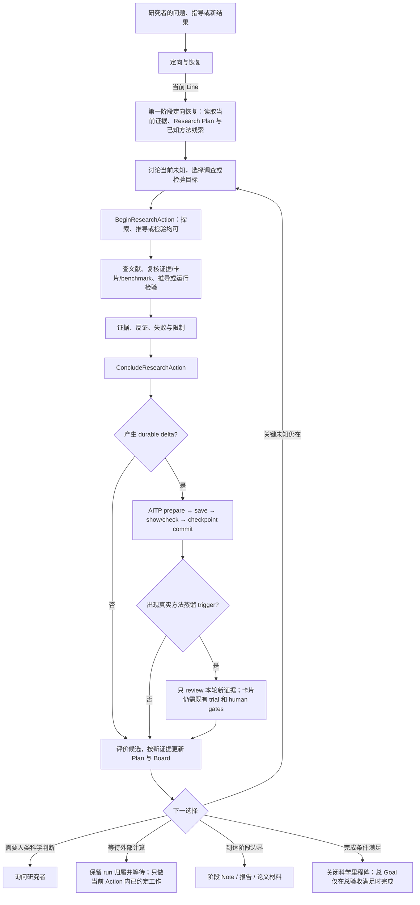
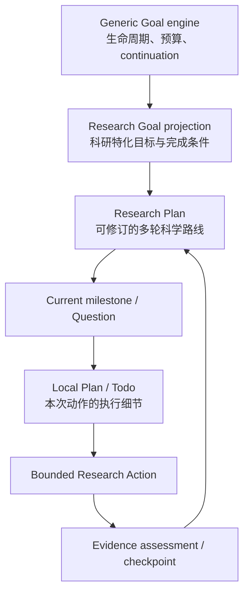
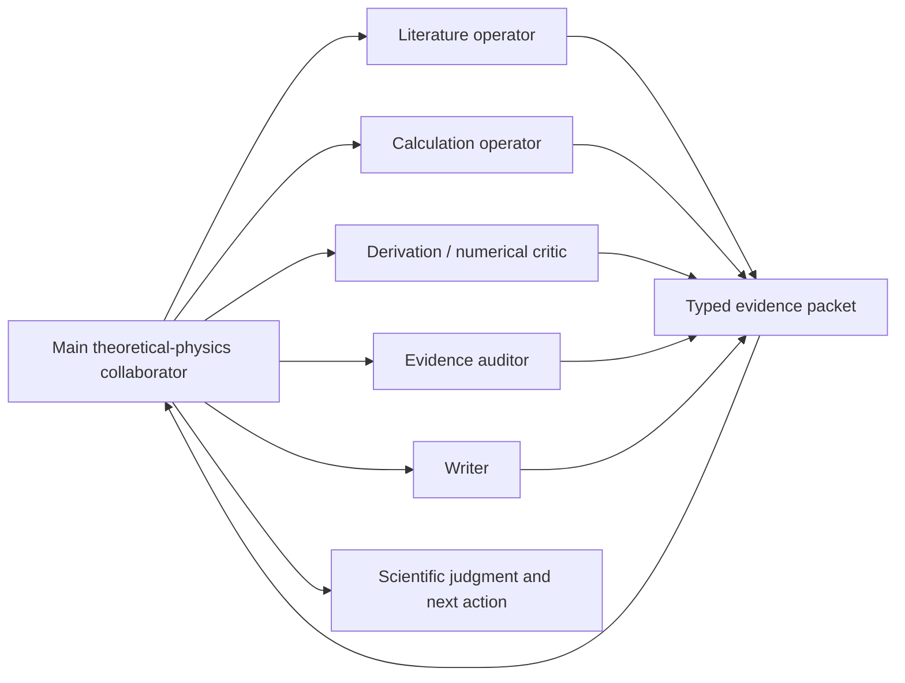
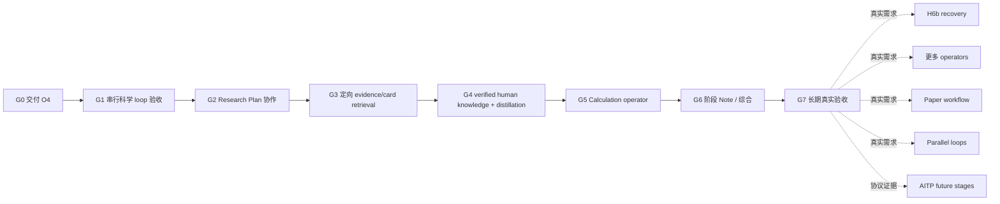

# Hakimi × AITP 理论物理合作者总体规划

> 状态：面向未来的产品总纲与分阶段实施计划，2026-09-05。
>
> 本文不是运行时、wire schema、AITP canonical Entry/Note，也不宣称下列未来能力已经实现。已关闭的 S0–S10 基础程序仍以 [`unified-research-mode-program.md`](unified-research-mode-program.md) 为准；详细机制与历史决策见 [`theory-research-agent-design.md`](theory-research-agent-design.md)。本文只回答三个问题：最终要得到怎样的理论物理合作者、现状离它还差什么、接下来怎样在一个有限总 Goal 内以有独立验收条件的里程碑实现。
>
> 本规划由一个有终点的总 Goal 驱动，G0–G7 是其内部串行里程碑，不是八个彼此割裂的 Goal。每个里程碑仍必须单独验收、记录证据并允许按真实结果微调下一阶段；C1–C5 逐项做 trigger review，trigger 不成立就以可审计 no-op 关闭并保持 `planned / unavailable`。总 Goal 只有在最终真实课题验收通过且没有未处置的高严重度 harness 缺陷时才完成，因此它是有限交付 Goal，不是“完成全部未来愿景”的无限 Goal。

总 Goal 未完成，不清零既有进展；是否正在续行以宿主 Goal 的实时状态为准，本文件不替代 active/paused 状态。执行时从 [续行与验收优化](#goal-execution-refinement) 进入，以 [逐项证据矩阵](#acceptance-evidence-matrix) 区分已测、未测与历史失败；[Board 交付回执](#waiting-purpose-board) 已覆盖等待期间科研目的显示。Goal 正文及历史段落中的“下一步”仅代表当时位置，不构成重复执行指令。[自然 operator 后处理验收](#natural-operator-postprocess-acceptance) 已产生正确结果，但超时后才恢复收尾。[operator 预算与交接切片](#operator-budget-guidance) 已交付安装；新谱移检查结果正确、恢复可用，但原次仍超时，父 agent 未读取新 delegation 指引。当前从 [父侧调用入口](#operator-caller-guidance) 完成交付与独立验证，不重算两个已完成结果。正式 Heisenberg 科研与跨 turn Goal 验收仍未完成。

## 1. 最终效果

目标不是让研究者操作一台科研状态机，而是让 Hakimi 表现为一位可靠的理论物理合作者：

- 能与研究者把模糊问题收敛为可证伪的当前问题和候选解释；
- 会先查当前课题的 AITP 证据、相关方法卡和必要文献，再选择最小判别性检验；
- 能维护一份随证据演化的 Research Plan，而不是机械执行一次性 roadmap；
- 每次工具工作都有明确目的、预期证据和停止条件；一个科学 loop 可以串行包含探索、推导和检验等多个 bounded Research Actions；
- 可以自己工作，也可以按需调用 literature、calculation、derivation、numerical critic、evidence auditor 或 writer operator；
- 会区分人类提供的线索、工具观察、外部来源和经过验证的科学结论；
- 在有 durable delta 时自动走 AITP 的可靠持久化边界，在没有 delta 时零写入；
- 只在真实、非 trivial、可能复用的工程或方法经验出现时做一次条件性知识蒸馏 review；
- 在阶段边界整理 Working Note、阶段总结或论文草稿，而不是每轮强制写文档；
- 用简洁 Board 告诉研究者课题做到哪里、这一轮在判别什么、现在唯一需要注意什么、下一步是什么；
- 有 Goal 时可以在明确边界内持续推进，没有 Goal 时仍能自然进行交互式 Research Loop；
- 内部工程审计仍然严格，但 hash、receipt、revision、adapter contract 等细节默认留在 audit view，不占据物理研究叙事。

成功的衡量标准不是“调用了多少工具、跑了多少轮、写了多少 Entry”，而是：新证据是否改变了候选解释、下一检验、限制或停止判断，并且这个变化能被研究者理解、恢复和审计。

## 2. 一个完整的用户故事

研究者进入一个理论物理项目，输入 `/research`。Hakimi 恢复当前 Program、Line、Question、Research Goal、Research Plan 和最近可靠证据；健康的 adapter 与历史审计细节保持折叠。

研究者提出：“Si 的 QSGW head-wing 为什么在第一轮发散？”Hakimi 不立即把“跑一个计算”当成答案。它先做以下事情：

1. 读取当前 Line 的 AITP handoff、相关 Entries/Notes 和适用的方法卡；
2. 区分已验证事实、人类新提示、历史失败和仍待验证的推断；
3. 必要时与研究者讨论 convention，或者定向检索文献、推导和既有 benchmark；
4. 给出少量候选解释，例如 Fourier convention、错误的 WFC reader 路径或数值不稳定；
5. 更新可修订的 Research Plan，说明每个候选需要什么判别证据；
6. 选择成本最低、区分度最高的一项检验，建立 bounded Research Action；
7. 主 Agent 自己做物理分析；编译、输入、输出、运行 provenance 和常见故障由 calculation operator 参考经过验证的方法卡处理；
8. 主 Agent 评价结果，说明支持了什么、否定了什么、还不能声称什么；
9. 如果结果是 durable delta，自动经 AITP CLI 保存并核验，包括有价值的失败、反证和负结果；只有没有新增可保留证据或判断变化时，才只更新本地进度；
10. 如果出现可复用 procedure 或关键 failure+workaround，只把本轮新证据交给 `distilling-methods` 做一次条件性 review；
11. Board 更新为下一项物理问题，而不是显示一墙内部状态；
12. 若 Goal 仍未达到且没有需要人类判断的边界，Goal engine 安排下一轮；否则等待研究者、外部计算或明确结束。

若研究者开启 `dreaming` 并设置 Goal，Hakimi 可对低成本、可逆、scope 内的细节作出明确记录的假设，连续推进多个 Research turns。若只开启 Research Mode 而没有 Goal，完全相同的科研认知 loop 仍适用于自然对话，但不会自行排入下一轮模型调用。

## 3. 科研主循环

这是一组认知职责，不是一组要求研究者手动推动的 UI phase。科学 loop 围绕一个问题形成和评价候选；Action 是其中一次有界取证或执行；turn 是一次模型会话轮次。三者不一一对应：一个 loop 可含多个串行 Actions，一个 Action 可跨多个 turns，纯讨论可以没有工具 Action。不要用 Research turns 的计数冒充完成的实验或科学 loops。

探索本身是合法 Action：尚无猜想时，可以先声明“调查哪些解释与已知证据相容”，再查文献、读代码、推导或检验。Action 的结束可以得到更准确的问题、反例或未决边界，不要求预先承诺一个答案。纯对话和宿主当前状态恢复不必登记成实验；模型发起的新工具工作仍须有对应归属。



### 3.1 定向与候选解释

`问题 → 猜想` 往往是科研中最重的一段，不能缩成一次无证据的模型猜测。检索有两个按需时机：候选形成前恢复 current Line 的现状与已知方法线索；候选形成后按需要精确复核适用卡片、Skill、反例与 benchmark。已有可靠上下文足够时不重复查找；这不是每个 turn 两次强制扫描。它允许：

- 与研究者讨论问题、物理 convention、真正关心的 observable 和可接受的近似；
- 回读当前 Line 已提交的 AITP evidence、failure、decision、working Note 与 handoff；
- 只检索与当前缺口相关的方法卡，而不是扫描全库或建立 registry；
- 定向搜索原始论文、官方文档和可信 benchmark；
- 做推导、量纲分析、极限检查、对称性分析和数量级估计；
- 让多个 perspective operator 独立提出支持证据、反例或判别实验。

这一段的产物是少量候选解释、各自的可证伪预言、当前证据和关键未知。若候选之间还没有可区分的观测，下一步可执行任务就是澄清假设、寻找判据或证明当前信息不足；不能以“计划尚未完整”为由禁止必要探索。

### 3.2 最小判别性检验

每轮优先选择最能改变判断的最小动作，而不是最完整或最昂贵的动作。选择次序是：

1. 能否用已有证据、量纲、极限或小型解析推导判别；
2. 能否用已有输出做只读后处理；
3. 能否运行局部单元或最小输入；
4. 能否做一个短 diagnostic run；
5. 只有前面不足时才运行完整计算、参数扫描或远程作业。

Action 必须提前说明 purpose、expected evidence、stop condition 和所需 capability。`BeginResearchAction → 实际工作 → ConcludeResearchAction` 是正常路径；同一结论不再额外调用 `RecordResearchProgress` 重复记录。

### 3.3 评价与下一轮

Conclude 不等于“工具成功”。主 Agent 必须回答：

- 观测本身是什么，来源和验证层级是什么；
- 它支持、削弱或排除了哪个候选；
- 哪些替代解释仍成立；
- 误差、收敛、近似和物理有效性边界是什么；
- 是否改变 Research Plan、Question assessment 或停止判断；
- 下一步为什么比其他动作更有判别力。

运行失败也可能是有价值的科研证据，但 scheduler `COMPLETED`、程序退出 0、文件存在或哈希一致都不自动等价于科学成功。

## 4. Goal、Research Goal、Plan 与 Action



| 对象 | 回答的问题 | 拥有 | 明确不拥有 |
|---|---|---|---|
| Generic Goal | 何时继续、暂停或完成？ | objective、completion criterion、budget、pause/resume/cancel、跨 turn continuation | 科学证据、工具 capability、AITP Topic |
| Research Goal | 这个 Goal 在科研语境中具体要完成什么？ | 同一 `goalId` 的科研 scope、criterion、guards 和 Program relation 投影 | 第二套 Goal engine 或第二个 scheduler |
| Research Plan | 目前认为怎样才能达到 Goal？ | 可修订 milestones、候选路线、needed evidence、assumptions、decision/replan/stop conditions | 不可变 roadmap、Goal completion、AITP ledger |
| Plan Mode | 怎样与人共同形成或修订计划？ | 一次交互式规划界面；把讨论结果转成或更新 Research Plan | Research Loop、continuation 或科学权威 |
| Local Plan / Todo | 当前 Action 的细节顺序是什么？ | 临时步骤、工具顺序、局部验证 | 科研状态、durable evidence、Goal |
| Research Action | 这一轮要判别什么？ | purpose、expected evidence、stop condition、capability、conclusion boundary | 整个课题或无限执行权 |
| Question / Line | 当前未知属于哪条研究线？ | 科研组织、优先级、assessment 和 next action | AITP workstream identity 的自动推断 |

Research Plan 可以一开始是猜测性的。它随着文献、推导、运行和人类修正逐渐清晰；每次只在新证据改变路线时修订。Plan Mode 可以在 Research Mode 中用于深入共同规划，但退出 Plan Mode 后仍由同一个 Research Loop 执行，不产生另一条生命周期。

规划深度随问题复杂度增加。无 Goal 的自然探索用当前 Question 和 bounded Action 即可；有跨轮依赖、资源承诺或多阶段目标时才使用完整 Research Plan。Local Plan/Todo 按执行需要使用，不应为读几篇论文或一次小推导强制走多层计划审批。G2 首个修正已让 `planned` Action 可仅绑定 finalized、approved 的 local Action Plan，不强制创建 Goal/Research Plan；已有 draft/active Research Plan 时仍须同时绑定 active milestone。小型可逆 Action 使用 minimal binding，不必进入 Plan Mode。该开发切片尚未完成真实对话验收。

## 5. 三种正交控制：Research、dreaming 与 auto

### 5.1 Research Mode

`/research` 是进入或退出联合科研能力的直接 toggle。进入后，自然 user turn 与合法 Goal continuation 都使用 Research Loop；退出不删除 Goal 或 AITP 记录。

Research Mode 决定“是否按科研 loop、evidence 和 Action 归属工作”。它不自行创建 Goal，也不自动产生下一 model turn。

### 5.2 collaborative 与 dreaming

它们是 Research planning policy：

- `collaborative`：只在会改变 Goal、Research Plan、关键 convention、代价或结论的 consequential uncertainty 上询问研究者；普通可验证细节由 Agent 自己调查。
- `dreaming`：Goal、scope 和 completion criterion 明确后，对低成本、可逆、scope 内的未知作出显式假设并继续；这些假设写入 Research Plan，后续证据可推翻。

两种策略都必须停在以下边界：Goal/scope 的实质改变、影响结论的 convention 歧义、昂贵或不可逆操作、外部权限、AITP human decision、Method-card approval/publication 以及证据不足却要作正式结论。

### 5.3 auto permission

`auto` 只处理常规工具风险确认。它不授予 Research Action capability、不替代 Goal、不回答 human gate，也不改变科学权威。

因此 `Goal + dreaming + auto` 表示：Goal 负责连续推进，dreaming 减少非必要科研提问，auto 减少常规工具确认；三者组合仍受已约定的科学、资源和人类决策边界约束。

## 6. AITP 在循环中的精确位置

AITP 是 local-first、canonical、可审计的科研记忆，不是思考引擎、planner 或计算平台。

### 6.1 轮次开始与恢复

Research Mode 进入、active session 冷恢复或真正需要当前证据时：

1. 用 AITP public CLI 观测 Topic、handoff 与 health；
2. 只在 current Line 有 explicit confirmed workstream binding 时做 scoped 读取；
3. 检查将要依赖的具体证据，而不是相信旧 prompt、roadmap 或 Board 摘要；
4. 按当前问题定向查找相关 Working Note、theory Note 和 `> method-card:`；
5. 将 canonical evidence 与 Hakimi local working state 对齐。

正常回答前只做轻量 reconciliation。可以机械证明的 stale period、历史无写入 checkpoint、重复 cleared alert 或 Action/phase 漂移由系统修复；Goal↔Program、Line↔workstream、科学 convention 和人类 decision 不能自动猜测。

### 6.2 Action 结束与 durable boundary

- `no_durable_delta`：只更新 Hakimi working state 和 Board；不写 AITP、不扫描卡片、不阻塞 continuation。
- `durable_delta`：生成一个 checkpoint candidate，经现有 `record prepare → draft → record save → show/scoped check → CommitResearchCheckpoint` 保存。
- AITP save 必须使用当前 0.9.0 `--expected-topic` + `--exact-workstream` compare-and-save contract；Hakimi 不直接写 canonical `.aitp` 文件。
- 同一结论只有一个 progress/durability boundary；`state_updated` 不产生新的 Method-card trigger。
- 保存失败、receipt 不清楚或 revision/binding stale 时 fail closed，不把本地状态展示成 canonical fact。

### 6.3 人类提供的信息

人类的话可能是目标、约定、经验、推断或已经验证的事实，不能混成同一 authority：

1. 原始指导先保留 attribution 和上下文；
2. 若它会影响科学结论，设计最小验证或查找可追溯来源；
3. 将“人类断言”“工具/来源观察”“Agent 评价”分开；
4. 只有经过检验并产生 durable delta 时才成为相应 Entry/Note 候选；
5. 人类 decision 只能由明确的人类选择产生，模型不能把验证结果伪装成 `authority: human`。

### 6.4 Method card、Skill 和工具

三层职责保持固定：

```text
工具：执行真实命令、读取文件、跑计算或检索来源
方法卡：记录经过证据支持、可复用的 procedure、适用范围、检查和停止条件
Skill：在合适场景检索卡片、指导执行、review trigger，并处理人机决策顺序
```

Method card 继续使用现有 AITP theory Note 规则；不新增 card schema、registry、catalog、dispatcher、INDEX 或 vector DB。卡片只在当前 Line/workstream 和任务语义相关时定向检索。

正式 trigger、`basis_refs`、post-card exact `sha256:` trial、revision、两步 human decision 和 publication 完全由当前 `distilling-methods` Skill 决定。Hakimi 只负责在新 durable Entry 首次 commit 后进行一次 bounded handoff；不能自动 approval、publish、跨 Topic 传播或用卡片解决 failure。

当前 same-turn handoff 是 best-effort，不是 exactly-once。只有真实会话再次证明 crash/resume 会稳定漏掉高价值 review，才启动 native H6b 的独立设计 Goal。

## 7. 内置 operator，而不是新的执行平台

Operator 是 Research Mode 中按需使用的 bounded specialist preset。实现上可以使用子 Agent，但它不是持续运行的独立智能体，也没有自己的 Goal engine、ledger 或科学决策权。



所有 operator：

- 只接受当前 Action 的 bounded question、input cursor、allowed tools 和 stop condition；
- 返回 typed evidence packet，包含 observation、refs、limitations、contradictions 和 verification；
- 不直接修改 Question/Line/Goal，不直接写 AITP，不替研究者作决定；
- 结果由 main Agent 串行综合，跨 Line 结果先进入 review，不异步改变当前结论。

### 7.1 Calculation operator

Calculation operator 的目的正是把工程负担从主物理合作者的前景中移开。它使用现有 workspace、Bash、SSH、scheduler 或已有 Hakimi 工具，并参考经过验证的 AITP 方法卡；当前不建设独立 runner、daemon、scheduler lifecycle、artifact database 或新执行平台。

对 ABACUS/LibRPA，知识应按以下六层组织，但都仍是现有 theory Note/Method card：

1. 总览：方法解决的问题及适用/不适用体系；
2. 编译环境：源码、依赖、命令、环境和真实常见错误；
3. 输入与参数：体系、泛函、赝势、基组、k-point、cutoff 和收敛选择；
4. ABACUS–LibRPA 流程：输入输出、目录关系、顺序和中间结果；
5. 后处理：observable、单位、解析和物理检查；
6. 诊断：错误、未收敛、不兼容、体系越界和停止条件。

只有真实执行过的命令、输入、错误、workaround 和验证依据可以入卡。主 Agent 默认只看：物理问题、输入科学假设、observable、数值质量、失败分类和结论边界；hash、binary identity、RPATH 和 receipt 在 operator evidence packet 与 audit view 中保留。

### 7.2 Literature、derivation 与 critic operator

- Literature operator：寻找原始来源、版本、关键假设和相互矛盾的结论，不生成无出处综述。
- Derivation operator：独立推导、检查符号、规范、极限、量纲和对称性。
- Numerical critic：检查离散化、收敛、误差传播、条件数、有限尺寸和 benchmark。
- Evidence auditor：只评估 provenance、claim-evidence 对应和遗漏的 falsifier，不替主 Agent 写结论。

这些 preset 一次只增加一个，并以真实重复需求为前置证据；不能预先建立一个庞大 agent zoo。

## 8. Research Board

默认 Board 只回答四个问题：

| 区域 | 默认内容 | 不默认展示 |
|---|---|---|
| Project | 当前 Research Goal/milestone、Line、距 completion criterion 的主要缺口 | 完整 Program、所有 Line、schema/revision |
| Current cycle | 当前 Question、候选解释、最小检验及处于思考/执行/评价/记录/等待哪一段 | 原始 phase 名和全部历史 action |
| Attention | 现在真正阻止判断或 continuation 的至多一项 | cleared、historical、其他 Line 的 warning 墙 |
| Next | 一个可执行 bounded action，或明确的等待/人类判断/阶段完成 | 多个互相竞争的内部 next 字段 |

Expanded audit 才展示 adapter version、Goal alignment、Line binding、receipt、hash、revision、historical alerts、checkpoint history 和完整 evidence refs。

### 8.1 warning 的处置规则

| 情况 | 回答前行为 | Board 行为 |
|---|---|---|
| 可机械证明且无科学语义的漂移 | 幂等自动修复 | 不打扰用户，audit 留痕 |
| 可由窄 recovery 操作安全恢复 | 自动恢复或给出一个明确 recovery next | 只显示当前 blocker |
| 涉及 Goal/Program、Line/workstream 或科学 decision | 不猜测，不自动确认 | 用自然语言显示唯一需要研究者判断的事项 |
| 历史失败已被新 retry supersede | 保留审计，不重新阻塞 | 默认隐藏 |
| AITP read 可用但 scoped write 不可用 | 按具体缺口保留可用读取与有界临时研究，待记录结果不能标为已持久化；degraded 用户回合探索已按 §19.7 修复并定向测试，真实体验待验收 | 显示“记录待绑定/恢复”，不说整个 adapter 坏了 |
| 外部计算等待 | 保存 run observation；不伪装成无进展或完成 | 显示等待对象、判断条件及当前 Action 内可做的工作 |

Board 是同一 Research snapshot 的投影，不是第二份人工维护的状态。多个 Line 可以保存在一个 Topic 中，但当前 session 只有一个 foreground Line、Question、Action 和 persistence boundary；默认 Board 只消费该 Line，防止 NiO、Si 或其他课题串线。

## 9. Note、项目总结与论文

Method card 不是所有知识产物的替代品：

| 产物 | 用途 | 触发 | 位置与权威 |
|---|---|---|---|
| Working Note | 跨 session 恢复当前判断、限制和下一步 | durable state 落后于真实进展 | AITP Note，经 public CLI 保存 |
| Theory Note | 推导、概念结构、阶段性综合 | 推导已足够稳定且值得长期复用 | AITP theory Note |
| Method card | 可复用 procedure 和验证锚点 | 严格遵循 `distilling-methods` trigger | AITP theory Note，始终先 agent draft |
| Stage report | 一个 milestone 的问题、方法、证据和边界 | 阶段完成或方向切换 | 研究 workspace 文档，可由 AITP Entry/Note pin |
| Paper draft | 面向发表的叙事、图表、推导和引用 | 科学结果达到研究者认可的完整度 | workspace/manuscript；必须人类审阅，不自动投稿 |

等待外部计算时，先在当前 Action 范围内整理证据或继续相关思考。切换到独立 Action 前，必须有已验证的 run 归属保存和恢复路径；当前只有一个 foreground Action/Run，尚不能把自由切换声明为可用。G1/G2 需给出最小串行恢复方案，不增加多 loop 调度器。文档生成必须从已验证 evidence refs 出发，不能用 Board 摘要代替来源。

## 10. 真实架构与职责

```text
Hakimi App
└── Workspace scope
    └── Session scope
        ├── AITP adapter / lifecycle coordinator
        │   └── 只调用 AITP CLI + files contract
        └── Main Agent scope
            ├── Research Mode admission / turn boundary
            ├── Research Goal projection + generic Goal bridge
            ├── Research Plan / Line / Question / Focus
            ├── Action ownership policy
            ├── Board projection
            └── bounded operator children

AITP Topic
├── canonical Entries / Notes / evidence pins
├── explicit workstream membership
├── health / handoff / checkpoint evidence
├── Method cards and trials
└── human decisions
```

职责划分：

- AITP：protocol、canonical ledger、Entry/Note、evidence pins、Method card、trial、human decision。
- Hakimi：Research Loop、Goal continuation、Research Plan、Question/Line/Focus、session orchestration、工具调用、human interaction、恢复和 UX。
- Operator/tool 层：真实文献检索、推导、编译、输入、运行、后处理和诊断；只返回 evidence packet。
- 研究者：课题目标、关键物理 convention、资源与不可逆动作、方向归属、最终科学判断、卡片 approval/publication 和论文发布。

不能把 AITP parser、validator 或 ledger 复制进 Hakimi，不能直接写 canonical `.aitp` 文件，不能把 Hakimi Goal/Line binding 写成伪 AITP 事实。

## 11. 当前事实与缺口

以下状态必须在每个阶段开始时以当前 HEAD、dirty status、version、CLI/help、schema、contract、fixtures、tests 和两侧 handoff 重新核验。

| 能力 | 2026-09-05 事实层级 | 说明 |
|---|---|---|
| Interactive Research turn 与 Goal continuation 分离 | 已有基础 | Research Mode 可在无 Goal 时交互；Goal 是唯一跨 turn continuation owner |
| Research Goal 投影、Research Plan v2、local Plan binding | 已有基础 | 不增加第二个 Goal engine；plan 可 revision |
| collaborative / dreaming | 已有基础 | 与 permission `auto` 正交 |
| Line/Question/Focus、单 foreground Action | 已有基础 | 多 Line 串行切换，不是并发 loop scheduler |
| exact Topic/workstream checkpoint save | 已有基础 | 依赖 AITP 0.9.0、adapter-contract 0.2 |
| `ConcludeResearchAction` durable candidate | 已有基础 | no-delta 零写入；durable delta 走 commit barrier |
| same-turn distillation handoff | 已有基础但 best-effort | 不是 exactly-once，不拥有 Skill 语义 |
| O4 executor Action ownership、historical discard、gate repair、warning 去重、bare `/research` toggle | G0 开发交付完成：`93c5954` 已推送并从 clean worktree 本地安装 | CLI 仍报 0.21.0（changesets 未消费）；真实科研体验由 G1/G7 另行验收 |
| Board 是否在真实长会话中足够清楚 | 部分完成 | 已有四区投影，需要三份 export replay 和 fresh/cold-session 使用验收 |
| 每轮自动找到恰当 evidence/card 并指导物理选择 | 部分/主要依赖 Skill guidance | 没有 native contextual router；不应建 registry/vector DB |
| 人类指导经验证后进入 durable evidence 与 card review | 流程组件存在，端到端体验未验收 | 必须区分 human assertion 与验证来源 |
| ABACUS/LibRPA calculation operator | planned / unavailable | 先使用现有工具；需重复真实需求后实现薄 preset |
| Literature/derivation/auditor/writer presets | planned / unavailable | 一次一个，自然需求驱动 |
| H6b crash-safe/exactly-once distillation coordinator | planned / unavailable | 需要真实漏交付证据和 reviewed contract；当前 S7 不足以声称实现 |
| 自动阶段 Note / paper workflow | planned / unavailable | 不等于 Method card；不能自动发表 |
| Parallel Research Loops | planned / unavailable | 串行 loop 先通过真实验收 |
| OS-level Research sandbox | unavailable | executor policy 只能约束模型工具调用；shell 仍依赖 host sandbox/permission |
| AITP M2/M3/M4、cross-topic catalog/collaborator protocol | planned / unavailable | 只由各自 natural-demand evidence 启动，不能由本规划抢跑 |

## 12. 总 Goal 的分阶段实施计划

### 执行原则

- 下列每一项都是总 Goal 内部有独立完成条件的里程碑；一次实施一个 slice，依赖解决后推进。可因真实证据调整顺序，例如先解除 G2 规划阻塞再完成 G1 真实场景，不把模块编号当固定科研顺序。
- 每个里程碑开始前重新核验两个仓库，并列出本轮 exact allowed files。
- 每个相关 slice 先用真实会话情景和 targeted tests 验收；形成可用交付后安装并运行真实模型。最终仍须在指定课题中做端到端科研验收，不能用 mock 替代。
- 如果现有实现已满足验收，阶段可以以证据充分的 no-op 关闭。
- 任何阶段若要求新 AITP schema/CLI、改变 human authority 或建设新平台，立即停止，先做独立设计与授权。
- 里程碑细节可以随真实证据调整，但不得暗中删除最终完成条件、扩大权限或把 `planned / unavailable` 伪装成已实现。

### G0：交付并验收当前 O4 恢复与 Action 归属切片

2026-09-05 开发交付已完成：`93c5954`，定向测试、各端类型检查、可重现 Web assets、文档构建、push 和 clean-build 安装通过。下面的真实长会话行为与“用户可理解”条目仍由 G1/G7 验收；交付不证明 agent 行为优越性。

**Objective**

将当前隔离工作树中已经实现的 O4 作为一个完整 Hakimi release slice 审查、提交、推送、本地重装，并证明三份真实 debug export 的 bypass、stale checkpoint、human-gate drift 和 warning storm 不再复现。

**Completion criterion**

- staged paths 精确属于 O4、bare `/research` toggle、对应文档/测试/changesets 和生成资产；
- 开始交付前重新 fetch 并记录 live `origin/main`；若它已推进，只在新的 clean integration worktree 中做非破坏性合并和冲突审计，不覆盖原 dirty worktree；
- targeted tests、typecheck、import lint、web assets check、docs build 与 diff check 通过；
- commit/push 后从 clean delivery worktree 构建并重装；
- fresh session 与一个 cold-restored anonymized fixture 中：被拒绝 Begin 后 Web/workspace/shell 不执行，安全 historical checkpoint 被清理，含 receipt 的模糊 checkpoint 保留，gate 恢复后可 resolve，Board 只显示一个 current attention；
- 用户可直接 `/research` toggle，并确认默认 Board 可理解。

**Scope**

Hakimi-only：现有 O4 runtime、public transport、TUI/Web、docs、tests、changesets 和由官方脚本生成的 web assets。

**Non-goals**

不新增科学 loop 节点、operator、AITP 能力、卡片 router、H6b、parallel loop 或 OS sandbox。

**允许修改**

仅 Hakimi 当前 O4 已触及的 allowlist；AITP checkout 与 GW/LibRPA export 只读。最终 allowlist 必须在提交前从 diff 生成并人工审查。

**验证命令**

```sh
pnpm exec vitest run packages/agent-core-v2/test/features/aitpResearch
pnpm exec vitest run apps/kimi-code/test/tui/commands/research.test.ts
pnpm exec vitest run apps/kimi-web/test/slash-menu.test.ts
pnpm -C packages/agent-core-v2 typecheck
pnpm -C packages/agent-core-v2 lint:imports
pnpm -C apps/kimi-code typecheck
pnpm -C apps/kimi-web typecheck
pnpm run build:web-assets -- --check
pnpm -C docs build
git diff --check
```

**停止条件**

dirty authorship 无法区分、upstream merge 冲突无法与用户改动安全分离、allowlist 不精确、AITP contract 事实冲突、生成资产不可复现、相关测试失败或安装源不是刚推送 commit 时停止。

### G1：用真实会话验收“科学叙事优先”的串行 Research Loop

**Objective**

让自然对话在 Research Mode 中稳定表现为“问题/候选解释 → 最小检验 → 证据评价 → 下一步”，内部 phase 不再成为用户或模型的操作负担。

**Completion criterion**

- 三份 debug export 被匿名化为 replay/acceptance scenarios，而不是复制科研数据；
- 无 Goal 的自然对话、active Goal continuation、外部 run 等待、失败后重试、纯讨论五种场景均能得到正确的 loop guidance；
- 尚无候选时允许先声明探索 Action；一个科学 loop 可以包含多个取证 Actions，不能要求完成猜想后才查文献；
- 模型不会为纯记账问题打断用户，也不会在没有 bounded Action 时做新科研工作；
- 每轮 Board 明确当前候选、检验、评价或等待位置，且只给一个 next；
- Project 和 Current cycle 先显示物理内容；turn 计数不占据科学摘要；`state_updated` 无待持久化时显示已评价/下一步，不误示为“正在记录”；
- 无需新增 public phase、wire schema 或 AITP contract 即通过验收；若现有 Skill/injection 已满足则以 no-op 关闭。

**Scope**

优先修改 `theory-physics` domain Skill、Research context presenter、derived Board copy 和 replay tests；只在代码证据表明缺口无法由现有字段表达时讨论更小接口。

**Non-goals**

不新增状态机 phase、每阶段强制工具、每阶段 AITP check/Note、自动科学判断或多 loop 并发。

**允许修改**

Hakimi theory-physics plugin/Skill、AITP Research injection/presenter、Board 纯投影及对应 tests/docs；AITP 只读。

**验证命令**

```sh
pnpm exec vitest run packages/agent-core-v2/test/features/aitpResearch
pnpm exec vitest run apps/kimi-code/test/tui/commands/research.test.ts
pnpm exec vitest run apps/kimi-web/test --pool=forks --maxWorkers=1
pnpm -C packages/agent-core-v2 typecheck
pnpm run build:web-assets -- --check
pnpm -C docs build
git diff --check
```

**停止条件**

若方案要求让 UI 推断科学结论、自动 complete/abandon Action、创建新的 phase machine、修改 AITP schema 或无法从真实 replay 证明用户收益，则停止并报告。

### G2：收敛 Research Plan、Plan Mode 与 dreaming 的协作体验

**Objective**

让 Research Plan 真正成为可演化的科学路线：不确定时在 collaborative 下与人讨论，在 dreaming 下记录低风险假设并推进；Plan Mode 只作为共同规划入口。

**Completion criterion**

- 从模糊课题到 provisional plan、从新证据到 replan、从人类修正到 revised plan 三个场景通过；
- Plan 明确列出候选路线、判别证据、assumptions、milestones、replan/stop conditions；
- local Todo 只包含当前 Action 的执行细节，不出现在 evidence 或 Research status 中；
- collaborative 只询问 consequential unknown，dreaming 对每项默认判断留痕；
- 无 Goal 的探索不以完整 Research Plan 为前置；按问题复杂度使用轻量 action plan 或长期 Research Plan，不强制每个 Action 都经过 Plan Mode；
- 外部等待、局部 persistence 不可用及重复无进展各有明确归属、恢复/重规划路径，普通维护不要求研究者反复操作；
- Goal/scope、关键 convention、昂贵/不可逆行为与 human decision 始终停下。

**Scope**

现有 ResearchPlanV2、planning policy、AskUserQuestion broker、Plan Mode bridge、model injection 和 Board plan summary。

**Non-goals**

不创建第二个 planner/Goal engine，不让 Plan 自动完成 Goal，不自动确认 Goal↔Program 或 Line↔workstream。

**允许修改**

Hakimi Research planning service、Plan Mode bridge、injection、TUI/Web plan views、protocol 表面仅在现有字段确实不足且六端同步可同阶段完成时；AITP 只读。

**验证命令**

```sh
pnpm exec vitest run packages/agent-core-v2/test/features/aitpResearch
pnpm exec vitest run packages/agent-core-v2/test/agent/goal
pnpm exec vitest run packages/kap-server/test/research.test.ts
pnpm exec vitest run packages/klient/test/facade.test.ts
pnpm -C packages/agent-core-v2 typecheck
pnpm -C apps/kimi-code typecheck
pnpm -C apps/kimi-web typecheck
git diff --check
```

**停止条件**

若需要改变 generic Goal ownership、Plan Mode 全局语义、human gate authority 或无法保持 REST/WS/SDK/klient/TUI/Web 一致，则先停止做独立接口设计。

### G3：实现 current-Line 的定向 evidence 与 Method-card retrieval

**Objective**

在候选解释和 Action plan 形成前，自动但轻量地查找当前 Line 真正相关的 AITP evidence、working/theory Note 和方法卡，并把适用条件与验证锚点注入当前科研上下文。

**Completion criterion**

- retrieval 只在 Research turn 且与当前 Question/Action 相关时发生；
- 只通过 AITP public read contract、`rg "^> method-card:"` 和现有 Skills 工作；
- current Line 有 binding 时严格 scoped，无 binding 时不冒充 scoped completeness；
- 零相关卡、已有卡完全覆盖、AITP unavailable 或 no-delta 时安静 no-op；
- no-delta 只免除蒸馏/重复维护，不能禁止下一项新调查需要的证据读取；两阶段 retrieval 是按需时机，不是固定检查次数；
- 不扫描全库、不建立 index/registry/catalog/vector DB、不把卡片当作工具自动执行；
- ABACUS/LibRPA 六类知识卡用真实已有 evidence 验证 retrieval，但不凭空补卡。

**Scope**

Skill-first 的 Hakimi routing、现有 AITP adapter read calls、current-Line context injection 和 targeted tests。

**Non-goals**

不新增 AITP CLI/schema，不改卡片规则，不自动 draft/approve/publish，不做跨 Topic 推荐。

**允许修改**

Hakimi theory-physics/using-aitp invocation seam、Research injection/coordinator 及 tests/docs；若 AITP 当前 contract 不够，停止而不是修改 AITP。

**验证命令**

```sh
pnpm exec vitest run packages/agent-core-v2/test/features/aitpResearch
pnpm -C packages/agent-core-v2 typecheck
pnpm -C packages/agent-core-v2 lint:imports
pnpm -C docs build
git diff --check
```

另用临时只读 fixture 验证：一张适用卡、一张 out-of-scope 卡、零卡、AITP degraded 和 legacy unscoped store。

**停止条件**

出现跨 Line 泄漏、需要语义 registry/vector DB、需要解析/复制 AITP validator、或 retrieval 无法给出 exact source refs 时停止。

### G4：贯通“人类指导 → 验证 → durable evidence → 条件性蒸馏”

**Objective**

用真实对话证明研究者提供的经验只有在经过检验后才进入可靠记录，并在满足原有 trigger 时立即得到一张本地 Method-card candidate 或明确 no-op。

**Completion criterion**

- 至少覆盖：正确的人类 workaround、被实验否定的人类猜测、已有卡已覆盖、一次新失败但 trigger 不足四种路径；
- human assertion、tool/source evidence、agent assessment 和 human decision authority 在 packet/Entry 中不混淆；
- 正常路径只有一次 `Begin → work → Conclude` 和一次 durable boundary；
- exact Topic/workstream save、show/check 和 checkpoint commit 完成后才 handoff；
- `distilling-methods` 对本轮 exact Entry 进行一次 review，trigger 不成立时 no-op；
- 不自动 approval、publish、cross-Topic propagate 或解决 failure。

**Scope**

现有 S6/S7、external `distilling-methods` Skill、AITP 0.9.0 contract 和真实 ABACUS/LibRPA 小型证据链。

**Non-goals**

不实现 H6b recovery，不新增卡片 schema/marker parser/registry，不批量扫描旧库，不伪造第二个 trial。

**允许修改**

优先 Hakimi tests/fixtures/Skill invocation glue 和 docs；AITP 规则只读。若发现 contract 缺口，先提交 evidence + minimal interface proposal，不直接实现。

**验证命令**

```sh
pnpm exec vitest run packages/agent-core-v2/test/features/aitpResearch
pnpm -C packages/agent-core-v2 typecheck
git diff --check
```

在 AITP 临时 store 中再执行当前 CLI 的 `enter`、`check`、`record prepare/save`、`show` 和 scoped `check`；不得修改用户科研 store。

**停止条件**

任何需要模型冒充 human authority、需要直接写 `.aitp`、证据不是实际执行所得、或无法证明 exact touched Entry 时停止。

### G5：实现一个薄的 ABACUS/LibRPA Calculation operator preset

**Objective**

让主 Agent 专注物理问题，把重复的编译、输入准备、流程、输出检查和诊断交给一个 bounded calculation operator，并返回可评价的 evidence packet。

**Completion criterion**

- 从真实重复任务中选一个最小 slice，例如“验证现有 binary + 固定 input + 解析一个 observable”，而非 `prepare/submit/collect` 全套 API；
- operator 能查适用方法卡、执行现有工具、记录输入/输出/error/units/convergence/provenance，并遵守 Action capability；
- main Agent 默认得到科学摘要、数值质量和限制；工程 hashes 进入 audit packet；
- failure packet 能区分 environment/input/runtime/postprocess/scientific invalidity；
- 失败只要带来可保留证据就可独立形成 durable Entry；不需要等待稳定 workaround 或 Method-card trigger 才记录；
- operator 不写 AITP、不修改 Research state、不拥有 continuation；
- 一个真实 calculation replay 和一个 failure+workaround replay 通过。

**Scope**

Hakimi theory-physics plugin 中一个 preset、现有 subagent/tool infrastructure、typed child evidence packet 与当前 ABACUS/LibRPA cards。

**Non-goals**

不建设 daemon、runner service、scheduler lifecycle、artifact DB、campaign schema、远程资源平台或自动参数推荐系统。

**允许修改**

Hakimi plugin/preset、child evidence contract 的既有扩展点、tests/docs；科研仓库只在专门 scratch/fixture 中执行，AITP runtime 不改。

**验证命令**

```sh
pnpm exec vitest run packages/agent-core-v2/test/features/aitpResearch
pnpm -C packages/agent-core-v2 typecheck
pnpm -C packages/agent-core-v2 lint:imports
pnpm -C docs build
git diff --check
```

另需一个真实、低成本、可重放的 operator acceptance packet；不能只用 mock 宣称科研可用。

**停止条件**

若一个薄 preset 无法完成且必须先建新平台、新 scheduler API、新 artifact schema，或真实步骤尚未重复证明需求，则阶段 no-op/blocked，不扩张范围。

### G6：阶段 Note 与项目综合

**Objective**

在 milestone、方向切换或 closeout 时，从已提交 evidence 自动准备一份可审阅的 Working/Theory Note 或 stage report，同时保持 Method card、科学总结和论文材料的边界。

**Completion criterion**

- 只有 meaningful boundary 触发，不是每轮强制写 Note；
- 每个主要 claim 可回到 exact Entry/source/run/code-change ref；
- 明确 assumptions、negative results、limitations、open questions 和 next milestone；
- AITP Note 使用 public prepare/save/check；workspace report 由 AITP record pin；
- 人类可以编辑/拒绝，不自动发布或改写历史 Note。

**Scope**

现有 AITP Note contract、theory-physics writer guidance、Research Plan milestone 和 evidence projection。

**Non-goals**

不生成无证据论文、不自动投稿、不把 Board 当来源、不让 Method card 替代项目总结。

**允许修改**

Hakimi writer preset/Skill guidance、existing Note flow、tests/docs；AITP schema 不改。

**验证命令**

```sh
pnpm exec vitest run packages/agent-core-v2/test/features/aitpResearch
pnpm -C packages/agent-core-v2 typecheck
pnpm -C docs build
git diff --check
```

用一个已关闭 milestone fixture 核验每个 claim 的 ref 和零证据时 fail closed。

**停止条件**

若需要新 Note schema、无法追溯 claim、会覆盖旧 Note 或绕过人类审阅，则停止。

### G7：真实长期科研验收与简化

**Objective**

用至少一个真实连续课题验证系统确实帮助科研，而不是只让 harness 更复杂，并删除或折叠无价值的状态噪声。

**Completion criterion**

- 覆盖自然对话、collaborative Goal、dreaming+auto Goal、等待计算、失败/重试、verified human guidance、跨 session 恢复和多 Line 切换；
- 衡量 evidence-driven next-action change、重复动作、premature completion、无必要提问、Board 理解时间和遗漏持久化；
- 研究者能在 compact Board 下说清项目位置、当前检验和下一步；
- 所有 durable claims 可从 AITP 恢复；no-delta turn 不产生多余记录；
- 形成一次 reviewed closeout，决定哪些后续 conditional goals 获得真实需求。

**Scope**

真实使用评估、replay harness、文档和小范围简化；不边评估边引入大平台。

**Non-goals**

不以 tool count、Entry count 或 loop count 作为成功代理，不宣称优于普通文件，当前 dormant external conformance suite 未评分前不作 superiority claim。

**允许修改**

Hakimi tests/docs/UX 小修；AITP 只通过现有 CLI 保存真实 evidence/feedback。任何协议变化另开 Goal。

**验证命令**

复跑 G0–G6 的相关 deterministic gates、两仓 `git diff --check`、AITP unchanged ledger tests，以及一份人工审阅的真实会话 acceptance report。

**停止条件**

研究者无法区分当前科学问题与内部状态、Board 仍需阅读大量 audit 才能理解、或 durable claims 不能可靠恢复时，不宣布总体串行体验完成。

## 13. 总 Goal 内的条件性能力审查

这些能力都必须在 G7 前后逐项审查，但实现与否取决于真实 trigger。trigger 成立且不违反 AITP gate 时，作为总 Goal 中新的有界里程碑实现；trigger 不成立时，保存证据充分的 no-op 结论并保持 `planned / unavailable`。它们不因被列出就成为必须开发的 runtime。

### C1：native H6b crash/recovery distillation coordinator

只在真实使用再次出现“checkpoint 已 commit，但 same-turn Skill handoff 因 crash/cold restore 丢失”且具有可复用价值时启动。需要先冻结最小 receipt/recovery contract，保持 Skill 为唯一 trigger authority。不能先假装 exactly-once。

### C2：更多 operator presets

Literature、derivation/numerical critic、evidence auditor 和 writer 必须各自有至少两次独立真实需求，再一次只实现一个。优先复用 Skill 与 typed evidence packet，不建立 preset zoo。

### C3：论文草稿 workflow

只有 stage reports 已稳定、claim-to-evidence 链可审计且研究者明确要求时启动。论文是 workspace artifact，AITP pin 其版本和依据；研究者拥有叙事、作者署名和发布决定。

### C4：并行假设 Research Loops

只有串行 loop 通过长期验收且真实课题证明并行候选能显著节约时间时启动。初始模型应保持一个 foreground authority：并行 children 使用 immutable input cursor 独立取证，返回 packets，由主 Agent 串行评价和提交；不能并发写 AITP，也不能让多个 Goal engines 争夺 continuation。

### C5：AITP M2/M3/M4 或新 adapter surface

reviewed artifacts、cross-topic links/catalog 和 collaborator protocol 继续由 AITP roadmap 的 natural-demand evidence 单独授权。Hakimi 发现缺口时先给出最小接口、真实失败证据、兼容矩阵和 non-goals；没有 shipped contract 就标记 `planned / unavailable`。

## 14. 依赖关系与建议顺序



G0 开发交付已完成。当前进入 G1，并按 G2 的实际依赖修正探索/规划体验；其余编号保留为验收范围，一次只实施一个 slice。用户已要求重新建立覆盖开发与真实课题测试的总 Goal，已完成的 G0 不重做，未完成的行为验收仍需补齐。

## 15. 端到端验收场景

最终串行体验至少要通过以下用户可见故事：

1. **自然对话、无 Goal**：研究者开启 `/research`，讨论并完成一个 bounded test；系统更新 Board/AITP，但不自动开启下一 turn。
2. **Collaborative Goal**：系统先问一个会改变路线的关键问题，Research Plan 形成后连续执行；普通细节不反复询问。
3. **Dreaming + auto Goal**：低风险假设被记录并自动推进；到关键 convention 或昂贵提交时停下。
4. **人类经验**：研究者给出 workaround；系统验证后记录来源，满足 trigger 才 review card，不满足时安静 no-op。
5. **关键失败**：失败被评价为环境、输入、数值或科学问题；稳定 workaround 复现前不凭空写卡。
6. **等待计算**：Board 显示等待对象和判断条件；系统可另做独立推导/证据整理，但不把 RUNNING 当结果。
7. **旧会话恢复**：历史无写入 checkpoint 可安全清理；含 receipt 的状态 fail closed；Board 不重复历史 warning。
8. **多个 Research Lines**：当前 Line 的 Question、alert、Action 和 AITP scope 不被其他 Line 污染。
9. **AITP degraded**：允许明确标注的临时探索，阻止 durable closure；恢复后从 canonical cursor 对齐。
10. **阶段完成**：completion criterion、evidence、limitations、Note 和 checkpoint 完整；Goal 才能 complete。

## 16. 全局非目标

本规划不授权：

- 新的 AITP card schema、registry、catalog、dispatcher、INDEX 或 vector DB；
- 复杂 `prepare/submit/collect` API、独立 runner、daemon、后台 service、scheduler lifecycle 或 artifact database；
- 直接写 `.aitp` canonical files 或复制 AITP parser/validator/ledger；
- 自动推断 Goal↔Program、Line↔workstream 或跨 Topic relation；
- 自动 human decision、Method-card approval/publication、论文投稿或科学结论；
- 每阶段强制 `aitp_check`、强制 Note、强制 method review、强制询问或额外 context injection；
- 把两个 marker 当两个独立实验，把阶段结论当 trial，或让卡片自动解决 failure；
- 在串行 loop 未通过真实验收前建设并行 loop；
- 把 executor tool policy 宣称为 OS-level sandbox；
- 为了 roadmap 完整而抢跑 AITP M2/M3/M4/H6b。

## 17. 全局完成判据

本规划中的“首个可用理论物理合作者”指同一有限总 Goal 内的 G0–G7 全部独立验收完成，并满足：

- 自然交互和 Goal-driven 两种路径都稳定使用同一科研认知 loop；
- Research Plan 会随证据更新，local Todo 不冒充科学状态；
- bounded Action 不能被通用工具绕过；
- AITP 读写、恢复和 scoped persistence 在用户层面顺畅但不喧宾夺主；
- verified human knowledge 和真实可复用经验能进入一次正确的 conditional distillation review；
- Calculation operator 至少在一个真实 ABACUS/LibRPA slice 中减轻工程负担；
- Board 的四个位置足以让研究者理解课题、当前检验、阻碍和下一步；
- 阶段 Note 能从 evidence refs 恢复；
- 真实长期使用没有未处置的高严重度 bypass、串线或 premature completion。

C1–C5 的审查是必做项，但代码实现不是无条件必做项。只有各自 trigger 成立、当前总 Goal 的授权与 AITP gate 都允许时才实现；否则以 no-op 证据关闭该项。这样既保留完整方向，也避免把愿景变成永远 active 的 Goal。

## 18. 与此前讨论的逐项对照

| 此前要求 | 本规划位置 | 当前处置 |
|---|---|---|
| Research Mode 下自然对话也走 Research Loop | §2、§3、§5 | 已有 turn 基础；G1 做真实体验验收 |
| Goal 不是 Research Loop 的前置，只负责自治 continuation | §4、§5 | 保持 generic Goal 唯一 owner |
| Research Goal 是科研特化 Goal | §4 | 采用同一 `goalId` projection，不建第二引擎 |
| Research Plan 指导 loop 且可随研究更新 | §3、§4、G2 | Plan Mode 只负责共同形成/修订 |
| collaborative 多讨论，dreaming 明确后自动推进 | §5、G2 | 与 `auto` permission 正交 |
| 猜想前可与人讨论、查文献、查 AITP 和卡片 | §3.1、G3 | 定向检索，不建 catalog/vector DB |
| 确认问题后再 plan、执行或分工 | §3、§7 | 一个 bounded Action；operator 按需 |
| 等待计算时整理 AITP 或深入思考 | §3、§9、G2 | 先验收当前 Action 内已约定工作；关闭后开展独立工作仍有缺口，不伪造 run 结果 |
| 自动读写 AITP，但低冗余 | §6 | durable delta 才写；no-delta 零写入 |
| 人类指导经过检验后可成为知识 | §6.3、G4 | authority 分离后进入 evidence/review |
| 知识卡不能简单用 Skill 取代 | §6.4 | card 记录、Skill 路由、tool 执行 |
| 自动调用适用卡片/Skill | §6.4、G3 | current-Line、任务相关、bounded retrieval |
| 主物理 Agent 不被 hash/编译细节淹没 | §7.1、G5 | operator/audit 层承担，物理摘要前置 |
| Calculation operator 是内置 bounded subagent preset | §7 | 可以用 subagent 实现，但无独立 authority |
| Board 简洁、能看懂项目和当前 loop | §8、G1 | Project/Current cycle/Attention/Next |
| warning 和不自洽状态回答前轻量修复 | §6.1、§8.1、G0 | 机械状态自动修；语义关系不猜测 |
| 多课题线不能混 | §8、§10、验收 8 | 单 foreground Line；exact workstream binding |
| 阶段整理 Note，最终可形成文章 | §9、G6、C3 | 与 Method card 分离；论文需人类 review |
| 先串行 loop，以后再并行猜想 | §13 C4 | serial acceptance 是硬前置 |
| 不希望产品像状态机门禁 | §1、§3、§8 | 内部安全约束折叠，用户看到科学叙事 |
| 不使用实验性开关；`/research` 直接开关 | §5、G0 | G0 已交付；真实使用体验在 G1/G7 验收 |
| 交付前同步远程 main，但不破坏已有 dirty changes | G0 | fresh fetch + clean integration worktree + 精确 allowlist |

## 19. 当前执行顺序与最终真实验收

当前已按用户要求重新创建覆盖本文全部范围的有限总 Goal。核心 objective 是“交付首个可用串行理论物理合作者，并用指定真实课题继续科研、观察输出、修复和验收”。G0 的开发交付证据保留，后续执行 G1–G7；细节可按真实证据调整，C1–C5 做逐项 trigger review。

当前 Goal 的续行顺序与验收收敛方式见 [§19.24](#goal-execution-refinement)，已有证据和未完成项见 [§19.26](#acceptance-evidence-matrix)。执行采用这两处当前记录，不重复 Goal 创建时已经完成的旧下一步；优化安排不重建 Goal、不清空证据，也不表示功能已全部验收。

最终验收使用只读导入的 `/home/bhjia/physics/quantum_chaos/Power_Law_Heisenberg_Chain/kimi-debug-session_-20260904-182916.zip` 恢复 `yangian-power-law-heisenberg-chain` 课题。先核验该非 Git 工作区的 AITP Topic、现有证据、当前 Research Goal/Plan/Line/Question 和真实 debug 输出，再完成至少一个有科学意义且有明确判据的 bounded milestone。把其 fresh/cold restore、Board、warning、Action、AITP persistence、distillation 和 Note 输出加入回归；发现的 P0/P1 harness 缺陷必须修复、测试、推送、重装并重放，直到不再复现。昂贵或不可逆计算、科学 convention 歧义和 human decision 仍按总 Goal 的停止条件暂停相关里程碑，不自动扩大权限。

### 19.1 实施与验收台账

本表按 §19.26 的逐项证据更新；“软件通过”“受控模型运行”和“自然科研体验通过”是不同结论。G1–G7 均未整体关闭，不能用较早的阶段快照覆盖后续成功或失败。

| 范围 | 当前证据与状态 | 下一交付要求 |
|---|---|---|
| G0 开发交付 | `93c5954` 已 push/clean install，原 dirty checkout 保留 | 不重做；旧会话真实模型 replay 未完成，不算行为通过 |
| G1 串行探索与 Board | 入口与冷恢复、无 Goal 的受控探索、本地结论收尾已有安装版证据；简洁 Board 与三份导出的共同故障形状有回归 | 自然五类情景、三个导出各自的覆盖映射及研究者理解验收仍需补齐；不以渲染测试代替 |
| G2 Goal/Plan 协作 | reviewed local Plan、Research Plan v2、auto/人类决定分离有回归；作业终态补录已交付（§19.25） | 真正的计划/重规划、跨 turn Goal 与等待时独立工作未验收；已有 live run 仍阻止新 Action |
| G3 定向检索 | 当前 scope 的 canonical Entry 与阶段 Note 已由安装模型回读（§19.20）；marker/权限/撤销有回归 | 相关 Method card 的实际选择、六层 ABACUS/LibRPA 知识复用、空/重复/越界内容的自然处理仍待验收 |
| G4 人类指导与蒸馏 | provenance/authority/kind 保存链与一次 handoff 有回归，saved Entry 与 candidate 的身份匹配已修复 | 四类真实正反情景 + touched Entry 路径；结构测试不证明人类内容已经验证，卡片不足条件时不伪造 trial |
| G5 计算 operator | 真实 H2O 两轮数值回归通过，但原报告遗漏；之后完成 failure 保存与 report-only 恢复（§19.16），operator 已为 0.2.1 | 不再称“数值未运行”，也不把报告恢复当作重新跑通完整新计算链；Method-card 复用、自然交接仍待验收 |
| G6 阶段综合 | 安装模型已保存 working Note，并在冷恢复后复用，未新增重复记录（§19.18–19.20） | 新 Note 的正确前置顺序、首次新 checkpoint 后的 Question 综合指引及人类审阅仍待验收；旧运行发生过两次 prepare 拒绝 |
| G7 真实课题运行 | Heisenberg primitive audit 的反证已安全收尾并冷恢复（§19.23）；这是无 Goal、未写 AITP 的诊断 | 不重做 A；继续明确归属的正常科研、真实 Goal 推进与必要记录；正式归属确认依赖不变 |
| C1–C5 | §19.13 的 no-op 经 §19.26 复核仍成立；阶段 Note 不是正式论文，报告恢复不是 H6b 丢失 | 原 trigger 不变；等待期间的串行工作问题不能统统推给 C4 并行 loops |

### 19.2 真实课题验收办法

先读指定 debug 包和项目当前状态，导出只作为历史观察，不把旧 Goal/Plan/结论强行写回 live session。恢复或 fork 使用现有 Hakimi API，并保留原会话；存在不同 Topic/Line、过期证据或未恢复认证时明确记录差异。先从现有代码、输入、输出及 AITP canonical 记录核验科学起点，再选择一项低成本且能改变判断的未决问题。

执行前记录该科学 milestone 的问题、候选解释、最小调查/推导/计算、允许文件和资源、结果判据、非结论及停止条件。有效反证和按预设诊断判据确定的未决边界可以是有效完成；不能仅以“程序运行成功”或“已写 Entry”完成科学 milestone，也不承诺解决该课题的全部开放问题。

验收分四类，报告中不得混用：

| 层次 | 保存的证据 | 通过判据 |
|---|---|---|
| 软件可靠性 | targeted tests、实际工具/恢复/持久化输出 | 被拒绝工作不执行、归属正确、证据不丢失、不提前完成 |
| 科研行为 | 真实模型提示与输出、来源、推导/计算结果及评价 | 能说明哪个候选受到支持/反驳、限制是什么、为什么选择下一步 |
| 使用体验 | compact Board、提问与重复动作实例 | 科学问题与下一步可见，常规维护不要求用户操作；理解时间由人评估，未测不填零 |
| 真实里程碑 | AITP refs、必要 Note/报告、可复查结果 | 满足事先定义的科学判据，结果可恢复，剩余未知如实列出 |

最低情景集合：自然交互无 Goal、Goal 连续推进、verified human guidance/反证、失败与 retry、外部等待、跨 session 恢复、多个 Line 隔离、durable/no-delta。能在目标课题自然发生的使用真实运行；其余用忠实 replay 验证并标注证据层级。不得为了凑场景启动无科学必要的计算或编造第二个 trial。

每次修复只重测受影响情景及必要回归。若重复相同动作而没有新证据，先调整方法、缩小问题或报告具体依赖；正常外部等待保持等待语义。验收中新发现的归属绕过、串线、证据丢失/误记、提前完成和阻断科研的恢复死锁必须修复并复测；不把无关低优先级需求不断加入本次完成条件。

最终报告给出固定情景的通过/失败/未测、科学结果与限制、相对旧导出的具体改进和仍存在的问题。历史导出与新运行的模型、任务或环境不同就明确说明，不能据此声称普遍科研能力提升。自动检查不能代替研究者对物理解释、Board 可理解性或论文质量的判断。

### 19.3 G1 首个实现切片（2026-09-05）

本切片只改显示与既有 context 的语义去重，不改变 Action/Goal/AITP 的权限和持久化事实。TUI/Web 在窄屏优先保留科学目标与当前工作；Goal 状态仍可见，turn 计数留在展开记录。`state_updated` 只有存在 pending checkpoint 才显示记录；`waiting` 来自现有 Goal continuation，而非从作业名推断。明确分类的历史失败退出当前 Attention，但展开记录原样保留；未分类的 legacy blocker 继续保守显示。

Research context 不再把 remaining-budget 或 researchRevision 的变化当成重述整个 brief 的理由，仍关注 objective、scope、completion criterion、continuation、预算上限和停止条件变化；新的 turn 继续获得 brief。验收完成条件和实际 continuation 也进入可读提示。没有添加注入通道、AITP check、自动 Note 或 Method-card trigger。

当前验证证据：core Research service + presenter 442 项、TUI Board 80 项、Web logic 131 项通过；core/TUI/Web typecheck 与 core import guard 通过。浏览器实际加载生产 Vue 组件，完成 light/dark、1000px/390px、hover/focus、展开历史审计以及 waiting/checkpoint 切换，截图和 smoke 输出保存在 `/tmp/hakimi-board-browser.y69NTU/`（临时诊断证据，不是科学 trial）。Web canonical build/check 的 521 个产物可重现。普通定向 lint 零问题；type-aware lint 的三个 warning 经 HEAD 核对为既存行，Web style check 的 28 个 baseline finding 无本次新项。新 changeset 仅声明 CLI patch；累积待发布的 CLI minor/SDK major 不由本切片改写。

这些测试验证投影和去重，不证明真实模型已正确探索、规划、持久化或蒸馏。G1 整体、G2–G7 和最终真实科学 milestone 保持未完成；本切片尚未提交、推送或重装。

### 19.4 G2 首个实现切片：独立小计划

发现并复现的阻塞是：无 Goal 的 Research 对话能够 prepare/finalize local Action Plan，但 `planned` Action 的 service 与模型工具校验仍强制要求完整 Research Plan。修正先用两个失败测试复现，再放开 existing optional parent binding，不添加 schema 字段或第二 planner。

当前规则：reviewed local Action Plan 的 ID、approved resolution、版本及 Line/Question/Program/Period context 必须仍有效；不存在未结束的 Research Plan 时可以独立执行，有 Goal 或无 Goal 均可。已有 draft/active Research Plan 时必须显式绑定其 active milestone，三个 parent 字段只可全有或全无。completed/discarded parent 不会被自动重新绑定；已有 parent 的 freshness、未授权工具拒绝和 stale plan 执行前撤权保持有效。这里没有自动批准 Plan，也不代表 alignment/persistence guard 已被解除。

定向验证：core service + presenter 共 456 项、protocol 43 项、server 30 项、klient 53 项及 SDK 的 planned-action forwarding 用例通过。core/klient/SDK typecheck 和 core import guard 通过；SDK 用例只证明转发，不伪装成真实模型运行。当前修改文件的普通 lint 为零 error，25 个 warning 均定位到未改动的旧行；没有顺手改动这些无关代码。两个 patch changeset 分别记录 Board 与小计划修复，未新增 major。

后续切片按 §19.5 对齐 `theory-physics` 指导与当前运行时；没有因此宣布 G1/G2 整体完成。外部等待、degraded 探索、定向检索、蒸馏、operator、阶段 Note 及真实课题运行继续按上述台账推进。所有新代码仍在隔离 worktree；原 Hakimi/AITP dirty changes 与真实科研项目未修改。

### 19.5 G1/G3 切片：探索指导与已记录知识回读

代码审查发现实际死路：Research executor 禁止所有 canonical 文件的直接 Read，但当前 AITP `show` 仅支持 Entry；Note/Method card 按 AITP Skill 必须读取文件。提交后的 Action 又已结束，导致 conditional review 无法读取 card 或执行通用 marker discovery。不能只改 Skill 来声称它能工作。

最小修复沿用 `aitp_show` 的 recorded-knowledge inspection 边界：mode ready 下，允许精确 workspace-relative `.aitp/topic/notes/note-<id>.md` 的 `Read`，以及指定 Topic/notes/entries 目录中固定通用 marker、仅文件名输出的 `Grep`，不要求 live Action。其余读取、搜索、编辑、shell 和 unknown tools 的 Action/capability 条件不变；Entry 仍用 `aitp_show`，canonical writes 仍用 AITP save。未添加 lease、schema、parser、索引、自动扫描或 trigger；路径约束不是 OS-level symlink/进程隔离。作用域适用性和证据判断留在 Skill，不能凭 marker count 接受候选。

`theory-physics` 0.1.3（manifest/marketplace 同步）与两份 references 现在明确：先讨论/回读/有归属探索再形成候选；一个科学 loop 可以跨 Action/turn；Goal 可选；大 Research Plan 与 local Action Plan 分工；collaborative/dreaming 与 auto 正交；人类指导需要实际检验；durability 不等于成功；只做一次 Conclude。等待时目前只有一个 foreground Action/run，不伪称独立或并行科学 loop 已可执行。专用 operator 与常规阶段 Note 路径仍待后续验收，不通过文字先宣布可用。

生产 Tool Executor 回归确认允许的 Note/marker callbacks 执行，而无归属 web、任意读取/搜索、跨工作区 Note 与 canonical writes callbacks 不执行。覆盖 active Action、无 Action、post-commit review、paused loop/no-lease、degraded 状态及路径/marker 反例。真实 PluginManager 在临时隔离 home 安装官方插件，生产 Skill discovery 发现一份 Skill，manifest/marketplace 版本一致，Skill 与两份相对路径 references 的受管副本逐字节一致。它验证安装和读取，不代表真实模型已完成科研检索或蒸馏。

本切片验证：

- core 单 worker：Research service、execution policy、injection presenter 和 PluginManager consumption 四个文件共 528 项通过；core typecheck 与 import guard 通过。
- AITP 使用其现有 `.venv/bin/pytest -q tests/ledger/test_adapter_contract.py tests/ledger/test_atomic_record_save.py`，21 项通过；系统 `python3.12` 未安装 pytest，未修改全局 Python 或项目依赖。
- 五个本次相关 core 源码/测试文件的 type-aware lint 零 error；86 个剩余 warning 全部位于未改动行，本轮发现的三个新 warning 已修复。
- `pnpm -C docs build`、`git diff --check` 与 changeset status 通过；docs 仍有既有 ES2024/bundle-size warning，未改无关配置。新 changeset 仅 CLI patch，既有累积 CLI minor/SDK major 保留。
- 正规 marketplace build 输出到 `/tmp/hakimi-theory-physics-013.bBWj3V/out/`，theory-physics ZIP 四个文件与源文件逐字节一致，manifest/marketplace 均 0.1.3。尚未替换用户安装中的插件。

该下一 Action 已按 §19.6 实施；没有扩展 AITP CLI、schema 或 native H6b。总 Goal 保持 active；G4–G7、operator、阶段 Note 与目标项目的新科学里程碑仍不能标成完成。

### 19.6 G3 切片：提交后 Note 的来源归属与撤销

代码与 red regression 确认：原 Note prepare 只看最新 checkpoint/Entry attention 和当前 Line，draft lease 只保存 checkpoint/Entry ID 与路径。切到别的 Line 后，旧 review 可以用新 Line 的 workstream prepare；工具排队后发生的切线也没有执行时复核。已有冷恢复测试只证明旧路径不能直接 Edit，不证明 prepare 的来源安全。

修复限于 Hakimi 已有服务：成功 commit 时从已验证 checkpoint 捕获精确 Line/Topic/workstream confirmation；Note 工具在真正执行时调用 Research service 的 prepare/save，fresh Topic observation 后复核原归属。成功 prepare 才授予精确本地 draft 权限，成功 save 撤销它；验证失败在归属不变时可修正并重试。切线、同 slug 重新确认、失去 ready、新 cursor、undo 和 restore 撤销上下文，切回原 Line 不会复活。Note I/O 未返回期间阻止本地切线/rebind 和重叠 Note I/O；迟到 prepare 不授权，迟到 save 如实保留 adapter 返回路径，不把可能的 canonical write 说成已取消或回滚。

没有新服务、scheduler、transport/schema、AITP parser 或 canonical 写入实现。沿用当前 CLI、外部 Skill 语义与 human decision；不增加每阶段 check/review/Note，也不自动判断 trigger。具体新增回归包括 cross-Line、same-slug rebind、degraded/ready、cursor replacement、undo/cold restore、queued tool 的执行时拒绝、late prepare/save、取消、single-flight、失败 retry，以及无 Action 的正常 prepare/edit/save。测试通过 DI 解析服务与 Note 工具；adapter 返回仍为 fixture，不冒充真实模型或真实课题运行。

本切片已验证：四个相关 core 文件单 worker 共 **544 项通过**；core typecheck 和 import guard 通过；四个本次相关 core 文件 type-aware lint **0 error**，86 个 warning 全部位于未改动行；AITP 官方 contract/atomic record-save 两个文件 **21 项通过**。README、双语使用文档和 Hakimi handoff 同步；docs build、changeset status 与 `git diff --check` 通过，docs 仍有既有 ES2024/chunk-size warning。新增一个 CLI patch changeset，既有累积 CLI minor/SDK major 不变。新代码尚未 commit/push/重装。

保留的明确缺口：

- restored attention 缺少可验证的来源确认上下文，目前只读；重复 commit 或重读证据不能恢复 Note 写权限，不能制造新 delta 来绕过。需要在 G3/G6 中冻结最小恢复设计，不能用“安全拒绝”代替恢复可用性的验收。C1 是否需要 native coordinator 仍按其独立自然需求 trigger 判断。
- AITP 0.9 的 paired Topic/exact-workstream 原子 save 只适用于 Entry。当前 Note save 无此参数；本切片不解析或原子约束 Note draft frontmatter，不提供 OS/symlink 隔离。如确需 AITP CLI/contract 扩展，必须先给最小设计与证据并取得相应授权。
- 普通阶段 Note、thin calculation operator 及真实 Power-Law Heisenberg 科学 milestone 均未完成，不因上述测试而计为验收通过。

上述 degraded 切片已按 §19.7 实施，仍须回到 G3/G6 的 Note 恢复缺口和 G4–G7 全部验收，总 Goal 不缩减。

### 19.7 G1 切片：AITP degraded 下的有归属临时探索

代码与回归确认，原 Research mutation 允许 degraded 下创建本地 Question/Action，但 turn admission 和通用工具 guard 都拒绝此类工作，导致“能开始、不能执行”的冲突。现在只有 typed 用户回合可以在 active、loop-running、ready/degraded 时取得 interactive lease；自动 Goal 准入仍要求 ready，已经准入的自主回合中途 degraded 也不能继续发起 Action 工作。

临时探索沿用现有 Action、capability、Line/Question/Plan revision 和权限检查，不增加 phase、服务或 transport schema。用户回合的本地 reconciliation、period 与 Board 正常更新；普通 adapter 警告不再把全部科研标为 workflow blocked，真正的 checkpoint、human gate、归属和执行冲突仍按原规则阻断。提示仅在语义状态变化时刷新，明确当前成果未持久化，不要求为了普通探索反复修复 adapter。

真实新结果或失败在已确认 Line/workstream 归属下可通过 Conclude 保留本地 pending candidate；无新证据才是 no-delta。degraded 期间 canonical prepare/save/commit 与 Goal 完成仍不可用，恢复后继续原 candidate；不重复结论、不自动写卡、不额外增加 check。未绑定的 durable Conclude 仍拒绝且不完成 Action；此时证据只能暂存在对话/工作区，不能声称已经生成可恢复 checkpoint，也不得伪造 no-delta 绕过。未绑定结果的可恢复持久化需后续最小设计。

回归覆盖 typed user 与 Goal admission、生产 executor callback、无 Action/权限不足/Question 变更、回合中途 degraded、失败 candidate、同一结论幂等、恢复后的原 candidate、未绑定零 mutation、本地 period/Board 与语义提示去重。不会提交真实计算，也不把 fixture 当真实科研验证。本切片仍在隔离 worktree，未提交/推送/重装；总 Goal active。

同回合入口衔接已按 §19.8 修复；本切片与入口修复合并跑四个相关 core 文件共 **560 项通过**，另有 AITP 官方 contract/atomic-save **21 项通过**。这些是定向工程测试，不是 G7 真实科研验收。

### 19.8 G1 切片：同一用户回合内进入 Research Mode

三个 red regression 复现：用户回合开始时 inactive，模型成功 enter 后仍无 interactive lease，coordinator 不执行本地 boundary；另一个边界是 autonomous lease 在降级后仍残留。修复只使用当前 main-agent typed ingress、mode event 和既有 step-head context：用户回合可在入口收敛后获得准入，coordinator 每个 turn 只执行一次本地 boundary；phase 反复变化不增加 turn 计数，turn end 后的 mode update 不会开启 loop。退出/暂停撤销准入。自动 Goal lease 只在新的、已获 continuation guards 放行的 Goal turn 开始时取得，模式恢复不能创建或恢复它。

定向测试包括同回合 enter、exit/re-enter、probe settle、degraded/ready、pause/resume、turn end 清理、非 typed 用户/其他 system trigger 拒绝及一次性 period/Board 更新。没有新的 context delivery channel、服务、公开 schema 或 AITP I/O；不会把 mode entry 当作新科学 Action，实际工具仍需合法 Action。双语 README/guide、Hakimi handoff 和两个 CLI patch changesets 已同步；原 Hakimi/AITP dirty checkout 与真实课题未修改，尚未提交/安装。

本轮最终验证：四个定向 core 文件 **560 项通过**；core typecheck、import guard（1,297 files）、changeset status、`git diff --check` 通过；六个相关 core 文件 type-aware lint **0 error**，87 个 warning 均不在修改行。docs build 通过（9.96s），保留既有 ES2024/chunk-size warning。两个新增 changeset 均为 CLI patch；累积 changeset 状态仍为既有 CLI minor/SDK major，本轮未增加 SDK breaking change。AITP 官方两个相关测试文件 **21 项通过**；没有新增 CLI/contract/schema，跨端接口未改变。

该 G3/G6 恢复切片已按 §19.9 实施；旧 cursor 不具备原始 Line confirmation，不能用当前绑定为它补造历史写权限。随后继续 G4–G7 与 C1–C5，最终交付和真实科研 milestone 不可省略。

### 19.9 G3/G6 切片：已有证据的 bounded Note Action

原 committed cursor 只有 checkpoint/Entry/receipt 等事实，不保存原始 Line confirmation。因此不添加持久化 review service，也不凭 attention 或当前同名 Line 重建旧权限。复用当前 Question 与 bounded Action：Question 的 `evidenceRefs`/`falsifierRefs` 选择 canonical Entry IDs，Action 同时授权 `tool:aitp_note_prepare` 与 `tool:aitp_note_save`；现有 Note 工具在真正 I/O 前重新观察 Topic，并通过官方 `show` 逐条验证所选 Entry 的 ID、active 状态、Topic 和显式 workstream membership。Note prepare 只接受该 Action 当前已确认的唯一 workstream。

该路径支持恢复后的已有成果整理和普通阶段综合，不要求先创建新的科研 Entry。实际综合内容、pins、是否产生新的科学判断及 Method-card trigger 仍由外部 AITP Skills 和主 agent 负责；host 的来源核验不证明物理解释正确。新 Note I/O 只在明确请求时读取选中证据，不扫描全库，不添加每阶段 check、自动卡片或第二套 ledger。post-commit 同回合路径保持可用；开始新的 Action 后不能借用旧 handoff。

恢复安全与可用性共同验证：关闭旧实例后，以新 DI 实例从保存的 wire 日志恢复，Question 和 Action 保持一致；旧 Note draft 权限不存在，而仍 fresh 的 Action 可重新验证来源并 prepare 新 draft。最初在同一个已填充的实例上调用 restore 会重放一次 update，造成测试内的 revision 漂移；测试已改成真实的新实例恢复，没有修改产品的 revision guard。Question/Line/Plan stale、暂停、degraded、human gate 或 Action conclude 会撤销 Action Note 权限，失效来源阻止 adapter prepare/save callback。同 batch Begin+Note 仍拒绝。迟到 I/O、single-flight、旧 post-commit scope 和幂等退路继续运行已有回归。

验证结果：四个相关 core 文件单 worker **579 项通过**（Research service 490、policy 38、presenter 17、PluginManager 34）；core typecheck、import guard（1,297 files）、changeset status 与 `git diff --check` 通过。四个相关 core 文件 type-aware lint **0 error**；86 个 warning 均不在修改行。AITP 官方 adapter-contract/atomic-save **21 项通过**，当前 Note CLI help 确认无 Topic/exact-workstream 原子 save 参数；AITP 仓库未修改。docs build 通过（9.91s），保留既有 ES2024/chunk-size warning。

`theory-physics` manifest/marketplace 同步为 **0.1.4**；按 `skill-creator` 原则只增加按需读取的证据整理参考，不新增强制科研步骤。真实 PluginManager 安装/discovery 及受管副本内容测试通过；官方 marketplace build 在 `/tmp/hakimi-theory-physics-014.H2ylL3/out/` 生成 ZIP，四个成员与源文件逐字节一致。构建脚本实际使用 `pnpm run build:plugin-marketplace --out-dir ...`；其 help 展示的额外 `--` 会被当前 parser 拒绝，未顺手修改此无关帮助。新增 changeset 仅 CLI patch，既有累积 CLI minor/SDK major 保留。本切片没有公开 schema/REST/WS/SDK/klient/TUI/Web 参数变化，也没有新增 AITP 原子 Note-save、review scheduler 或 H6b 能力。

以上是工程回归与插件交付检查，不是目标项目的真实科研验收。隔离 worktree 的新代码尚未 commit/push/重装；原 Hakimi/AITP dirty checkout 和 Heisenberg 科研文件未修改。总 Goal 继续 active，不能把 G3/G6 局部可用等同于 G1–G7 全部通过。

下一唯一最小 Action：审查并补齐 G4 的 verified human guidance、反证/失败和 conditional distillation 正反场景，确认它们能通过同一个 Conclude/checkpoint/touched-Entry 路径，且不重复记录或伪造 trial；随后交付 G5 薄 operator、完成 C1–C5 审查，并进入 G7 安装版本的真实 Heisenberg milestone，不以继续增加 mock tests 代替真实运行。

### 19.10 G4 身份屏障与 G5 薄 operator 的工程交付准备

2026-09-05 的 G4 审查发现：prepare 已固定候选的 kind/authority/creator，但 commit 的 canonical show 只对照 ID、active 状态和 Topic/workstream。新增八个反例（kind、authority、creator 或缺失 authority，各覆盖 production verifier 与兼容分支）全部复现错误接纳。修复让既有 verifier 返回已经读取的官方 show 结果，由 Research service 在推进 cursor 前统一对照候选；不增加第二次读取或 parser。所有 mismatch 保留已保存 Entry、原 receipt 和 pending checkpoint，不重写、删除记录或触发 post-commit handoff。这里没有保存前 authority 的原子保证，也不验证人类是否真实表达过某个决定；AITP 现有 atomic-save flags 仍只覆盖 Topic/exact-workstream。

另外六类 fixture 贯通 Conclude、prepare、save、show/check、commit：未验证 human suggestion、已检查 workaround、被否定猜测、一次可复现失败、source evidence、explicit human decision。它们保留已有 provenance 类型，只有成功 commit 后才 handoff 一次，重复 commit 和 Skill unavailable 为非阻塞 no-op；没有新建卡片。fixture 明确不是真实科研验证，G4 四类真实情景仍待验收。被修改的旧 happy-path test 已改为 DI 构造并补齐官方 show 应有的身份字段，没有弱化检查以让旧 fixture 通过。

G5 只新增一个 Theory Physics `calculation-operator` agent profile，manifest/marketplace 同步为 0.2.0。它复用现有插件 profile loader、Agent 工具和 typed evidence packet，不固定 model/provider，不修改 `/preset` 路由池，不增加 runner/scheduler。主 agent 先确定物理检验和 Action，按需提供已有方法、输入、资源上限、输出范围与停止条件；operator 返回实际 observable、数值质量、失败层次与 audit references。按 `skill-creator` 原则把具体委派说明放入按需 reference，不注入新的每阶段流程。parent Agent 调用受 Action policy 检查；child shell/file 操作仍依赖任务约束与既有工具风险权限，不能把角色提示宣称为继承的逐命令 Action enforcement 或 OS sandbox。

验证：四个 core 文件单 worker **593 项通过**（service 504、policy 38、presenter 17、PluginManager 34）；typecheck 与 import guard（1,297 files）通过；五个相关文件 type-aware lint **0 error**，86 个 warning 对照完整 diff hunk，均不在修改行。AITP 官方 adapter-contract/atomic-save **21 项通过**；CLI help 与 contract 0.2/0.9.0 重新核对，未改 AITP 文件。docs build 通过（9.91s，既有 ES2024/chunk-size warnings）。Skill quick_validate 用 AITP 项目 venv 通过；系统 Python 3.12 缺少 PyYAML，未因此安装或改动环境。

真实 PluginManager 受管复制、Skill/agent discovery、工具范围、禁用/启用撤回均通过；官方 marketplace build 产物在 `/tmp/hakimi-theory-physics-020.Fjs0SW/out/`，ZIP 六个成员逐字节等于 source。两个新增 changeset 为 CLI patch；累积 CLI minor/SDK major 保持原授权。没有公开 REST/WS/SDK/klient/TUI/Web schema 变化。已安装的 Hakimi 0.21.0 在隔离空目录完成一次真实模型连通性调用并返回 READY；这只证明模型可调用，不计为 G7 科学 milestone。

原 Hakimi HEAD `892733a`（156 dirty paths）与 AITP HEAD `eae1bce`（20 dirty paths）本轮未修改；所有新增开发仍在隔离 HEAD `93c5954` 上，尚未 commit/push/重装。Heisenberg 与 GW_librpa 科研文件没有修改。总 Goal active；G4/G5 工程进展不关闭 G4/G5 的真实行为验收，更不关闭 G7。

下一唯一最小 Action：审查并交付当前可测试的隔离版本，以其正式安装包开始真实 operator 计算/失败重放；遇到输出缺陷再做有证据的修复。随后完成 G4 的真实情景、C1–C5 需求审查与 G7 的真实 Heisenberg milestone，不再用扩充 mock 数量代替模型运行。

### 19.11 G7 首次真实运行与启动目录修复

G1–G6 的当前工程切片已作为 `4c242d626` 提交并推送到隔离 feature branch，未合入 main。干净 detached worktree 使用 frozen lockfile、单 package worker 与 3 GiB Node heap 构建、pack、全局安装；安装 CLI 仍显示 0.21.0，main bundle、search worker、Web provenance 与该干净构建逐字节相同。官方 Theory Physics 0.2.0 经 PluginManager 安装，六个受管文件与源文件相同。原 Hakimi/AITP dirty changes 保留，没有提交科研文件。

第一条安装版真实模型提示在指定 Heisenberg 项目只读恢复 L=7/8 near-HS certifier 问题，无 Goal、计算、网络、子 agent 或科研文件写入。5 分 23 秒内完成 23 次工具调用和一个 bounded Action；无归属 Bash 被 executor 拒绝，开始 Action 后可进行 provisional workspace exploration。未重复调用 RecordResearchProgress。AITP adapter 却报告找不到 compatible contract，canonical 读取未完成，模型没有调用已安装 Theory Physics Skill；因此不是完整 Research Loop 验收通过。模型随后关于距离归一化与 log basis 的诊断没有实际计算支持，不能写为物理结果。

根因由实际路径核验确认：native print 和 v2 SDK 使用 core-v2 的 home resolver，默认落到 `.kimi-code` 且忽略 `HAKIMI_HOME`；CLI/SDK 公共 resolver、插件安装和诊断使用 `.hakimi`。首次真实会话确实创建于旧 home；源码诊断显式指定正确 home 时，AITP 0.9.0/contract 0.2 在 catalog ready 前后均能成功 probe。不能把故障归因为尚未复现的 catalog-readiness race，也不添加无依据的 retry。

修复只统一 core-v2 的 home 优先级：显式参数、`HAKIMI_HOME`、兼容的 `KIMI_CODE_HOME`、默认 `.hakimi`。不复制配置、迁移插件、混合 session index 或覆盖旧会话；旧 home 中的会话仍可通过明确目录覆盖访问。四个 red assertions 先复现，修复后 core bootstrap/Research service 共 518 项通过；CLI 路径与 native print 共 41 项通过，含 SDK/native/CLI resolver 对照。新增一个 CLI patch changeset；无 AITP runtime/CLI/schema/human-decision 或公开 wire 变化。

core/CLI typecheck、core import guard（1,297 files）、四个改动代码文件的 type-aware lint（零 warning/error）、changeset status 和 diff check 均通过；docs build 通过，保留旧 ES2024/chunk-size warnings。修复后的默认-home源码启动实际 probe 到 AITP 0.9.0/contract 0.2，并发现受管 Theory Physics Skill；这是启动诊断，不冒充安装版模型复测。

首次原始提示、工具输出与结果留在隔离 worktree 的 gitignored `.tmp/research-acceptance-20260905/natural-orient-r2/`；不提交私人会话或把工作日志当科研 evidence。修复版的正式安装与真实复测尚待完成，G7 继续 active。下一唯一最小 Action：交付修复版并从正确 home 重跑真实只读恢复，确认 AITP 与领域 Skill 可用后，再预声明一个低成本判别性科学检验；随后完成其计算/评价、必要 Entry/Note 和 Goal/恢复观察。

### 19.12 G7 安装版首次进入通过、冷恢复发现独立时序缺陷

启动目录修复已作为 `c9e69df38` 推送并从干净工作树构建、pack、重装。安装 main bundle 与构建一致；Web assets/provenance 校验通过，doctor 指向正确 Hakimi home。默认配置模型的实际请求连续返回 HTTP 429，未执行工具，已主动停止该次重试；没有改账户或全局配置。随后用已有配置的另一条模型路径作显式单次选择，48 秒内经 4 次工具调用完成 EnterAITPMode → GetResearchStatus/Skill → aitp_show：mode ready、AITP 0.9.0/contract 0.2、Theory Physics 可用、指定 failure Entry 已读取。报告保留了“失败尝试不构成 L=7/8 非零证书”的边界。

这不是同模型 A/B：旧 home 中默认模型与 Hakimi home 默认模型不同；不能用两次回答直接比较模型优劣。原始调用仍保存在 gitignored acceptance 目录，`natural-orient-r3` 是零工具的 429 中止，`native-readiness-r4` 是真实首次进入通过。

恢复 r4 的同一会话后，`natural-orient-r5` 再次报告找不到 AITP contract。它实际加载了两份 Skill，AITP enter/check 失败后完成一次 provisional Action（18 次工具，4 分 27 秒），且如实说明未完成 fresh ledger check；未计算、未修改科研文件、未保存 Entry/Note。源码时序与新增 red regressions 对应：cold restore 的 adapter probe 可在 session Skill catalog 初始化完成前读取空 catalog。首次创建时可用不代表冷恢复可用，故这项缺陷不能关闭。

最小修复复用 `ISessionSkillCatalog.ready` 和既有 abortable helper：发现前等待 catalog，退出/reset 立即取消等待，等待后复核 lifecycle generation；不会自动 retry、增加 check、放宽 contract 或新建服务。两个 red 用例分别复现过早 degraded 和忽略 catalog 初始化失败；另一个测试覆盖取消旧 wait、无 Python spawn、后续新 probe 独立成功。Research service 文件 507 项通过；core typecheck/import guard 通过，原有 86 条 lint warning 保留，没有修改无关代码。初版测试误用了当前 TS lib 不含的 Promise.withResolvers，已改为现有 Promise/deferred 写法，未改编译配置。

最终定向验证为 core bootstrap/Research service 共 521 项通过，AITP 官方 contract/atomic-save 21 项通过；lint JSON 与 diff hunks 对照确认 86 条 warning 均不在改动行。docs build、changeset status 与 diff check 通过。修复版尚待交付与真实 cold-restore 复测。G7 仍未完成新科学 milestone；Goal/Plan、受归属保护的 Entry/Note、operator 和其他真实情景验收继续保留。下一唯一最小 Action：安装本次修复并复测同一会话 cold restore，之后执行预声明的低成本 near-HS 诊断，而不是重复只读调查。

### 19.13 冷恢复实测通过与当前条件性需求审查

`d8178d5a8` 已推送并从干净 detached worktree 单 worker 构建、pack、安装；安装 main bundle、search worker 与 Web provenance 逐字节匹配，doctor 通过。CLI 仍显示 0.21.0（未消费 changesets），已有运行中的用户进程没有被终止或假装热更新。原 Hakimi 的 156 个 dirty paths、AITP 的 20 个 dirty paths 均保留。

`native-readiness-r6` 直接恢复 r4/r5 的同一个真实会话，使用同一条临时选择的已配置模型路径：51 秒内完成 GetResearchStatus、Skill、aitp_show 三次工具调用。mode ready、health ok、AITP 0.9.0/contract 0.2；上轮 degraded alert 自动变为 cleared，当前 attention 为空，已完成 Action 及其下一项诊断建议保留，Program 仍是正确 Heisenberg Topic。未手改 session state、Board、科研数据或 canonical ledger。首次入口目录错误和本次 cold-restore 时序缺陷在对应实际路径上均已修复；这不证明所有恢复情景或总体科研能力已验收。

本次没有新的科研计算、验证结果、Entry、Note、card 或 trial。自然模型报告的候选诊断不得升级为已验证结果。下一科学 milestone 仍限定为低成本 near-HS convention/primitive-operator/bridge 诊断，不宣布 L=7/8 witness 已认证；记录前须明确 Goal 是现有 Program 的 milestone，并把验收 Line 显式绑定到现有 `symmetry-operator-search`。已请求一次人工语义确认；没有用 auto 权限、模型猜测或同名 slug 冒充确认。

当前 C1–C5 审查如下。这里关闭的是本次需求审查，不是新增功能；后续 G7 的新证据可以重新触发有界评审。

| 项目 | 本次证据判断 | 处置 |
|---|---|---|
| C1 H6b recovery coordinator | 新故障发生在 contract discovery，尚未进入 checkpoint commit，更没有 committed 后丢失 Skill handoff 的复现 | no-op；现有 service 修复即可，H6b 仍 planned/unavailable |
| C2 更多 operator presets | 当前只有同一个课题的连续调查与启动复测，没有分别达到两次独立需求；重复模型回合不计独立方法经验 | no-op；只保留已交付的薄 calculation-operator，真实 G5 操作验收仍待完成 |
| C3 论文 workflow | 本轮无新 validated stage report，课题 L=7/8 仍 unresolved，没有本轮论文撰写/发布决定 | no-op；G6 的阶段 Note 不等于正式论文 workflow，更不授权署名或发布 |
| C4 并行科学 loops | 当前只验证串行读侧与恢复，尚未通过完整串行科学闭环，也无并行假设节省时间的实测 | no-op；仍 planned/unavailable，不以子工具批次当多 loop |
| C5 AITP M2/M3/M4、新 surface | 已发现的入口/恢复故障都在 Hakimi；现有 AITP contract 足够修复，没有新增协议的自然需求与单独授权 | no-op；不改 AITP schema/CLI/human semantics，不启动未来阶段 |

总 Goal 保持 active，G1–G7 行为验收没有整体关闭。接下来的唯一最小 Action 是在上述归属确认后，使用安装版 Hakimi 做一个预声明的实际小检验及必要 evidence 记录；若未确认，不开始需要该归属的记录或自动 Goal continuation，不重复只读调查消耗回合。

### 19.14 G5 实际 operator 失败诊断与共享生命周期修复

在等待 Heisenberg 归属确认期间，推进独立 G5 验收，不把自动 continuation 当作确认。准备计算 replay 时发现旧 H2O 回归 provenance 中的 binary SHA 与现有 binary 不同，当前环境 `ldd` 另有八项缺失库。因此停止该数值重放，不把旧 oracle 转移到新字节，不更改科研源文件、运行环境或远程任务。这是身份冲突/环境未就绪，不是新的 QSGW 物理失败结论。

随后在官方 AITP CLI 初始化的独立临时 Topic 中，用已安装代码 `d8178d5a8`、Theory Physics 0.2.0 和本地已配置的 `openai-codex/gpt-5.6-sol` 执行一次有限模型验收（显式模型选择不修改账号配置）。主 agent 24 次工具调用、6 分 15 秒；测试 Line/workstream 显式设置只作用于临时 Topic，不修改真实课题归属。`BeginResearchAction` 先成功，下一 batch 才委派唯一前台 `calculation-operator`。子 agent wire 记录确认四次串行调用：Read 指定 provenance、一次 sha256sum、一次 ldd、Write 唯一测试 evidence packet。它正确报告 NO-GO、未执行 binary、未伪称科学通过。

验收失败在主 agent 的回传链，而非上述诊断：实际 LLM tool snapshot 从 30 增至 60 个工具后仍没有 `ReviewResearchEvidence`、`ObserveResearchRun` 和 `DiscardHistoricalResearchCheckpoint`，并非仅凭模型抱怨判断。主 agent 形成一个 pending failure candidate 后，AITP 工具报告 not ready，尽管 Research mode 仍 ready；没有 canonical Entry，也没有绕过 adapter 写入。子 agent 恢复 inactive mode 调用了 Session-shared adapter/coordinator reset，是独立于前两次启动 bug 的生命周期归属缺陷。

本次最小修复在 Hakimi：为 mode 的旧 allowlist 补齐三个已实现工具；只有 main agent 安装 AITP 生命周期订阅，child restore/undo 不再取消 session adapter/maintenance。绑定与 review 工具说明明确 expected revision 是顶层 Research snapshot revision；review 回包不再引导活跃 Action 另写重复进度。没有新增工具/schema、改变 adapter contract、放松 canonical 写屏障或 human decision，也没有设置新的环境开关。Skill reference 的普通 Read 仍要求 Action 归属；本轮首次被拒后在 Begin 成功后正常读取，不通过全面放行 Read 修复。

两个 tool-overlay 用例和 inactive/ready child restore/undo 两个用例先在旧实现上失败，修复后通过；Research service/policy 共 547 项通过，core typecheck/import guard 通过，四个相关文件 type-aware lint 零 error，87 条既有 warning 均不在修改行；AITP 官方 contract/atomic-save 21 项通过。私有提示、原始工具结果与失败状态保留在 gitignored `.tmp/research-acceptance-20260905/operator-failure-r1/` 和独立临时测试 store，不提交私人会话。

安装版修复 replay 尚待进行；本次不能关闭 G5/G4/G7。下一唯一最小 Action：交付修复后，在同一临时会话恢复原 pending failure，验证正式 review/prepare/save/commit，再用一次新的有归属子任务验证 adapter 不再失效；成功持久化仍不等于完成真实 calculation replay 或 Heisenberg 科学里程碑。

### 19.15 原 checkpoint 恢复通过，下一动作衔接缺陷复现

§19.14 修复已作为 `4d036b633` 提交、推送至当前 feature branch，并从该 commit 的干净 worktree 构建安装；CLI 仍显示 0.21.0，changeset 未消费，不能冒称发布新版本。安装包 main 字节与干净构建一致。Theory Physics 0.2.0 和 AITP 0.9.0/contract-0.2 未被本次安装修改。

同一临时测试会话的 `operator-recovery-r2` 使用真实配置模型，10 次工具调用、约 2 分 58 秒，成功完成 GetResearchStatus → ReviewResearchEvidence → prepare → Read/Edit draft → save → show → scoped check → CommitResearchCheckpoint → status。原 pending candidate 成为一条 agent-authority failure Entry，pending 清除，正式 CLI 独立核验一个 Entry、零 Note，当前 scope 零 errors/warnings。原 operator 的 NO-GO 没有被改写成科学成功；旧回合缺少 review 的事实仍有说明。本次真实 artifact pin 由测试控制方补给模型，因此不计作 operator 自动 artifact pinning 的验收；没有重复 failure、card、trial 或 human decision。

随后 `operator-child-replay-r3` 原计划验证新 child 不再 reset adapter，但在委派前就复现另一个问题：checkpoint 已提交，phase 仍为 `state_updated`，Begin 连续失败；改 Focus 无效，重复 RecordResearchProgress 被正确拒绝，改 Question 的 next action 也无法解除。控制方在约两分钟、8 个工具调用后中断自有测试进程（exit 130），保留原始记录，没有继续无意义重试，也没有启动 child 或新计算。因此 r2 证明恢复持久化成功，不足以证明修复后正常 child 委派已实测通过。

最小修复让已有 plan/begin 接受一个已收束的 `state_updated` 边界；service 与 wire reducer 都阻止未决 checkpoint、live action/run 或 human gate 被替换，计划与 scope 校验仍在唯一 Begin 路径中先完成。普通 Begin 仍一次原子 dispatch，不额外写 phase/progress、不修改旧结论、不自动放弃或批准。无 delta、已提交 checkpoint、显式 approval、失败零 mutation 与 replay 用例中六个正向用例先在旧实现失败；修复后 service/ops/policy 共 656 项通过，typecheck/import guard 通过。

本修复安装版复测尚待完成。总 Goal 保持 active：G5 数值计算 replay、G7 Heisenberg 新科学里程碑，以及相关真实场景均不能由上述临时失败诊断替代。下一唯一最小 Action：交付本次动作衔接修复，重放同一临时会话的 bounded child 回读，验证 Begin、委派后 adapter、review/show 和 no-delta Conclude，确认没有新增 canonical 记录。

上述动作衔接修复已于同日提交并推送为 `810f3ced0`，从干净 worktree 串行构建、打包并本地安装。最终定向 tests 为 662 项，AITP 官方 contract/atomic-save 21 项通过；docs build、typecheck、import guard 和 diff check 通过，type-aware lint 的 87 条既有 warning 均未落在修改行。系统 Python 缺 pytest，随后使用 AITP 既有 `.venv/bin/python -m pytest` 正常完成，没有安装额外依赖或改环境。安装的 main 与构建产物同为 SHA-256 `d7754430e76c8cca63402c53065954bf1851b49a1eeaa305f6ca2e5b54ee1012`；Web provenance 521 files 验证通过，doctor 通过，CLI 仍为 0.21.0。没有 OOM；保留已有 node-pty install-script 被阻止、TSDoc/TypeScript 版本和 Web chunk warnings，不改配置掩盖它们。

`operator-child-replay-r4` 复用 r3 的同一提示和同一会话，真实模型用 8 次主工具调用、约 2 分 50 秒、exit 0 完成：status → 激活既有 Question 的 workflow（不改归属）→ Begin → 一个前台 calculation-operator → status → ReviewResearchEvidence → aitp_show → Conclude。直接核对 main/child wire：主工具零错误，一个原子 begin、一次 complete/progress；child 只有一次指定文件 Read，零 Research mutation。委派前后 mode 与 aitpHealth 都 ready；没有额外 SetPhase、Focus 修改或 RecordResearchProgress 工具调用。临时 store 仍恰好一条旧 failure Entry、零 Note，旧 Entry hash 不变，未产生 pending candidate、marker、card、trial 或 human decision。这关闭了本次 next-Begin 死锁与 child-reset 的安装版复现，不等于完成正常 ABACUS/LibRPA 数值 replay，也不证明更强科研能力或 OS isolation。

总 Goal 仍 active。下一真实课题 Action 仍为已提出的有限 near-HS convention/primitive-spin/bridge 诊断；正式 Goal–Program 与验收 Line→`symmetry-operator-search` 的语义确认尚未收到，不以自动 continuation 冒充。原始 Hakimi HEAD `892733a005` 的 156 个 dirty paths、AITP HEAD `eae1bce5eb` 的 20 个 dirty paths 均保留，真实 Heisenberg/GW 科研文件与 ledger 没有被本轮测试修改。

### 19.16 G5 新 driver 的真实 H2O 回归与报告遗漏恢复

使用 §19.15 的已安装代码和同一独立临时 Topic，再用一次新的 Question/Action 执行既有 `qsgw_aims_mole_H2O_libri` 回归。原 LibRPA checkout 有 21 个 dirty/untracked paths，全部保留；只从既有提交 `7fc613eb2c043292a7dbf2f2b249b3761b553df8` 创建新 archive/source 副本，构建新的 driver，不使用已知身份冲突的旧 binary。一次性测试 fixture 限定单编译 worker、1 MPI、单线程、6 GiB 虚拟内存上限、一个 244 KiB 数据集、原始输入和比较器；没有新产品 runner、下载、源码改动、远程作业或容差修改。

`operator-h2o-replay-r5` 的真实子 agent 调用完成一次 build 和一次 replay：build 1 分 32.76 秒、峰值 RSS 682,196 KiB；回归 0.97 秒、104,428 KiB，均 exit 0、零 swap，未观察到 OOM。受控 clean-environment `ldd` 有八个缺库，oneAPI 环境中全部解析。两次 QSGW update 的 gap 为 8.835008322884264 eV 和 10.154305710907652 eV；summary gap 最大差 1.954e-14 eV、residual 差 3.775e-15 Ha、eigenvalue trajectory 差 1.227e-14 Ha，均通过原比较器。初态 iteration 0 加两次 update 是三行，不是三次更新；`converged=0`，此处只验证固定回归复现，不证明物理收敛、普适正确性或生产可用。

同一次验收的交接未通过：子 agent 在 15 次工具调用后未保存约定 packet，并声称 Write 不可用。直接核对 profile 和 LLM tool snapshot，Write 及其 schema 实际存在，与前次成功 Write 使用相同工具快照；没有 Write 调用或拒绝。因此 packet 缺失是事实，工具不可用不是已证实原因。主 agent 审查了回传文本、Conclude 一次并 prepare failure draft 后达到测试的十分钟上限，控制方仅中断自己的测试进程；未绕过 adapter 或重跑计算。

`operator-h2o-recover-r6` 在同一会话恢复原 key/draft，用六次工具调用、1 分 55.50 秒、exit 0 完成 status → Read → Edit → save → CommitResearchCheckpoint → status。记录明确纠正了未验证的工具归因，保存真实 comparator/manifest pins；原生 barrier 执行 pre/post check 与 canonical show，模型没有额外重复 check/show。官方 CLI 独立复核两条 agent failure Entries、零 Note、当前 scope 零 errors/warnings，scope 外保留一个测试 Topic 警告；旧 binary failure hash 不变，无 resolves、card、trial 或 human decision。这证明恢复后持久化成功，不把原 r5 交接改写为成功。

Theory Physics 0.2.1 只作有证据的指引修正：受托保存 packet 时预留调用预算，未尝试不能称工具缺失，主 agent 区分实际错误与未经验证的原因；不为了补报告重跑已完成计算。没有新增工具、公开 schema、AITP contract 或 runtime enforcement。现有 PluginManager 安装/discovery 测试 34 项、AITP 官方 contract/atomic-save 21 项通过；新的真实报告复测仍待进行，不能由提示文字或这两组测试推断行为改善。首次误用了当前 Vitest 不支持的 `--minWorkers`，查实际 help 后以 `--maxWorkers=1 --no-file-parallelism` 运行通过；未修改依赖或测试来掩盖错误。

总 Goal active，真实 Heisenberg milestone 仍待明确归属后执行。本阶段下一唯一最小 Action：安装本次已提交插件，使用既有输出做一次新的有归属报告任务，观察真实 Write/回传/主 agent review；不再次构建或计算，不伪称独立物理 trial。

本次指引交付已提交并推送为 `a6631ca03`，从该 commit 的干净 worktree 通过正式 PluginManager 更新受管 Theory Physics 为 0.2.1。安装前确认六个旧受管文件与上次交付一致，未覆盖用户插件修改；安装后六个文件与新源文件一致。marketplace ZIP 的六个成员逐字节验证通过；首次检查漏写 ZIP 顶层目录导致路径查找失败，按实际成员路径校正后全部通过。Skill validation、changeset status、docs build（9.25 秒）和 doctor 通过；保留 docs 既有 ES2024/chunk warning。CLI engine 和 Web 未修改，安装版仍为 0.21.0，main hash 保持 `d7754430e76c8cca63402c53065954bf1851b49a1eeaa305f6ca2e5b54ee1012`。本轮新增 CLI patch changeset，未消费既有累计 CLI minor/SDK major，也未重跑无接口变化的全套跨端测试。AITP protected dirty handoff 未修改，无新 AITP 兼容性或协议声明。

`operator-report-replay-r7` 在新进程中使用已安装 0.2.1，wire 确认 child 已加载新指引。主 agent 15 次、child 5 次工具调用，6 分 48.39 秒、exit 0：先成功 Begin，child 仅 Read 三个既有文件、Write 一份新的 Action-specific report、一次 sha256sum；主 agent Read 实际文件、确认 adapter ready、正式 Review、Conclude 一次并以新的工程恢复事实走 prepare/fill/save/Commit。报告 digest 由 child 实测，官方 save 与独立审计一致；没有额外手动 check/show、重复进度或新计算。最终 scope 为三条 Entries（两条旧 failure 和一条新工程 result）、零 Notes、零 errors/warnings，pending 清除，scope 外测试 Topic 警告保留。旧 failure 没有 resolves/supersedes，未因新成功倒填原失败原因；没有 marker、card、trial 或 human decision。

这里的提示已经给出测试输入、预算和非收敛边界；r7 的报告-only任务也比 r5 的完整 build/run 任务更窄。因此证据支持“当前报告写入/回传/持久化路径可用”，不支持文字修改单独造成行为提升、原长任务不会再漏报告或自主科研能力整体已通过。原遗漏仍作为观察到但未归因的失败保留。G5 的真实数值执行和报告恢复已有正向证据，总 Goal 仍不能关闭；下一唯一最小 Action 是在该独立 Topic 用已提交证据验证一次 bounded 阶段 Note 的生成与恢复，继续 G4/G6，而不是等待确认时重跑同一 H2O 计算。

最后的原始 snapshot 审计补充了 G4/G6 的前置缺口：H2O Question revision 已到 6、persistence 为 committed，但 assessment/nextBoundedAction 仍是测试前的计划，evidenceRefs 为空；三个已提交记录并不等于 Question 已综合。`research.ack_checkpoint` 的当前 reducer 只更新 persistence/revision 并清除 pending，不改科学评价或 evidenceRefs。与此同时，`effectiveNextStep` 正确采用 latestProgress 的不重跑建议，不能据此声称整个 Board 都在指挥重跑。下一唯一最小 Action 因该真实证据调整为：追踪提交后的 Question 评价/证据关联与 Board 来源投影，复现哪些字段会误导；明确机械关联与主 agent 科学综合的边界后作最小修复/引导，再进入阶段 Note。不能凭 receipt 自动宣布科研接受、把其他 Line 的记录搬入当前 Question，或新增每阶段门禁。

### 19.17 G4 提交后的 Question 综合时序

代码追踪确认：Conclude 原先在 pending checkpoint 形成时就提示仅在科学解释变化后更新 Question，而首次 Commit 仅给出蒸馏交接。前者容易遗漏工程证据或下一步已经变化的情况；若提前更新 captured Question revision，还会使原 checkpoint 过期。最小修复只调整现有工具输出：no-delta 可在本地按需综合；durable 先完成原 checkpoint，再由 main agent 根据已保存证据更新现有 Question，而不是由 ack reducer 自动裁定科研状态。

首次 Commit 的定向提示仅在 ready/active、无 pending、exact committed cursor、同一当前 Line/Question 且 revision 只发生本次 ack 的递增时出现。它带当前 Question ID/revision 和已保存 Entry ID，要求保留相关旧 evidence refs、有依据地更新 assessment、剩余 needed evidence 和 next action；若已准确则 no-op。重复提交、切线/换 Question、进一步 revision 变化、暂停/degraded、新 pending 或 cursor 变化均不重复该提示。没有新增状态字段、工具、公开 schema、扫描、AITP I/O、强制 Note、科学接受/关闭或 failure resolution；外部蒸馏规则和原 checkpoint barrier 不变。

新增回归先复现四项预期失败，修复后 Research service 525 项单 worker 测试通过。真实 service 路径覆盖 prepare/save/show/check/commit 后原科学字段仍不被自动覆盖，再用现有 Question 接口成功综合且没有额外 check。类型检查发现测试使用了 CreateQuestion 不支持的字段，删除该误用后 typecheck 通过；import boundary 1,297 files 通过，changeset status 保持既有累计 CLI minor/SDK major，本次仅新增 CLI patch。源代码层通过不代表模型实际完成收尾；下一验证是从该提交重新安装，在既有独立临时 H2O Topic 对已保存输出做低成本解释，不再次构建或计算，观察首次 Commit 后的 Question 更新，再进行阶段 Note。真实 Heisenberg milestone 和整个 Goal 仍未完成。

### 19.18 G6 已安装模型的阶段 Note 与恢复摩擦

`3e8edc6e5969e3cd0aeca3bb0f5c3066d1430945` 已推送到当前 feature branch，并从新 clean worktree 串行构建、打包和本地安装。CLI 仍为 0.21.0（未消费 changesets），main digest 为 `d8aac95eae80055c3b0d65b0a9436889c4b7d9fc78677ff4a25d06b8a5573c79`；Theory Physics 0.2.1、AITP 0.9.0/contract 0.2 不变。官方 AITP contract/atomic-save 21 项、docs build、CLI/assets 检查通过。生产和测试文件 lint 为 0 errors、86 warnings，未声称全绿；未重跑本次未改变的公开接口全矩阵。

安装验证发现 npm 拦截 `node-pty` install script，version/doctor 虽通过，直接加载原生模块却失败。控制方中断自己的 r8 进程（零模型工具调用，exit 130）。project-scoped allow-scripts rebuild 被 npm 拒绝；随后 global 按包名 rebuild 成功，但也意外重编译了另一个全局应用中的同名依赖。这是本次操作的越界副作用，已向用户报告，不能声称其产物未变；没有擅自回滚或修改全局 npm policy，后续不得使用该全局包名匹配命令。Hakimi 的精确依赖加载及真实 PTY 子进程输出 `hakimi-pty-ok`、exit 0 后才重启验收。原 Hakimi 156 条、AITP 20 条 dirty paths 保留。

`question-synthesis-note-r9` 由已安装 Hakimi 在同一独立临时 Topic 运行，提示只要求解释已有证据并写一份可恢复的阶段 working Note，没有指定 `UpdateResearchQuestion` 或要求制造新 Entry 来测试首个 Commit。7 分 50.58 秒、32 次模型工具调用、exit 0，无子 agent、Bash、重编译或数值重跑。首次 Note prepare 因 Question evidenceRefs 为空而拒绝；模型补 refs 后因已运行 Action 捕获旧 Question revision 再次被拒。它没有直接写 canonical 文件或循环重试，而是将旧 Action 无 delta 地 abandoned、完成 Question 综合、以新 revision 开始第二个 bounded Note Action，随后 prepare/Read/Edit/save 成功并正常 Conclude。

新 working Note `note-bbd42696c91843e3860afb4789b3875b` 以四个现有 immutable artifact 的 exact pins 综合三条既有 Entry。H2O Question 从测试前的 revision 6 推进至 revision 9，明确关联三条 canonical refs，并由模型将限定的固定回归问题设为 closed/supported；不是 ack 自动提升，也不等于物理收敛或整个 Goal 完成。旧 binary failure 和 packet-omission failure 的 bytes/hash 不变，仍 unresolved。最终 scoped enter/check 为三条 Entries、一份 Note、零 errors/warnings，scope 外一个测试 Topic warning 保留；没有 duplicate Entry、trial、card、decision、resolves 或 supersedes。最后 Action completed、no-delta，不产生新 pending checkpoint。

证据支持“旧 Question 可由模型综合，现有证据可形成阶段 Note，拒绝后能自行恢复”；不支持“首次 Commit 提示已由真实新结果验证”或“阶段综合已无摩擦”。实际还出现两次本可避免的 Note 拒绝和重复 session-start Skill/enter/check；第一次 GetResearchStatus 已带当前 ready/clean scoped maintenance。下一唯一最小 Action：根据这条轨迹，将既有 Note Action 前置的 evidence-ref/revision 顺序在现有 model-facing 指引中讲清，并区分原生已完成维护与真正必要的新检查，再复测既有证据综合路径；不削弱 ownership/freshness、不新增阶段、schema、强制扫描或卡片触发。Heisenberg 的真实科学 milestone、首次真实新 commit 的综合提示以及新增 Note 的 session cold-restore 行为仍须按总 Goal 验证。

### 19.19 G6 阶段 Note 前置顺序与维护回执复用

针对 §19.18 的实测摩擦，Hakimi 的 Begin 描述提前说明：先回读 canonical Entries、确定 Question 的 assessment 与 evidence/falsifier refs，再开始捕获该 revision 的 Note Action；需要独立证据调查时，先收尾 reading Action。拒绝信息同步说明这一次序，不会自动重绑旧 Action。既有充分 Note 且无 delta 时直接复用，不制造 Entry 来取得 Note 权限。

现有 Research 注入在 ready read receipt 与当前 Program 内容、observed revision、Line/workstream 确认绑定匹配且读取时间不早于确认时，说明 native enter/check 已完成。它只是已记录读取的适用范围，不保证外部状态永久不变；真正 stale／external change、证据回读和必要保存验证仍保留。findings 继续显示；相同范围只有 refreshedAt 改变不再注入新内容。未增加状态、工具、阶段、执行 gate、维护 I/O、AITP schema 或 card trigger。

定向单 worker 557 项通过（526 service、31 presenter）；新增恢复测试保留 “缺 refs 拒绝 → 事后补 refs 仍 stale → 收尾旧 Action → 新 Note Action 可 prepare” 的安全语义。首次类型检查发现测试夹具误用了 memory_status ready，已改为官方 available 后通过；新增 veto 断言也按真实 output 形状修正，未削弱生产拒绝。imports 1,297 文件通过，四文件 lint 0 errors／1 warning；官方 AITP contract／atomic-save 21 项和 docs build 通过（既有 ES2024/chunk warnings 保留）。CLI patch changeset 不消费版本；本次无公开接口变化，不声称重新跑过 REST/WS/SDK/klient/TUI/Web 全矩阵。安装后仍需真实模型复测，单元测试不能证明摩擦已经消失。总 Goal 和 Heisenberg 科学验收继续保留。

### 19.20 G6 安装后恢复并复用阶段 Note

`a0a4dacd6e07b67504451c442a63a03eda51e1a8` 已提交并推送 feature branch，从新 clean worktree 串行构建、打包后安装。CLI 仍为 0.21.0，main digest 为 `d2188abd7208c9d0f3e4cd4acf94144324443d5f71f66525c4554945dc9f61fd`；521 项 Web assets 校验通过。此次先预览 exact tarball install 的五项依赖变更，再只为该安装启用 node-pty lifecycle scripts；未使用全局包名 rebuild。安装日志只编译 Hakimi 的 node-pty，实际 PTY 输出与 exit 0 通过；另一全局应用的原生文件前后 digest 相同。Theory Physics 0.2.1 与 AITP 0.9.0/contract 0.2 未变，源与 managed contract digest 相同。原 Hakimi 156 条、AITP 20 条 dirty paths 保留。

已安装进程 cold-resume 同一临时 Topic/session，`note-reuse-after-restore-r10` 从 01:26:14.484Z 到 01:27:41.306Z，86.822 秒、7 次工具调用、exit 0：一次 Skill、Begin、Read 已有 Note、三次 canonical show、Conclude completed/no-delta。真实 wire 中有 native maintenance 复用提示；模型未调用 enter/check、prepare/save、Bash、子 agent 或 Question mutation，没有拒绝或重复写。控制方的结束 enter/check 验证仍为三条 Entries、一份 Note、scope 内零 findings、scope 外一个测试 Topic warning；四份 canonical 文件哈希均不变，两个 failure 均 unresolved。支持旧 Note 的 session cold-restore 和这次只读复用路径；因本轮没有新 Note 或新 Entry，不算新 Note 准备顺序或首次 Commit 综合提示的真实正向测试，也不是速度/行为优势的对照实验。

回答正确区分固定两次 update 的回归可重复性与未验证的物理收敛，并认为不应重跑已完成的小课题。但其条件性下一步仍把 “是否未发起 Write” 当作待判定：这一点已在旧 failure 的 limitations 中明示，真正未明的是未发起的原因。该表达不足保留，不能声称研究者视角的下一步已完全准确。下一唯一最小 Action：回到 G7，使用已安装版本对指定 Heisenberg 项目做现有证据的只读定向恢复，收敛尚未解决、低成本的科学检验；未获确认的 Goal/Program 或 Line/workstream 语义不自动补写，不以临时 H2O 验收替代真实课题 milestone。

### 19.21 G7 真实自旋代数诊断与未绑定结果的收尾缺口

2026-09-05 使用 §19.20 的已安装版本，cold-resume 同一个真实 Heisenberg 验收会话，执行 `heisenberg-primitive-bridge-r7`。本次不再以 orientation 收尾：预先限定为 L=7/8 后端的单自旋 exact 代数与少量 exact-field→Arb 恒等式检查，不运行多体矩阵、projector、witness、优化器、谱统计或远程任务。该科研目录不是 Git 仓库；旧 symbolic 环境实际为 Python 3.10.12，与项目的 ≥3.12 要求不一致。控制方在新临时目录准备 Python 3.12.13、SymPy 1.13.3、python-flint 0.9.0，保留旧环境。模型只在该临时目录写脚本、日志、JSON 和报告，运行受单 CPU、2 GiB 虚拟内存和每命令 120 秒约束，使用 `-B` 避免改动原项目缓存。

真实检查得到可复现的负结果：当前 backend `spin` 的 `x` 分支没有处理 up→down，故 `Sx|up>=0`，而约定要求 `(1/2)|down>`；`Sx²|down>=0` 也不等于 `(1/4)|down>`。两个数域、各两个 site 的 84 项 exact 检查中，52 项通过、32 项失败，包含直接作用、Hermiticity、平方和 SU(2) 对易关系。控制方另用独立短探针重复这两个反例，0.44 秒、峰值 RSS 65,232 KiB、exit 0。所选 minimal-polynomial reduction、零/非零、加乘与复共轭的 Arb 原生 contains/overlaps 检查在 128/256/512 bits 下均通过；这是有限 sanity suite，不是完整数域正确性证明。84 项检查不是 84 次独立研究 trial，两次同脚本运行也不算两个 trial。

这定位了修复和独立复验前不能依赖的自旋算符路径，不证明每个复合矩阵元素都错误，不证明历史 exact-zero/ball 矛盾的全部原因，也不认证或反驳 L7/8 obstruction。模型发现初版报告把独立的 H/projector 路径说得过强后，修正临时报告说明并重跑该廉价脚本；未测试的 H/projector 路径及独立 L6 结论均保持原证据边界。新诊断没有使用 float-based `ball_info` 作判据，没有修复原 backend，也没有修改原四份 script/test/data/report（前后 digest 相同）。临时 JSON 的自描述标签仅属于本次测试文件，不是新 Hakimi/AITP artifact schema。

同时实测复现了 §19.7 已知、尚未解决的产品缺口。一次成功 Begin 后，模型完成实际工作，以 `durable_delta` 调用 Conclude，被拒为 “A durable conclusion requires a current Line with an explicit workstream binding.”；它尝试 RecordResearchProgress 暂存，也因 Action 仍 `in_progress` 被拒。最终读取的 snapshot 仍是 `action_executing`，latestProgress 仍是前次未执行诊断的 orientation，没有 pending checkpoint。模型没有伪造 no-delta、自动绑定、直接写 canonical 或重试同一个 Conclude。两个拒绝保住了写入与归属边界，但没能让完成的科研事实进入可恢复的本地结论/Board。既有对应单 worker 回归实跑为 1 passed、525 skipped，它断言的正是此拒绝行为，不能把该测试通过称作体验缺口已修复。

整次已安装模型运行从 01:40:27.760Z 到 01:50:27.819Z，27 次工具调用，达到预设十分钟上限后只中断测试进程，exit 130。诊断、修正文案和第二次廉价运行已保存；没有最终自然语言收尾，不能宣称用户交互验收通过。记录了两次 Skill 加载和较长 JSON 的多次回读，未据此声称检验成本或交互效率已优化。AITP preflight 的当前 `symmetry-operator-search` scope 为零 errors、13 个 historical-pin-drift warnings；scope 外 24 errors/250 warnings 明确保留，不声称全库健康。没有新增 Entry、Note、card、trial、decision 或 failure resolution。源与测试材料留在 `/tmp/hakimi-heisenberg-primitive-audit.8sUqgC/`，提示、完整工具结果与退出回执留在忽略目录 `.tmp/research-acceptance-20260905/heisenberg-primitive-bridge-r7/`。

#### 下一切片的最小契约：本地结论与正式入库分离

以下是基于本次复现的待实现设计，仍为 **planned/unavailable**；不把未绑定旧 checkpoint 当作已经支持的新能力，不改变 AITP 的任何契约。

1. **一个真实结论边界。** 继续复用 Conclude 的显式 durability 判断。在缺少正式入库归属、但 Action 自身身份和 revision 仍有效时，应能原子保存完整本地结论、关闭该 Action 并撤销其工作权限；不得降格为 no-delta，不再要求调用一次 RecordResearchProgress。
2. **只保留一个受控待归属结果。** 使用 Agent 的现有 checkpointed Research working state/wire 记录 source Action、完整 progress/durability、实际已知的 Program/Line/Question/revision 和证据位置，未知归属明确为空。它不是 AITP Entry、不是可直接 save 的 checkpoint，也不是新 artifact 数据库、ledger、scheduler 或后台队列。新结果不能覆盖该待处理结果；普通对话、必要状态读取与恢复不因此伪装为计算仍在运行。
3. **明确恢复后才生成正式 checkpoint。** 正式目标 Line/workstream 必须由现有的人类确认语义取得；无 Line 的旧结果不能因为后来出现了同名 Line 就自动吸附。先追踪现有绑定/恢复接口，冻结最小的显式结果归属操作及 expected-revision 契约，再实现：复核来源、目标、当前上下文和未越过 prepare/save 边界后，只生成现有 bound checkpoint，仍经官方 AITP prepare/fill/exact save/check/commit。不得自动 approval、Goal alignment、failure resolution 或 trial 认定。
4. **Board 只说真正状态。** 显示已得到的科学结论及 “未入库：待确认归属”，唯一下一步来自真实恢复依赖；不能显示旧 orientation 作为最新结果。Goal 的自动推进/完成按未处理持久化依赖 hold，不能靠改 Goal 状态掩盖本地结论缺失。
5. **保留旧安全边界。** 已绑定 durable/no-delta、旧 checkpoint discard、receipt/cursor、两步 human decision 和精确 workstream save 语义保持不变。新本地结果的冷恢复、undo、幂等与冲突重试、Program/Line/Question 变化、能力撤销、重复结论和跨 Line 反例须有定向回归；公开投影或恢复操作改变时同时验证 REST/WS/SDK/klient/TUI/Web。

总 Goal 仍 active；本次科学诊断有新证据，但正式 AITP Entry/阶段 Note、Goal 自动科研与整套 G7 体验未完成。下一唯一最小 Action：按上述边界完成未绑定 durable 结论的最小接口设计和实现，再从已保存的 r7 结果恢复收尾进行安装版复测；不重新做 orientation，不重跑昂贵 witness，不靠人工手改 Board、伪造 no-delta 或推断绑定通过验收。

本轮仅修改本节验收记录和待实现设计，没有修改生产代码或公开接口，也没有 commit/push/reinstall。docs build 9.07 秒通过（既有 ES2024/chunk warnings 保留），diff check 通过。结束时官方 CLI 的 scoped enter 为 18 active/7 superseded/1 unresolved failure，scoped check 与前述 counts 相同；没有以退出码 1 的历史 warnings 冒充 clean。未重跑无变更的 REST/WS/SDK/klient/TUI/Web 全矩阵或 AITP 全套 ledger tests。原 Hakimi HEAD `892733a005` 的 156 个 dirty paths、AITP HEAD `eae1bce5eb` 的 20 个 dirty paths 保留；隔离 worktree 在 `0c58849d4` 上只有本计划文档的一处跟踪文件修改。

### 19.22 总 Goal 优化与本地结论恢复实现

2026-09-05 按用户要求优化总 Goal，继承 G0–G7、条件性 C1–C5、既有交付与失败证据，不重新计算通过项、不缩成单独 UI 修复。先交付 §19.21 的收尾缺口，再继续功能/行为证据清单；正常科研流程、异常恢复和真正跨 turn Goal 推进分别验收。自然验收提示只给科学问题、约束和预期成果，不手把手指定内部工具或 phase。终点是首个可用版本及一个有限真实科学里程碑，不要求解决全部 Heisenberg 开放问题；关键缺陷必须修复复测，非关键建议进入后续清单。

本切片只修改隔离 Hakimi worktree。Conclude 在 Action 身份及已知科研上下文仍有效、但无 Line 或 Line unbound 时，原子关闭 Action、写唯一 progress，并保留原 Action、完整结果/限制/证据 detail、durability candidate 和已知 Program/Line。`localConclusion` 使用现有 checkpointed Research working state，跟随 undo、可 cold replay；它不是第二账本、正式 pending checkpoint 或持久化 lease。重复相同结论幂等，冲突结果和后续科研工作不能覆盖它；Goal continuation/completion hold，状态读取和讨论仍可用。

显式归属复用现有公开 `propose_checkpoint`，只增加可选 local conclusion ID 与 `confirmedBy: user`，并要求精确非零 public revision、已有目标 Line 和 fresh confirmed workstream。已经绑定来源 Line 的结果不能转移；原 assessment/next 不可被替换。首次绑定带来的 Line revision +1 单独验证，不视为科研内容改变；原 Program/Question 或 reviewed Plan 内容、身份、revision 变化仍拒绝且保留原结果。模型侧 Propose schema 未开放这些人工字段。接纳只生成旧 bound checkpoint，随后仍走 AITP prepare/fill/exact-save/show/scoped-check/commit。

TUI/Web 紧凑 Board 显示真实本地结论和一次待确认归属提示，不显示旧工作仍在执行。Web Checkpoint 区展示只读原结论并提供显式确认，未有前景 Line 时可先选择目标并确认 binding，不偷偷切换 Line。TUI 使用 `/research adopt-conclusion <localConclusionId> <lineSlug> [questionId]`；已有 Manager 的 `W` 控件可对所选 Line 确认 binding。REST、共享事件、SDK 与 klient 同步新增可选投影和恢复字段；不增加 AITP schema/CLI/contract、自动绑定、approval、publication 或 trial。

已验证 core Research 542 项及生成的 wire/state manifest 4 项、protocol 45 项、REST Research 31 项、SDK Research 14 项、klient memory/IPC 实际传输各 1 项、Web 34 项、TUI 138 项。core 与六个公开客户端/传输包 typecheck 均通过，core import boundary 通过（1,298 files），文档构建 13.03 秒通过；既有 ES2024/chunk warnings 保留。Web style 以 baseline mode 返回 28 条 findings，不能称为零问题。新 changeset 为 CLI patch/SDK additive minor；累计待发布集合仍为 CLI minor/SDK major，未执行 version。diff check 通过，浏览器明暗主题/焦点、正式 Web 资产生成和交付安装仍 pending。新 Plan 归属边界先由两个失败回归复现，再以正反场景修复，不降低普通 Action 的版本守卫。AITP checkout 20 条已有修改未触碰，真实科研文件未改，尚未安装本切片，也未重跑 r7 科学计算。

后续交付前验证：真实浏览器渲染上述中性 fixture 的 Board/Manager，明暗主题、hover/focus、未绑定禁用、显式绑定后接纳、原结果不改写、精确 revision/目标及 pending 防重复提交均通过，页面无脚本异常。新增长按钮曾使 390px 窄屏结果区溢出，双语按钮收短为确认结果归属后结果区不再溢出；既有五页签栏仍有约 17px 局部溢出，作为 G1 非关键 UI 后续项保留，不宣称整个移动端无问题。此浏览器验证没有连接科研后端或写 AITP。REST Research 31 项再次通过，其中同一结论现在由真实 `/api/v1/ws` 订阅收取，并与 REST GET 比较完整原结论、Action 终态及 revision；不再只有事件 schema 解析证据。Web 34 项与 Web/kap-server typecheck 复验通过。35 个修改的 TS/Vue 文件定向 type-aware lint 为 0 errors、100 warnings，warning 均不在本次变更行；不宣称全仓 lint clean。AITP 仓库环境的 contract/atomic-save 21 项通过，官方 help 和 0.9.0/contract 0.2 再核验，未修改该仓库。

正式 `build:web-assets` 和 `--check` 通过，521 文件逐字节一致，耗时分别 22.40/22.86 秒，峰值 RSS 约 2.21 GiB；未发生 OOM，既有 chunk warnings 保留。source identity `f0589660be03261607e9b29a8d0cb3e73c781bfe937a8519eed9531d5c112825`，recipe identity `e242351ea791477e571a8d49cff178ff7bcfd569628322d2fb3e1b850c5b082e`。生成目录只由官方脚本替换；临时浏览器及其依赖均不进入提交，也不安装系统包。远程 main 仍为 `015763451d8b6ec01a9954ae2239e76005952581`，已是当前分支祖先。

下一唯一最小 Action：将该已验证切片 scoped 交付并从 clean commit 本地安装，然后只恢复 r7 已存在的结果完成收尾，单独保存安装版行为证据；正常绑定下的科学记录和 Goal 自动推进验收随后继续。总 Goal 保持 active，安装与真实原会话收尾在此记录时仍未完成。

### 19.23 本地结论交付与原会话恢复验收

2026-09-05，§19.22 切片提交为 `06b8524102df93bab404de4495391772848b033d` 并推送到 `merge/pr-9-auto-subagent-preset`，远程 ref 核验一致。从该 commit 的新 detached clean worktree 安装 frozen lockfile，串行构建 packages、CLI、运行 bundle smoke，再经正式 prepack 打包安装。CLI 仍为 0.21.0；未执行 changeset version 或 npm publish。安装 main 与 clean build 的 SHA-256 同为 `cb7f2f46c643ef0d9479bede2c8af59b30f47bcdf7cf4459200ce5a007388241`，521 个 Web 文件逐字节相同、源码侧正式 provenance checker 通过。安装包不含开发用 checker，直接从安装目录调用曾报 MODULE_NOT_FOUND；改为源码 checker 加安装文件比对，不把它记作产品缺陷或跳过验证。CLI/help/doctor 通过，真实 PTY 输出 `hakimi-local-result-pty-ok` 且 exit 0。

精确 tarball 安装先 dry-run，只有 Hakimi 与四个依赖变更；仅为该安装允许 node-pty lifecycle，串行编译。未调用全局包名 rebuild。另一全局应用的原生文件前后 SHA 相同。Theory Physics 0.2.1、AITP 0.9.0/contract 0.2 未变，源与 managed contract digest 相同。构建无 OOM；既有 dependency lifecycle、TSDoc/TypeScript 和 chunk warnings 不被清除。原 Hakimi HEAD `892733a005` 的 156 个 dirty paths、AITP HEAD `eae1bce5eb` 的 20 个 dirty paths 保留。

安装后真实运行 `heisenberg-local-conclusion-recovery-r8`，恢复原 session `session_e0d6533b-dba6-4e7a-8fbe-5d1264013dc1`，模型仍为 `openai-codex/gpt-5.6-sol`。提示明确限定为恢复已有结果而非正常自然科研验收：不重算、不改科研文件、不创建新 Goal/Line/Question/Action、不猜测归属、不写 canonical AITP。03:52:23.354Z 到 03:53:57.759Z，94.405 秒，exit 0；仅 `GetResearchStatus`、两次 `Read` 和一次 `ConcludeResearchAction`。旧 Action `1117a7a6-012b-469f-815c-88428c8732cc` 成功 completed，phase 为 state_updated，原结果/证据/限制作为 local durable conclusion 保留；没有 RecordResearchProgress、no-delta 降格、新 checkpoint 或 AITP 写权限。模型自然语言收尾明确区分诊断失败、有限 Arb sanity pass、尚未验证的 witness 和记录归属。

另用同一 clean commit 构建的 SDK 执行只读 cold resume/getResearch，无模型调用；snapshot revision 13、mode ready、Action completed、本地结论保留、无 pending checkpoint。effectiveNextStep 明确要求确认记录归属后再提议 scoped checkpoint，并禁止重复实验或结论。科研源码、测试、quarantined data/report 的四个保护 digest 不变；canonical `.aitp/topic` 全文件清单及 bytes 前后相同。官方 enter/check 前后逐字节相同：当前 symmetry-operator-search scope 25 Entries/0 Notes，0 errors、13 historical-pin-drift warnings；scope 外 24 errors/250 warnings 保留，不能宣称全库健康。本轮无 Entry、Note、card、trial、human decision 或 failure resolution；旧 spectral-rmt 的单个 observation marker 不为本次恢复提供蒸馏 trigger。

将该真实 cold-restored snapshot 交给同 commit 的 TUI Board component，在 100 列下输出六行：interactive/no Goal、当前诊断结论、一次归属 attention 和唯一 adopt-conclusion 下一步，没有旧 Action 执行状态或展开审计洪流。这是实际 snapshot 的 renderer 验证，不是另一次实时 TUI 交互。临时 standalone harness 初次以 CommonJS 加载导致 YAML import 失败；改用 ESM `.mts` 与仓库既有 raw-text loader 后通过，没有修改产品构建或测试标准。

**模型内容误差保留：** Conclude 的一条 observations 称旧报告已采用修正后的边界，但旧 `primitive_audit.md` 仍含 “directly invalidates every J0/J1/J2” 的过强措辞；修正来自恢复提示及本轮评价，不是旧文件。主要 result/limitations 已采用“依赖该 primitive 的计算需逐项复核”的窄声明，但不能因此把该错误归因视为已验证事实。旧证据与本地结论均不被暗改，后续正式记录前须将原文、修正解释和未验证项分开；显式归属也不等于批准科学内容。此恢复成功不计作正常绑定记录或 Goal 自动推进通过。

运行提示、完整模型输出、工具结果与退出回执保存在忽略目录 `.tmp/research-acceptance-20260905/heisenberg-local-conclusion-recovery-r8/`；clean install、snapshot 和保护清单在 `/tmp/hakimi-local-result-install.4JcVXK/`，均不打包入产品。下一唯一最小 Action：按优化后的 B 步逐项核对 G1–G7 的代码、测试与安装版行为证据，明确剩余正常主流程/跨 turn 验收，不重复已通过的原会话恢复。需要归属确认的正式科研仍保留该依赖；总 Goal active，未宣称全部完成。

### 19.24 当前 Goal 的续行与验收优化 {#goal-execution-refinement}

本节把既有总 Goal 收敛为可逐项验收的交付任务，不另起第二个 Goal，也不改变 G0–G7 的范围或 C1–C5 的独立需求条件。Goal 的 objective 仍是交付首个可用的串行理论物理合作者，并在指定 Heisenberg 课题完成一个有限、可复查的科学里程碑；不是完成全部开放物理问题，也不是把每个候选平台能力实现一遍。

**续行依据。** 原 Goal 正文里的“当前修复尚未交付”等进度描述是设置时的快照；后续推进采用本文件的最新验收记录，不能因此重做 §19.23 已交付的切片。宿主当前只开放 Goal 创建、查询和完成/阻塞状态更新，不支持改写未完成 Goal 的 objective；因此保留 active Goal，通过它已经引用的本文细化计划，不把未完成 Goal 假标 complete 后重建，也不手改宿主存储。

**2026-09-05 优化起点。** A 的本地结论恢复已交付，外部作业终态补录见 [§19.25](#retained-run-recovery)，B 的逐项证据盘点也已在 [§19.26](#acceptance-evidence-matrix) 完成。当前不是重做 A 或再写一份总盘点，而是补齐 B 暴露的具体缺口，然后完成 C/D 的正常科研与真实 Goal 验收。下述验收包组织已有要求，不另加产品能力或科研状态机；一个包可以分成多个有明确结果的开发 Action。

执行顺序保持 A–E，但每一步先看已有证据，不机械重复：

1. **A：沿用已交付结果。** §19.23 的本地结论收尾及冷恢复不再重复；它仅证明恢复，不代替正常绑定记录或跨 turn Goal 推进。
2. **B：补齐已定位的剩余工作。** 复用 §19.26 的代码、测试、安装版行为与缺口清单；每次只更新发生变化的条目，保留失败与未测。功能已具备时不新增机制，证据缺失时安排最小验收，不再全量盘点或先扩写更多规划。
3. **C：验收正常科研。** 在明确确认的 Program/Line/Question 下，从真实未决问题出发，经过必要的讨论、检索或推导，选一个判别性检验，评价结果和反证，更新 Research Plan、必要 AITP Entry/Note 与 Board。验收提示只给科学问题、约束和成果，不逐条指定内部工具。
4. **D：独立验收自动继续与停止。** 实际观察 Goal 跨 turn 选择下一步、等待外部工作、恢复、达到完成条件或请求必要人类判断；无 Goal 的自然科研同样要成立。重放状态或调用一次工具不能代替这一项。
5. **E：按缺陷回到最小修复。** 合法科研无法继续、归属错误、结果丢失或误记、重复写入、提前完成等问题，先保存复现，再修复和复测受影响场景。只重新交付发生产品变化的切片；非关键体验建议另列，不无限延长本 Goal。

这不是 A–E 必须走完才允许修复的流程：若 B 已证实一个会阻断 C/D 的缺陷，下一 Action 就处理该缺陷，之后回到尚未验收的条目。等待外部计算与“没有新证据却重复相同操作”必须分开；前者保持真实等待，后者先诊断或调整方法。一次只推进一个有明确结果的小切片，不因等待人类归属确认而重跑已有计算或替人确认。

**剩余验收按使用故事组合。** 不为每个功能各造一套课题或记录。同一段真实输出可以支持多个条目，但必须指出分别支持什么；同一执行链不能因此变成两个独立 trial。

| 验收包 | 需要实际看见的行为 | 对应原范围 |
|---|---|---|
| 自然探索与等待 | 无 Goal 时能讨论、回读、比较解释并选择小检验；等待已有作业时能做范围内有价值的工作，Board 同时讲清科研目的和等待对象 | G1、G2、G3；已关闭 Action 后的新工作限制单独验证 |
| Heisenberg 正常科研与 Goal | 明确归属后，由科学问题形成可修订计划，真实跨 turn 推进、评价反证，完成一个有限里程碑及必要记录；暂停、等待与恢复不伪装为持续运行 | G2、G7，并复用 G1/G3/G6 的相关证据 |
| 人类指导与知识复用 | 对照原四类情景检验指导、反驳猜测、复用已有卡片和不足条件时 no-op；只有真实 trigger 才进入现有蒸馏流程 | G3、G4；不为验收凑卡片、trial 或批准 |
| LibRPA 工程交接 | 主 agent 给出科学任务和适用条件，operator 完成真实执行及证据包，主 agent 解释 observable、反例和限制；旧数值成功与旧交接失败均保留 | G5，并与 G3/G4 共用相关方法证据；不能由 Heisenberg 代替 |
| 综合、恢复与交付 | 新的阶段 Note 顺序正确，冷恢复后可回读且不重复写；三个 GW 导出逐个映射到故障回归；最终安装版完成受影响流程复测 | G1、G6、G7 和 E；不把 fixture 当模型自然科研 |

每个包先补缺失证据，不重跑已经足够的部分。验收提示只给科学问题、已确认的范围、资源限制和预期成果，不告诉模型应调用哪些 Research 工具或如何过 phase；排障时可以使用强指导提示，但必须单列为诊断。每个 case 绑定当时的交付 commit、实际输入和完整输出，不能用旧版本的一次成功覆盖新版本尚未运行的路径。

**科研效果与工程正确性分开判断。** 科研验收要能回答：这一轮减少了哪个未知？候选解释为什么值得检验？检验是否有区分力、前提是否成立？证据支持到哪里、还有什么反证和限制？下一步为什么由这些结果推出？基础代码检验发现反例可以是有效诊断，但不等于解决原物理问题，也不自动证明 Goal、计划和持久化通过。工程验收另查归属、恢复、重复写入和工具执行边界；不以工具数、记录数、warning 清零或测试全绿替代科研进展。

**完成条件。** 同时满足：G1–G7 各自的验收要求有可定位证据；C1–C5 有需求结论而不是强行实现；交付版本可以对应到源码 commit；正常科研、异常恢复和跨 turn continuation 分别验证；真实 Heisenberg 里程碑达到预先写明的判据并完成必要记录。支持、反证或符合预定诊断标准的未决结论均可作为科学结果，但 Action/Board 僵住、只写了记录或测试全绿均不算工作流完成。LibRPA 的工程执行与报告证据仍单独用于 G5，不由 Heisenberg 代替。

总 Goal 的有限终点是上述条件，不是所有开放物理问题得到肯定答案，也不是知识卡数量达到某个指标。原有必验项不能改称可选项来关 Goal；原有条件性项目则按真实需求决定 no-op，保持未实现状态。影响这些验收的关键缺陷必须修复并复测；不影响验收的额外功能或润色进入后续清单，不滚动加入本 Goal。

**轻量与判断边界。** 科学问题、猜想、文献判断、检验设计和结论由合作者式的主 agent 负责，必要时与研究者讨论；工具及薄 operator 承担工程执行和审计细节。AITP 负责 canonical 证据与知识记录，蒸馏仍只走当前 `distilling-methods` 的条件性路径，无 trigger 就 no-op。Board 默认只保留课题位置、本轮问题/检验/结果、必要 attention 和唯一 next。恢复不增加每阶段扫描、强制 Note、第二套 Goal 或自动人类决定。

**允许修改与验证。** 本次计划优化仅修改本文件，不修改产品运行时、科研项目或 AITP dirty changes。后续每个实现切片继续按总 Goal 在隔离 Hakimi worktree 列出精确文件 allowlist，检查六端一致性；AITP surface 需要改变时另行停止设计评审，不在本次顺带扩展。文档运行 `NODE_OPTIONS=--max-old-space-size=3072 pnpm --dir docs run build` 与 `git diff --check`；代码切片使用相应包的定向 `vitest run <files> --maxWorkers=1 --no-file-parallelism`、typecheck 及受影响的 contract/fixtures，再验证安装版行为。构建和大型测试串行；每个真实实验预先写明资源、时限与停止边界，mock、故障重放和真实计算分开报告。

重型测试、构建和真实模型验收串行进行。实验资源上限在执行前按该 case 确定，不因一次超时自动加大；重复同一失败前先定位原因，保留失败输出，只有修复或新证据支持时才重试。复用可核验的数值产物与记录，不用重复计算证明文档或 Board 文案改变；只在产品发生变化的交付点构建安装，再验证受影响路径。文档优化不触发新版本、重装或科研执行。

**当前执行位置。** 同一 Action 内等待期间的授权工作、Note 整理和冷恢复已有 fixture；TUI/Web 覆盖科研目的的展示缺口也已修复，并补上旧单 Line 快照中明确 foreign Action/run 的隔离。完整 Research 测试、两端展示、浏览器验证及 `f6320758d` 的交付安装见 [§19.27](#waiting-purpose-board)。后续 [§19.28](#natural-operator-postprocess-acceptance) 用该安装版完成真实离线后处理，operator 产物通过独立核对；原次在 600 秒中断，正式审查、记录和 Question 收尾在另一次受控恢复中完成。科学结果与恢复有效，但自然端到端时限验收未通过，不能重标为成功或用它替代 Goal、长作业等待、Method card 与 Heisenberg 正式验收。

**停止条件与唯一下一步。** 用户暂停/取消、需要新科学约定或人类决定、超出资源/文件授权、无法区分 dirty changes、需要新协议时停止相关动作并报告依赖；安全独立项可以继续，不冒充整个 Goal 已完成。Heisenberg 正式归属仍沿用 §19.13 已提出的确认依赖，不重复询问或由测试代签。[§19.29](#operator-budget-guidance) 的 0.2.2 已交付安装，但实测表明父 agent 没有重新读取 delegation reference，仍要求完整重复报告且未传整体预算；新结果又经另次恢复才完成记录。下一唯一最小 Action 是沿现有 `Agent` 的父侧 profile 描述消费路径，使必要的精简交接指导在调用时可见，并验证新上下文与旧会话的实际调用。不新增工具、Action 类型、scheduler、schema、硬性科研门禁或额外逐阶段注入。父审查、AITP save、原失败证据与总验收范围不变；复用已验证产物检查交接，不重跑 LibRPA 或已完成的后处理。

该 Action 开始前先写明要填补的证据缺口和资源上限；结束后分别评价科学结果、operator 交接、主 Agent 的解释与必要持久化、Board 的一致性。数值成功不能掩盖交接或收尾失败，配额、超时或未获确认也不能记为验收通过。只更新获得新证据的矩阵条目，若失败则选择一个已定位缺陷作为下一切片，不再次扩写总规划或无依据重跑全部 case。这是当前总 Goal 内的执行约定，不是新增 Research runtime 门禁。

### 19.25 已关闭 Action 的外部作业观察恢复 {#retained-run-recovery}

B 的等待/恢复对照发现一个可以由现有公开 SDK 确定性复现的死锁：登记 running 作业后结束本次 Action，后续终态观察被拒绝，而下一 Action 又被尚未终结的作业阻止。恢复会话后仍然如此。这是控制流程的 fixture 诊断，没有提交真实作业，也不是新的 Heisenberg 科学验收；基线来自安装所用的 `06b8524102df`。原始输出保存在 `/tmp/hakimi-research-evidence-audit.KqoQq9/run-recovery.json`。

本切片的 objective 是让已经获得的同一作业观察能够补录，保留原 Action 结论并解除“终态无法登记”的死锁。完成判据是正常及 paused 恢复、身份不匹配拒绝、终态不可重开、完整 journal 恢复、公开 REST 重启与 WS 投影通过，并在交付安装版复查。它不实现自动轮询、scheduler、多 foreground Action，或等待期间独立科研；这些仍属于 G1/G2 的后续验收，不能由此次修复冒充通过。

实现沿用现有边界：Agent-scope `IAgentResearchService.observeRun` 与 `ResearchModel` 的 `research.observe_run` reducer 共用 scope-agnostic `runObservation.ts` 判断，不新增 service、wire payload 或公开 schema。仅当前 completed/abandoned Action 的既有 run 可走恢复路径；Action、campaign、job、已有 source/binary identity 必须一致，省略 pins 时保留原值。两份 run 投影冲突、stale revision、终态与 scheduler/stage 矛盾、把旧终态改回运行或另一结果均拒绝。正常 executing Action 的原有要求保留。

恢复只更新观察，不改变原 progress、Action status、phase、human gate 或 AITP checkpoint。paused 时可补录该元数据，但不恢复执行权限；mode exit 后仍拒绝。实际 executor 回归确认：同 batch 的合法 `ObserveResearchRun` 可以执行，但没有 live Action 的 `Bash` 执行体调用次数为零。已有普通工具授权、安全边界与人类决定不由观察替代。

精确修改范围为 `packages/agent-core-v2/src/features/aitpResearch/` 内的 `research/runObservation.ts`、`research/agentResearchService.ts`、`aitpResearchOps.ts`、`tools/researchToolsImpl.ts`，以及现有 core Research 与 kap-server Research 测试文件；同步两份 README、双语 Research guide、Hakimi `TRACKING.md`/compatibility matrix、本节及一个 CLI patch changeset。没有修改科研目录、AITP runtime/CLI/contract/Skill 或对方 20 条 dirty paths，也没有因本 fixture 生成知识卡。

验证中保留失败而非只记最终绿色：两个 ready-mode DI 回归先在旧实现的 action-status 检查处失败，随后修复；最终 core Research、Goal、wire/state manifest 四文件共 719 项通过，core/kap-server typecheck 与 core `lint:imports` 通过。REST 原默认 5 秒测试/10 秒清理时限曾出现 9 项失败，包括超时后清理影响后续用例；安装基线的同一既有用例也复现超时。显式使用 `--testTimeout=30000 --hookTimeout=30000` 后，基线单项通过（测试区间 4.95 秒），修改版全文件 32 项通过（测试区间 66.96 秒）；没有更改既有断言或全局 timeout，也不据此声称所有服务器关闭耗时问题已解决。新真实服务器重启用例单独设置 30 秒上限。

补充验证：protocol 45 项、TUI 三文件 160 项、Web 两文件 34 项、SDK Research 定向 18 项通过（其余 43 项未运行），klient 主包与 examples typecheck 通过。AITP 官方 adapter-contract/atomic-record-save 21 项在仓库 `.venv` 通过；通用 Python 未安装 pytest 的首次尝试不是测试结果。定向单线程 oxlint 零 errors、88 warnings，安装基线相同文件亦为 88 warnings 且按规则计数一致；新 helper 的一处非严格比较已修正。文档构建通过，保留现有 ES2024/大 chunk 提示；521 个 Web 资产可重现且无需修改，`git diff --check` 通过。新增 changeset 仅 CLI patch；累计 changeset status 中的 CLI minor/SDK major 来自既有授权条目，不在此改版或发布。

交付回执：14 个 allowlisted 文件提交为 `f6ea828a1af80fa8c8fb3c61861943e7b4c40447`，已推送到 `origin/merge/pr-9-auto-subagent-preset`。从 `/tmp/hakimi-retained-run-install.gbkTaY/checkout` clean commit 串行构建内部包、CLI 与 tarball 后安装，版本仍为 0.21.0；安装入口与构建入口逐字节相同，SHA256 为 `5bed7ee8269ce2c558a0c82fa352f65351dabd0ab336f2c4d72de7749c877abc`。Node 24.18.0、pnpm 10.33.0；构建后工作树 clean。npm 12 首次安装跳过 node-pty 脚本，原生模块加载失败；随后仅对已安装 node-pty 的精确目录执行一次带 `--allow-scripts=node-pty` 的 global rebuild，未改用户 npm 配置。真实 PTY 子进程输出 `hakimi-pty-smoke`、exit 0，安装入口内容不变；其他全局包脚本未获放行。

安装后通过实际 `/home/bhjia/.local/bin/hakimi web` 启动独立临时 home/workspace 的进程，用公开 REST 登记 running 并结束 Action，关闭进程后重新启动。恢复 revision 6 的 completed Action/running run；暂停 loop 后可在 revision 8 补录同一作业终态，保留 pins、原 progress、phase 和 paused 状态；真实 WS 收到相同终态。显式 resume 后 revision 10 接受下一 Action，随后 fixture 收尾，两个临时服务器均正常退出。原始输出为 `/tmp/hakimi-retained-run-install.gbkTaY/installed-run-recovery.json`。该 home 无 AITP plugin、mode 为 degraded，没有模型调用、实际作业或 `.aitp` 创建；ready 路径由前述 DI 回归覆盖，不把两类证据合并为正常科学流程通过。

当前状态：本恢复切片已交付安装并完成公开调用复测，总 Goal 保持 active。下一唯一最小 Action 是回到 B，完成其余 G1–G7 的代码/测试/安装版行为证据矩阵，定位尚未验收的最小事项。正常绑定科研、跨 turn Goal continuation 和人类归属确认依赖不变。

### 19.26 G1–G7 验收证据矩阵 {#acceptance-evidence-matrix}

本轮完成 B 的证据盘点，不宣布 B 所包含的剩余功能已经实现。核验基线为隔离 worktree `6f9a2b61eebefc16dddb9c7587bbe500fe48a403`，产品安装来自 `f6ea828a1af80fa8c8fb3c61861943e7b4c40447`（0.21.0）；此前模型运行分别使用其当时安装版本，不能统称在最新版本上重测通过。AITP 工作树为 0.9.0 / contract-0.2，HEAD 与 dirty 差异保留，未改其运行时、Skill 或科研 ledger。

**证据怎么读。** 下列“实现/回归”只说明代码与软件约束；“模型实测”说明某次真实输出；“未验收”保留原 completion criterion，不降低标准。调用次数、exit 0、Entry 数、测试总数均不是科研能力评分。测试只模拟人类决定时，不能据此声称真实研究者已确认课题归属。

代码与测试定位采用以下缩写，避免每格重复长路径：

- **R**：[Research service](https://github.com/bhjia-phys/hakimi/blob/f6ea828a1af80fa8c8fb3c61861943e7b4c40447/packages/agent-core-v2/src/features/aitpResearch/research/agentResearchService.ts)，含 Action、Plan、归属、Note 权限与恢复；**RT**：[对应回归](https://github.com/bhjia-phys/hakimi/blob/f6ea828a1af80fa8c8fb3c61861943e7b4c40447/packages/agent-core-v2/test/features/aitpResearch/aitpResearchService.test.ts)。下文给出函数或测试名关键词。
- **L**：[turn admission](https://github.com/bhjia-phys/hakimi/blob/f6ea828a1af80fa8c8fb3c61861943e7b4c40447/packages/agent-core-v2/src/features/aitpResearch/loop/researchTurnAdmission.ts) 与 [loop coordinator](https://github.com/bhjia-phys/hakimi/blob/f6ea828a1af80fa8c8fb3c61861943e7b4c40447/packages/agent-core-v2/src/features/aitpResearch/loop/researchLoopCoordinator.ts)；**P**：[execution policy](https://github.com/bhjia-phys/hakimi/blob/f6ea828a1af80fa8c8fb3c61861943e7b4c40447/packages/agent-core-v2/src/features/aitpResearch/research/researchExecutionPolicy.ts)。L 不替模型做科学判断，也不拥有 Goal continuation。
- **G**：[generic Goal service](https://github.com/bhjia-phys/hakimi/blob/f6ea828a1af80fa8c8fb3c61861943e7b4c40447/packages/agent-core-v2/src/agent/goal/goalService.ts) 与 [Goal 回归](https://github.com/bhjia-phys/hakimi/blob/f6ea828a1af80fa8c8fb3c61861943e7b4c40447/packages/agent-core-v2/test/agent/goal/goal.test.ts)；**S**：[theory-physics Skill](https://github.com/bhjia-phys/hakimi/blob/f6ea828a1af80fa8c8fb3c61861943e7b4c40447/plugins/official/theory-physics/skills/theory-physics/SKILL.md) 及其 [routing](https://github.com/bhjia-phys/hakimi/blob/f6ea828a1af80fa8c8fb3c61861943e7b4c40447/plugins/official/theory-physics/references/research-routing.md)、[evidence reporting](https://github.com/bhjia-phys/hakimi/blob/f6ea828a1af80fa8c8fb3c61861943e7b4c40447/plugins/official/theory-physics/references/evidence-reporting.md)。S 的科学指导仍是模型协议，不是确定性物理判定。
- **B**：[TUI Board](https://github.com/bhjia-phys/hakimi/blob/f6ea828a1af80fa8c8fb3c61861943e7b4c40447/apps/kimi-code/src/tui/components/chrome/research-board.ts) / [回归](https://github.com/bhjia-phys/hakimi/blob/f6ea828a1af80fa8c8fb3c61861943e7b4c40447/apps/kimi-code/test/tui/components/chrome/research-board.test.ts)，[Web 投影](https://github.com/bhjia-phys/hakimi/blob/f6ea828a1af80fa8c8fb3c61861943e7b4c40447/apps/kimi-web/src/lib/researchBoardPresentation.ts) / [本地结论回归](https://github.com/bhjia-phys/hakimi/blob/f6ea828a1af80fa8c8fb3c61861943e7b4c40447/apps/kimi-web/test/research-local-conclusion-board.test.ts)。渲染通过不等于研究者理解通过。
- **D**：[checkpoint 工具](https://github.com/bhjia-phys/hakimi/blob/f6ea828a1af80fa8c8fb3c61861943e7b4c40447/packages/agent-core-v2/src/features/aitpResearch/tools/researchToolsImpl.ts) 与 [same-turn handoff](https://github.com/bhjia-phys/hakimi/blob/f6ea828a1af80fa8c8fb3c61861943e7b4c40447/packages/agent-core-v2/src/features/aitpResearch/research/distillationHandoffService.ts)。正式卡片规则只来自 AITP 当前 `distilling-methods`，不在本表复制另一套。

**原始模型证据索引。** 本轮逐条读取了 `.tmp/research-acceptance-20260905/` 中下表的 `prompt.md`、`stdout.jsonl` 和 `result.json` 的相关内容；JSONL 逐行提取调用，未整批加载会话或扫描科研库。原始文件不提交进产品仓库，科学解释与产物核验沿用 §19.11–19.23 的具体记录。下表只是可定位的验收索引，不是卡片 catalog。

| 证据组 | 原始 case | 实际结果和不能推出的结论 |
|---|---|---|
| E1 入口/探索 | `native-readiness-r4`、`natural-orient-r5`、`native-readiness-r6` | ready、degraded 临时探索、cold restore 均有真实调用；提示明确限制无 Goal/只读，不能替代自主长期科研 |
| E2 operator 失败/恢复 | `operator-failure-r1`、`operator-recovery-r2`、`operator-child-replay-r3`、`operator-child-replay-r4` | 原 binary/environment 失败、持久化恢复、旧 phase 拒绝及修复后新 Action/child 回读；r3 exit 130，保留失败 |
| E3 数值/报告 | `operator-h2o-replay-r5`、`operator-h2o-recover-r6`、`operator-report-replay-r7` | 数值确实运行并通过固定 oracle；r5 因报告遗漏/收尾未完成在 600 秒中断，r6 完成 failure 保存，r7 仅恢复报告并保存 result；不是新完整计算链成功的复测 |
| E4 Note/复用 | `question-synthesis-note-r8`、`question-synthesis-note-r9`、`note-reuse-after-restore-r10` | r8 无工具且因安装问题中断；r9 保存 Note 但经历 prepare 拒绝；r10 在 86.822 秒内回读已有 Note/Entries 并 no-delta 收尾，未运行新 Note prepare |
| E5 Heisenberg 诊断 | `heisenberg-primitive-bridge-r7`、`heisenberg-local-conclusion-recovery-r8` | 原诊断 600 秒中断；后续 94.405 秒完成既有本地结论收尾；既不证明 L7/8 witness，也不证明 Goal 或 AITP 持久化 |
| E6 作业恢复 | §19.25 的 installed-run-recovery JSON | 真实 CLI 独立进程、公开 REST/WS 和冷恢复通过；没有真实模型、scheduler 作业或 ready-mode AITP，不与 E1–E5 混算 |
| E7 自然后处理与恢复 | `operator-natural-postprocess-r11`、`operator-natural-postprocess-recovery-r12`；[§19.28](#natural-operator-postprocess-acceptance) | 新离线后处理与 packet 有独立核对；自然提示下 600 秒超时，另用 424.506 秒恢复审查、Entry 与 Question。没有新 QSGW run 或 Goal，不把恢复倒算为原次通过 |
| E8 新谱移检查与恢复 | `operator-orbital-shifts-r13`、`operator-orbital-shifts-recovery-r14`；[§19.29](#operator-budget-guidance) | 0.2.2 安装版的四组刚性 benchmark 与 28 个数值独立核对一致；原次 600 秒至 prepared draft，另用 107.192 秒保存并完成 Question。父侧未重读新 reference，仍复制完整报告；有一次 83 秒 compaction。没有新 LibRPA run 或 Goal，未通过自然时限验收 |

E1–E5 的 15 个模型 case 中，没有 `CreateGoal`、`UpdateGoal`、`PrepareResearchPlanV2` 或 Plan mode 变更调用；多份提示还明确禁止设置 Goal。新增 E7/E8 的四个 case 同样没有这些调用。因此没有证据可把它们记为 G2/D 的真实 Goal/Plan 验收。另一方面，D 可以把 Skill 内容作为 tool delivery 交给模型，不能仅凭没有显式 `Skill(distilling-methods)` 调用就断言 handoff 未发生。

#### G1：探索、串行科学叙事与 Board

| 原验收条目 | 实现/回归定位 | 模型与剩余验收 |
|---|---|---|
| 三个 GW 导出的复现；无归属工具不可绕过 | RT `recovers the exported stale-checkpoint and human-gate shape`、`denies BeginResearchAction and research work in the same tool batch`；P/R executor veto | 共同的 revision-4/7、gate/phase 漂移及绕过形状有确定性回归；两个 journal fixtures 另覆盖旧字段和双 Line。尚缺三份导出逐个故障→场景的完整映射，不称“三会话端到端通过” |
| 无 Goal、Goal continuation、等待、失败/retry、纯讨论五类 guidance | L/S；RT user-turn admission、held continuation；G waiting/pause/cancel | E1/E2/E5 覆盖受控探索、失败/恢复；E6 仅作业元数据。真正 Goal、自然外部等待、纯讨论不被额外登记等仍未完整验收 |
| 未定猜想先探索；一个科学 loop 可有多个 Action | R `assertActionCanBePlanned`、S routing；RT `planAndStartAction begins directly from idle` 及 concluded-candidate→next Action | E1/E2 有探索和先前结论后的新 Action；跨多个候选的自然叙事仍待观察；不能把 turn 数当科学 loop 数 |
| 不为记账打断人；科学内容、位置、唯一 next、折叠细节 | B `shows record after a conclusion only while a checkpoint actually needs persistence`、`renders the single effective next step`、跨 Line/compact 回归 | E5 恢复快照可渲染短 Board；真实用户理解时间未测，不能填 0。E3/E4 的恢复摩擦保留，未声称提示负担已消失 |

G1 后续优先复用现有字段和 Skill；本轮不新增 public phase、wire schema 或 AITP contract。

#### G2：Goal、可修订计划与协作

| 原验收条目 | 实现/回归定位 | 模型与剩余验收 |
|---|---|---|
| 模糊问题→provisional Plan；新证据/人类修改→replan | R `prepareResearchPlanV2`/`activateResearchPlanV2`；RT `persists and undoes Research Plan v2 revisions` | milestones/evidence/decisionPoints/assumptions/replan/stop 可表达；替代路线的内容靠模型。上述 15 case 没有实际 Plan 创建或修改，三类行为均未验收 |
| 简单 Action 无需 Goal/完整计划；复杂工作使用 local Plan；Todo 不充当证据 | R `prepareResearchPlan`、`resolveActionPlanBindings`；RT `executes a reviewed local Action Plan without inventing a Goal or Research Plan` | E3 有 simple Action，但提示明确指定该路径；自然复杂度选择和 reviewed Plan 仍待验收 |
| collaborative 问关键问题；dreaming 可修订假设；auto 不冒充人类决定 | RT `routes collaborative planning`、`non-delegable Research decisions human-owned in auto mode`；S；G | 软件分离成立；真实 collaborative Goal/dreaming+auto Goal、授权问题是否适量未验收，不能由默认 permission 推出自动科研通过 |
| 外部等待、持久化不可用、重复无进展分别处理 | R live-run guard、`observeRun`；G continuation；§19.23/19.25 | 本地结果保留和终态补录已实测。**当前 Action 已关闭但 run 仍 live 时，任何新 Action 仍被拒绝**；现有 Action 内的已授权工作/回读不能等同于新的独立工作。等待期间整理/推导的完整体验尚未闭合，不将其归入 C4 后延期 |
| 用户暂停/取消、科学约定/资源/范围变化时合理停止 | G pause/cancel/budget/restore；R Goal guard/human gate | 有软件测试，无真实跨 turn 的继续→等待/恢复→完成或必要提问验收；Heisenberg 正式归属确认仍等待人类，不重问已提出的问题 |

#### G3：相关证据、Method card 与 Skill 检索

| 原验收条目 | 实现/回归定位 | 模型与剩余验收 |
|---|---|---|
| 当前问题的 canonical Entry/Note 回读与正确 scope | P `isResearchRecordInspection`、S routing、R binding/Note context；RT exact Note/marker/foreign scope/undo 回归 | E1/E4 在当前范围回读 Entry 与 working Note；E4 冷恢复已有事实零重复写。尚不能证明模型总会选到最相关证据 |
| 卡片适用性、generic marker、Skill 路由；无 index/整库逐阶段扫描 | P 精确记录读许可；S 调用外部 `using-aitp` | generic marker 许可有测试，E1 有发现操作；未见本次模型完成真实 Method card 的 basis/适用性/验证边界审查后用于计算 |
| 空结果、重复覆盖、degraded/unbound、无 delta 时合理 no-op | R degraded/local conclusion；D duplicate/unavailable；S | E1/E5 证明部分 degraded/unbound 路径，E4 证明已有 Note 复用；空卡库、已有卡覆盖和无新 delta 不妨碍新问题取证仍需自然场景验证 |
| ABACUS/LibRPA 六层知识逐步复用 | S / calculation-delegation 的 exact card 输入；AITP theory Note 原规则 | 总览、编译环境、输入参数、ABACUS–LibRPA 流程、后处理、诊断的实际卡片覆盖矩阵尚缺。E3 的 BUILD-AND-REPLAY 说明是验收步骤，不冒充 canonical Method card；不凭示例补造六张卡 |

#### G4：人类指导、核验、记录与条件性蒸馏

| 原验收条目 | 实现/回归定位 | 模型与剩余验收 |
|---|---|---|
| 人类建议、工具/来源、agent 核验、人类 decision 保留归因 | R `assertDurableCommitProvenance`；RT `rejects inconsistent candidate provenance` 及 save/candidate 身份匹配 | 结构约束不能证明内容真的经验证；现有受控 operator 提示不能代替“真实人类建议被确认或反驳” |
| 一次 Begin/work/Conclude；durable candidate 经官方 save/receipt/commit | R `concludeAction`；D；RT `carries a concluded candidate through prepare, save, show, check, and checkpoint commit` | E2/E3 已实际保存失败与结果；E5 原收尾失败和 E4 两次 prepare 拒绝仍列为历史失败，不从最终绿色抹去 |
| first commit 后只 review touched Entry；duplicate/unavailable/no-trigger 不阻塞 | D `CommitResearchCheckpointTool` / `AitpDistillationHandoffService`；RT handoff/no-op/Note ownership | 有软件回归及真实提交回执；没有 qualifying card/trial 链的完整模型验收。`review_requested` 不是已产卡；E4 新指导后的首次新 checkpoint→Question 综合亦未复测 |
| 四类实际情景：正确 workaround、反驳猜测、已有卡覆盖、一次失败不足触发 | S / 外部 `distilling-methods` | **四项均未按原要求完成验收**；一次真实失败已保存只证明记录，不自动证明第四类的模型 trigger 判断通过。没有为凑数制造 card、trial 或人类批准 |

#### G5：薄 calculation operator

| 原验收条目 | 实现/回归定位 | 模型与剩余验收 |
|---|---|---|
| 现有 preset/工具执行，parent 审查 packet；child 不拥有 Goal/ledger | [profile](https://github.com/bhjia-phys/hakimi/blob/f6ea828a1af80fa8c8fb3c61861943e7b4c40447/plugins/official/theory-physics/agents/calculation-operator.md)、[delegation](https://github.com/bhjia-phys/hakimi/blob/f6ea828a1af80fa8c8fb3c61861943e7b4c40447/plugins/official/theory-physics/references/calculation-delegation.md)、R/P 与 evidence packet 回归 | E2/E3 有真实 parent/child 调用、结构审查和官方持久化；模型选择来自用户 routing，不是新 runner |
| 输入/输出、单位、数值检查、失败分类、工程审计折叠 | profile/evidence-reporting；B | E3 的 gaps、oracle residual、2 updates 与 `converged=0` 分开解释；不能据 exit 0 宣称物理收敛。主 agent 原本仍承担过遗漏报告/pin 的恢复成本 |
| 正常数值 replay 与 failure/workaround | E2/E3 的原始命令与产物，§19.14–19.16；E7 | 真实 H2O 数值成功、环境/binary 失败与 report-only workaround 都已发生；r5 交接失败，r7 未重跑数值。0.2.1 的 r11 新后处理/packet 成功但原次超时，r12 才完成正式审查和记录；完整自然工程交接的时限验收仍未通过，不能作因果优越性声明 |
| 已有知识复用、范围不符停止、失败独立记录不强制蒸馏 | profile/S；RT provenance/persistence | 原失败保留；真实 Method card 的复用和适用范围不符情景尚缺，与 G3/G4 共用最小验收，不能用 Heisenberg 替代 |

这里的硬约束是父 `Agent` 调用的 Action policy，以及 child 暴露的工具集合；child 的 Bash/文件范围仍依赖指令与现有工具风险规则。它不是继承的逐命令 Action 权限或 OS-level sandbox。不能把 `shell` capability、`auto` 或未知工具的精确 grant 描述为文件/网络隔离。

#### G6：阶段 Note 与项目综合

| 原验收条目 | 实现/回归定位 | 模型与剩余验收 |
|---|---|---|
| 有意义的边界才综合，claim 连到已有证据；负结果/限制/下一步不遗漏 | S evidence-reporting，R bounded Note Action | E4 已保存一份 working Note，联系三条 Entry 和固定报告；不是只实现工具，也不是论文质量或人类审阅已通过 |
| 官方 Note prepare/save；artifact 引用；恢复不覆盖旧内容 | R Note context/draft lease；RT `revokes a prepared Note`、`executes Note tools for the unchanged post-commit scope` | E4 冷恢复回读成功。r9 因 refs 缺失和 Begin 后修改 Question 导致两次拒绝；后续改进目前仅验证 r10 回读，**未验证新 Note prepare 的改进顺序** |
| 不按回合强制 Note；现有内容覆盖时零写；人类可改/拒绝、不自动发表 | S，AITP 现有 supersession/decision 边界 | E4 r10 零新增记录提供有限行为证据；人类修改/拒绝的实际过程未测。正式 paper workflow 仍 C3，不为关闭 G6 自动写论文 |

#### G7：真实科研、连续推进与人的体验

| 原验收条目 | 已有证据 | 未完成的总验收 |
|---|---|---|
| 自然/协作/dreaming/等待/失败/human guidance/cold restore/多 Line | E1–E6 + RT 两 Line 与旧 journal 回归 | 正常绑定 Heisenberg 科研、真实 Goal、多 Line 自然切换与 verified human guidance 尚未完成；fixture 不冒充用户课题 |
| 有科学判据的有限里程碑，必要记录可恢复 | E5 的基础代数 exact 反证、本地结论与 cold restore | 诊断有效，但无 Goal、未进 AITP；正式 scope 确认后再按原路径保存与继续，不能把本地结论说成已持久化到 ledger |
| evidence-driven next、重复、提前完成、提问、Board 理解、遗漏持久化 | E2/E3/E4/E5 保留失败、重复 prepare、原错误归因和恢复记录；B 单一 next 回归 | 尚无完整逐场景人工评分。r10 提出再次查“Write 是否调用”的疑问，而旧 failure 已记录未调用；这是仍需核对的重复/归因摩擦，不称完全消除 |
| durable claims 都可从 AITP 恢复、no-delta 零多余记录、reviewed closeout | E2/E3/E4 的临时 operator Topic；E4 r10 零写 | E5 仍为 localConclusion，不能算全部 durable claim 已入 ledger；尚无研究者认可的总 closeout，Goal 继续 active |

**C1–C5 本次需求复核。** C1：没有本轮新增的“已 commit 后 crash 导致 touched-Entry handoff 丢失”证据，packet 遗漏和 Note prepare 拒绝不是该触发；C2：未证明每个新角色各有两次独立需求；C3：阶段 Note 已有实测，但没有正式论文的明确请求/稳定审阅链；C4：串行体验尚未通过，不启动多假设并行；C5：所见问题仍属于 Hakimi 编排、模型归因和验收，没有证明需要新 AITP surface。五项本次均 no-op，能力保持 planned / unavailable；以后出现原 trigger 时再审查，不能从这次 no-op 推导为永久取消。

**本轮范围与验证。** 只更新本文的当前台账和证据矩阵，不改产品代码、模型 prompt、科研产物、原 dirty checkout 或 AITP。使用真实代码/测试、15 份现存模型调用记录与 §19.25 的安装进程回执；没有新模型调用或科研计算。定向重跑 RT 的导出形状、同 batch 拒绝、held Goal、provenance/持久化、local Plan、Research Plan v2、human decision、Note 撤销、本地结论与 retained-run 恢复共 18 项通过，其余 543 项本轮未运行；上一切片的六端和 AITP 21 项结果仍按 §19.25 的版本/命令限定，不伪称本轮全量重测。本文无 CLI/schema/contract/Skill surface 变化，按 `gen-changesets` 的 docs-only 规则不新增 changeset，也无需重装相同 binary。

文档首次构建因五个指向站点外 Markdown 的相对链接失败；改为固定交付 commit 的源码链接后构建通过，没有禁用 dead-link 检查。其余源码链接也固定到同一 commit，避免站点将其当作本地页面。`lint:imports` 检查 1,299 文件通过，`git diff --check` 通过；现有 ES2024/大 chunk 构建提示保留。原 Hakimi HEAD `892733a00582` 的 156 条 dirty paths 与 AITP HEAD `eae1bce5eba3` 的 20 条 dirty paths 未纳入修改。

**唯一下一 Action。** 先验收 G1/G2 的“等待时继续有价值工作”是否可由已有 Action 内授权路径承担：在隔离 fixture 保留同一 live run，验证已授权回读/独立推导或既有 Note 整理、Board 的等待/当前工作表达以及恢复后的 run 归属；与“已关闭 Action 后不能新开”的已知限制分开。如果现有路径足够则 no-op；否则提交带复现的最小 Hakimi 设计，不先建第二 foreground owner、scheduler 或新 schema。科学项目仍只读，不为测试伪造 run 终态、课题绑定或人类决定。该项不依赖尚待确认的 Heisenberg 归属，不重做已完成数值，也不把本次矩阵更新算作科研验收。

### 19.27 等待期间保留科研目的的 Board 修复 {#waiting-purpose-board}

2026-09-05，按 §19.24 继续现有总 Goal，没有新建 Goal 或缩小 G1–G7。基线为隔离分支 `1baa93e38a04c1af52ec9530758a67c9c0de663e`；远程 main `015763451d8b6ec01a9954ae2239e76005952581` 已是祖先，不重复 merge。原 Hakimi checkout、AITP 的 20 条 dirty paths 和科研目录均未修改。

先验证现有执行路径：running run 不会禁止同一 fresh Action 内已授权的回读、shell 工具或基于既有证据的 Note 整理。生产 executor 配合测试工具执行体、模拟 AITP adapter，验证允许的工作执行、未授权搜索与 producer Edit 拒绝、Note draft 的窄权限、原 run/Action/progress/cursor 不被改写。冷恢复分别带/不带 run，旧草稿权限不恢复，重新验证来源后才能准备/保存。没有执行真实 Python 推导、作业或 canonical Note；不把 fixture 当成科学试验，也不据此创建 Method card。已关闭 Action 后的新独立工作限制仍未解决，不以“同一 Action 可用”代替该验收。

显示缺口由两端回归复现：TUI 和 Web 的 run-first 投影遮住当前 Action 的科研目的，旧单 Line fallback 还会漏出明确属于另一 Line 的 run。修复只改投影与布局：TUI 在原 Current cycle 行给目的和作业预留宽度，不增加语义行；Web 保留目的，把作业 ID、调度状态和阶段作为其下方的附属信息。已关闭 Action 不显示为 ongoing purpose，Action/run 身份不匹配或明确 foreign 时不混入当前紧凑视图。展开态仍保留完整原始审计记录。没有用 UI 推断新的微步骤、修改科研状态或授予权限。

源码范围为 TUI `research-board.ts`、Web `researchBoardPresentation.ts` 与 `ResearchBoard.vue`；测试扩展现有 TUI Board、Web local-conclusion Board 和 core Research 文件。同步两份 README、双语 Research guide、Hakimi TRACKING/compatibility matrix、本文件，以及仅 CLI patch 的 `research-waiting-purpose` changeset。Web helper 新字段仅属浏览器内部投影；REST/WS、Node SDK、klient、AITP CLI/schema/adapter-contract/Skill 均无变化，AITP protected handoff 不写入。

验证：core Research 563 项、TUI Board 91 项（含 80/120/180 列中英文）、Web Board/Manager 39 项通过；三包 typecheck 和 core `lint:imports`（1,299 files）通过。新 TUI fixture 首次 typecheck 因修改 readonly snapshot 失败，已改为构造新快照，未放宽类型。定向六文件 type-aware oxlint 为 0 errors、86 warnings，不声称全仓 lint clean。Web style 为 baseline 模式 28 findings，本次修改文件不在 findings 中。AITP 官方 `.venv` 的 adapter-contract/atomic-save 21 项及官方 help 复验通过；没有再次跑不受影响的六端完整协议测试。

真实 Chromium 渲染生产 Board，覆盖中英文 × 明暗主题 × 1180/390px 共 8 项，目的、作业与调度状态可同时阅读，无页面错误或横向溢出，hover/键盘焦点正常；另验证单 Line 下 foreign run 隐藏。截图与原始报告保存在 `/tmp/hakimi-waiting-board.n1FPsm/`。首次浏览器启动因默认缓存未找到 executable 失败；复用此前隔离浏览器和 runtime-libs 后通过，没有安装系统依赖。原始 UI fixture 没有连接科研后端，不能当作真实研究者的理解或 Goal 验收。

正式 `build:web-assets` 与 `--check` 通过，521 个资产逐字节可复现，source identity 为 `e03683e079afc712ca006aa06ad14faf55b9259572779602b54a0dc18973d257`，recipe 为 `e242351ea791477e571a8d49cff178ff7bcfd569628322d2fb3e1b850c5b082e`。只由正式脚本替换带 hash 的生成文件，旧资产仍可从 Git 恢复；既有大 chunk 警告保留。浏览器、类型检查和重型构建串行，未启动真实计算。

文档构建 14.80 秒通过，既有 ES2024/chunk warnings 保留，`git diff --check` 通过。新 changeset 仅 CLI patch；累计发布集合仍因既有授权条目显示 CLI minor/SDK major，未执行 version 或发布。

此记录时源码与资产已验证，但尚未提交、推送或本地安装。下一唯一最小 Action 为 scoped 交付与 clean-commit 安装；G1/G2 的自然等待、真实 Goal、G3/G4 知识复用与蒸馏等剩余验收继续保留，C1–C5 状态不变，总 Goal 保持 active。

交付回执：切片已提交并推送为 `f6320758d303e6e96bdc66c4c8cdd2b9568ffb2a`，远程 ref 核验一致。134 个精确暂存路径经 Git rename 识别为 79 个变更文件，未混入其他工作。从 `/tmp/hakimi-waiting-board-install.Y832Sf/checkout` detached clean commit 构建：frozen 依赖 5.5 秒、单 workspace 并发的包构建 57.8 秒、CLI 28.2 秒、smoke 4.0 秒、正式 prepack/pack 25.4 秒，均 exit 0，构建后工作树 clean。dry-run 确认全局安装只替换 Hakimi 及其四个同版本依赖；仅一次性允许 node-pty lifecycle，实际 make 为 `--jobs 1`。npm 对 jobs 环境变量发出未来兼容警告，未修改用户 npm 配置，也未使用无目标的全局 rebuild。

安装版本仍为 0.21.0，入口 SHA-256 为 `340a446d5d8cef2787900d58f4109818a151fbba28ee5b57afaa22192adb4d18`，与 clean build 逐字节相同；521 个 Web 文件及 provenance 也逐字节一致。官方源码 checker、安装 CLI/help 和真实 PTY 均通过；PTY 输出 `hakimi-waiting-board-pty-ok`。原始核验回执为上述临时目录的 `installation-verification.json`。managed Theory Physics 0.2.1、AITP 0.9.0/contract-0.2 未变，原 Hakimi HEAD `892733a00582` 的 156 条 dirty paths 保留。没有重启用户已有进程、改科研文件或执行真实科学 run。总 Goal 继续 active，下一 Action 采用 §19.24 的自然 operator 交接验收。

### 19.28 自然 operator 后处理与中断恢复验收 {#natural-operator-postprocess-acceptance}

2026-09-05，在已安装 `f6320758d`（CLI 0.21.0、Theory Physics 0.2.1、AITP 0.9.0/contract-0.2）上继续隔离 `operator-acceptance` Topic / `operator-audit` Line。安装入口 digest、六份相关 managed profile/Skill/reference 与交付源码逐字节核对，AITP contract 与当前 canonical checkout 相同。原 Hakimi 与 AITP dirty changes 不动。复用已有会话的明确测试绑定，不为真实 Heisenberg 课题代签归属。

**问题与授权。** 这不是重复固定 oracle 或再补旧 packet：独立后处理已有 H2O 能谱，判断两次更新中残差下降是否满足实际停止判据，或足以支持收敛推断。提示只给科学问题、输入/输出范围、资源和成果，不指定 Research 工具或 phase 顺序；但会话历史含先前强指导案例，因此这是自然任务提示下的持续会话验收，不是无历史的盲测。新文件仅位于临时 `data/h2o-convergence.irFLhY/`；单条分析命令 30 秒、512 MiB、单进程单线程，全次 600 秒。不编译、不运行 LibRPA、不增加迭代、不改旧数据、不访问其他科研项目。此例没有长作业等待，也没有 Goal。

**原次未通过端到端验收。** `operator-natural-postprocess-r11` 从 06:33:11.751Z 到 06:43:11.824Z，按上限 SIGINT 后 exit 130。主 agent 自行创建新 Question、Focus 和 Action，再委派现有 calculation-operator；没有 Begin 拒绝后通用工具绕过。主 agent 10 次、child 30 次工具调用。child 在约第 127 秒开始、第 566 秒返回；24 次读取/检索之后生成 452 行、约 19 KB 的单用途脚本，分析命令成功，并写出 result 和 typed packet。主 agent 读三份产物、再次 hash，但尚未 Review、Conclude 或持久化就到达上限。冷恢复为 ready、Action in_progress，无 pending checkpoint；这不能解释成已完成，也不能因为子任务完成就自动替主 agent 作科学接受。

**真实科学结果。** 未向被测模型提供的独立 Node 核对从 72 个能谱值重算 gap 与相邻最大本征值差，结果与助手脚本一致。gap 为 7.1680295730 → 8.8350083229 → 10.1543057109 eV；最大本征值变化为 9.0367613210 → 7.0557815652 eV。第二次/第一次 residual L2 与 max 比值分别约 0.7846411、0.7807372。输入与所读实现的停止条件为 iteration ≥ 2 且 max_delta < 1e-4 eV；最终更新仍为阈值的 70557.8 倍，converged=false，达到的是 max_iter=2。gap 和本征值变化可由能谱交叉核对；没有逐迭代 Hamiltonian 矩阵，不能独立复算残差范数。两次更新不证明渐近收敛、下一次继续下降或物理有效性。主 agent 开头把 gap 也说成下降，child 和最终结论纠正为 gap 增加、增量减小；保留该初始误述，不宣称全过程判断正确。此 postprocess 不是新的 QSGW run、Method-card trial 或 Heisenberg 结果。

**恢复单独计量。** `operator-natural-postprocess-recovery-r12` 从 06:45:16.608Z 到 06:52:21.114Z，424.506 秒、13 次工具调用、exit 0，无重新委派、分析或 Bash。首次 Review 使用中断前 revision 76，被当前 81 正确拒绝；GetResearchStatus 后同一 packet 重审通过。随后一次 Conclude，经官方 prepare/fill/save 和 Commit 保存 `entry-8fa315b378ff41549ae2a99281092372`，更新原 Question 为 closed / contradicted / committed。这里的 contradicted 是否定“现有证据足以支持该判断”，不是证明迭代永不收敛。原 Action completed，无 pending。恢复前后的失败与结果各自保留，不能把两次加起来改称一次顺畅成功。

主 agent 额外调用了 `aitp_show`、`aitp_check` 和末尾 `aitp_enter`；当前 `commitCheckpoint` 本身仍执行 exact Entry show 与 post-save scoped check，故不能以“没有重复检查”描述本次。`distillationAttention=review_requested` 只证明 touched-Entry handoff，不证明语义 review 已完成；未新增 marker、Method card、trial、human decision 或 Note。不得据这个字段关闭 G4。既有两条 failure 的 resolves/supersedes 均未改变。

**记录与 Board。** 独立官方 check 为 4 Entries、1 Note、0 scoped errors/warnings，scope 外保留原有 1 warning；新 Entry active，并 exact-sha256 pin 三份新产物及原始输入/trace。before/after/recovered 清单中原有 54 个被保护文件（旧 ledger、数据、日志和 source archive；不包含完整展开 source/build 树）逐字节未变，只新增三份分析产物和该 Entry。工具 trace 和脚本检查另验证 source 只读、无额外计算/写路径，不夸大为 OS 隔离。独立 SDK 冷恢复 revision 87 保留终态、receipt 和 Question。相同交付源码的 TUI renderer 在 100 列把 `test / action` 更新为 `next / ready`，并显示唯一条件性下一步；它仍显示一条 Working Note 年龄 warning，没有自动解决历史 failure。这是实录快照渲染，不是实时浏览器或研究者理解测试，也不能把结构性 Note 年龄提醒解释成必须再写 Note。

**证据位置与结论。** `.tmp/research-acceptance-20260905/` 保留两个 case 的 prompt/stdout/stderr/result，r11 的 child wire 与 main 时间段副本、独立核对脚本及结果、三个时点的 snapshot/保护清单和两份 Board 文本。原始科研材料和用户进程未重启或修改。本轮只扩展该证据记录及忽略的验收材料，没有产品代码、public schema、AITP contract 或 Skill surface 变化，不重装同一 binary；文档检查另行记于交付报告。

G5 的新后处理、实际 packet 落地、父审查和恢复已有实测，G1 的新结果/Board 更新也有局部证据，但完整自然交接的时限、G2 的真实 Goal、G3/G4 的卡片、G6 的新 Note 与 G7 的正式 Heisenberg 验收仍未通过。下一切片按 §19.24 收敛既有 operator 指引中的预算传递和输出重复；现有观察只支持这个薄改进，不证明它已经消除耗时，更不支持新执行平台。C1–C5 无新增需求证据，保持原状态；总 Goal active。

### 19.29 Operator 整体预算与单份交接 {#operator-budget-guidance}

2026-09-05，按 §19.28 的实际超时与重复报告证据，只调整已有 calculation-operator profile 和 delegation reference。主 agent 传递整个任务剩余时间及更早的 child 返回边界，为自身审阅和必要记录保留时间；单条 Bash timeout 不等于整体预算。没有给定截止时间时不伪造截止时间，不足以完成委派和审阅时缩小获授权的检查或报告未完成，不延长授权、不放宽判据。operator 使用适合固定输入的最小可复现分析，不为一次检查建设通用解析/报告框架；保存完整现有格式 packet 后简短返回路径、ID、结论和缺失检查，只有确需 inline 时才再返回整包。未要求文件时仍 inline 返回，字段契约与主 agent 的 Review 不变。

本切片修改 allowlist：两份 profile/reference、`plugins/official/theory-physics/kimi.plugin.json` 与 `plugins/marketplace.json`（0.2.2）、两份根 README、Hakimi handoff README/compatibility matrix、本规划及 `.changeset/operator-handoff-budget.md`。外部 AITP 0.9.0 / contract-0.2、distilling-methods、科学判断和两步 human decision 均不改。原 Hakimi HEAD `892733a00582` 的 156 条 dirty paths、AITP HEAD `eae1bce5eb` 的 20 条 dirty paths 不动。没有 core/public schema/TUI/Web 源码或资产变化，不新增 deadline runtime、卡片规则或复杂 runner。

现有真实 PluginManager 安装/发现/字节完整性与 agent profile loader 测试共 58 项通过，覆盖引用可达、版本一致、无子委派、无模型硬编码与原 tools；没有用新增文本匹配测试冒充行为保证。AITP 官方 adapter contract / atomic-save 21 项通过。文档构建 21.28 秒通过，最终文档复验 12.80 秒通过，既有 ES2024 warnings 保留；CDN 构建输出到新临时目录，changeset status 正常，新项只列 CLI patch，未执行 version 或 publish。六端 schema 未变，因此没有为此纯插件切片重复跑全部六端/typecheck/Web assets。这里证明安装与契约兼容，不证明新指引已经改善真实时限。

**交付。** 精确 10 文件提交 `26d2706ddf2a233586c29ff29609a03e2fb8273f` 已推送，远程 ref 一致。通过既有 PluginManager 从 `/tmp/hakimi-operator-budget-delivery.aVuFTC/checkout` 的 detached clean commit 安装 0.2.2；安装前校验旧 managed 0.2.1 与父提交六文件一致，安装后六文件与新源码及正式 CDN zip 逐字节相同。未重装未变化的 CLI 0.21.0，其 `f6320758d` 入口 digest 仍为 `340a446d5d8cef2787900d58f4109818a151fbba28ee5b57afaa22192adb4d18`；AITP 0.9.0/contract-0.2 未变。安装、CDN 与文档回执在该临时 delivery 目录。

**独立新问题，而非重跑旧分析。** r13 在同一明确测试绑定的 `operator-audit` 会话，使用两个既有 H2O trace 检查 0→1、1→2 的占据/非占据固定 band 标签是否各自刚性移动；每组以 max|Δε−mean(Δε)| / max|Δε| ≤ 0.01 为预定描述性 benchmark。该阈值不是物理精度或 QSGW 收敛标准，固定标签也不代表跨迭代同一波函数。自然提示给出问题、两份输入、输出与资源范围，不指定内部 Research 工具/phase；已有会话包含强指导历史，不是盲测。唯一新输出在临时 `data/h2o-orbital-shifts.tA05Bl/`，512 MiB、单进程单线程、单命令 30 秒、整次 600 秒；没有 LibRPA rerun、编译、网络或原课题访问。

**原次仍未通过时限。** 07:16:32.944Z 到 07:26:32.986Z，600.042 秒、exit 130。主 agent 16 次调用，child 9 次；开头有一次 provider overloaded 自动重试。Action `887b7d78-ed0b-419d-a836-b6547c6c4720` 正常创建，child 在第 124 秒开始、第 404 秒返回，已写 334 行脚本、1203 行结果 JSON 和完整 packet。父侧没有 Read 新的 delegation reference；其 Agent prompt 只有单命令限制和自行给定的 10 次工具上限，没有整体剩余时间或提前返回边界，却明确要求完整统计及完整 typed packet。child final result 约 12 KB，仍与保存文件重复。不能因改过 reference 就声称它实际指导了该父侧调用。

父审阅后的 context 从宿主记录的 231015 tokens 压缩到 46988，compaction 实际耗时 83.185 秒；这不是模型计费 token 统计，也不单独证明本次新增报告造成全部压缩成本。之后主 agent 又加载一次 using-aitp，第 548 秒完成 Review、第 583 秒完成一次 Conclude、第 591 秒 prepare，第 597 秒读草稿；截止时尚未 save。冷恢复 revision 98 为 Action completed、同一 checkpoint pending，Board 正确显示 record，不再显示旧 Action 执行。纯改指引未解决该旧会话成本，不能把不同问题、较少读取或后续恢复当成因果改善证据。

**数值与恢复。** 独立 Node oracle 从原两份 trace 重算分类、四组统计和 gap 对照；28 项与 operator 一致，最大差 1.7764e-15 eV（容差 1e-10）。三轮均 5 occupied / 19 unoccupied，frontier 标签 4/5；两次 occupied 比率为 0.701913659、0.700955354，unoccupied 为 0.327721202、0.330551836，四组均不满足 1%。实际 gap 增量 1.666978750 / 1.319297388 eV，不等于两组平均移动差 3.944852242 / 3.106020664 eV。支持固定标签非刚性的描述结论，不证明轨道身份、物理有效性或收敛。

r14 从 07:27:55.495Z 到 07:29:42.687Z，107.192 秒、9 次调用、exit 0，只恢复同一 candidate。没有再次 Review/Conclude、Bash、child 或新科学 Action；沿原 draft 保存并提交 `entry-77df1eaf542e4360b345c1a75405b7c7`，Question `b90fc5d6-8cba-48de-9ea1-39ba9496edea` 更新为 closed / supported / committed；supported 指确认非刚性结果，不是确认刚性假设。原 checkpoint `c2b02983-e961-4d78-8cc5-9e4bc5d79060` 保留相同 prepare/save/commit 链。额外 model-facing show/check/enter 仍存在，不宣称重复维护问题已消失。

独立官方 check 为 5 Entries、1 Note、0 scoped findings，scope 外保留 1 warning。新 Entry active，exact-sha256 pin 三份新产物和两份输入，resolves/supersedes 为空。SDK cold restore revision 106 无 pending、原 Action completed；100 列 TUI renderer 为六行、next / ready，唯一下一步是仅在需要物理轨道归属时另取 overlap/character 证据，仍保留 Working Note 年龄 attention。它是实际 snapshot 渲染，不是浏览器或人类理解验收。原有 58 个受保护文件逐字节未变；只新增三份产物和该 Entry。无新 Note、marker、card、trial 或 human decision；`review_requested` 仍只证明 handoff，不能证明语义蒸馏完成。未将同一链的后处理子问题当作独立 trial。

两次 prompt/stdout/stderr/result、r13 main/child wire 副本、独立 oracle/comparison、三个时点 snapshot/文件保护清单及 Board 文本保存在 `.tmp/research-acceptance-20260905/`。G5 的新结果与恢复证据增加，但自然完整时限、G2 Goal/Plan、G3/G4 卡片及 G7 正式 Heisenberg 均未完成。下一唯一 Action：核对并修正当前 `Agent` 实际公开的 profile `description` / `whenToUse` 入口与精简交接规则的连接，再验证调用者和 specialist 的实际行为；不再仅修改未被读取的长 reference，不新建 API、状态机或额外逐阶段注入。C1–C5 无新增独立授权，维持原状态，总 Goal active。

### 19.30 父侧调用入口的指导触达 {#operator-caller-guidance}

2026-09-05，继续同一总 Goal。上轮状态答复时宿主为 paused，本次 continuation 已恢复 active；不因文档的历史 active 字样推断存在运行中任务。§19.29 的失败表明父侧未读 delegation reference，而 `agent/tools/agent/agentTool.ts` 的 `buildProfileDescriptions` 只将 `description` 和 `whenToUse` 送入父侧可用 agent 类型说明。因此只把已有预算、精简单份交接与父审阅要点放入 calculation-operator 的 `whenToUse`；不加重复 reference、自动注入、定时器或流程 gate。详细 child prompt、packet 格式、工具权限和模型路由不变。

本切片 exact allowlist：`plugins/official/theory-physics/agents/calculation-operator.md`、`plugins/official/theory-physics/kimi.plugin.json`、`plugins/marketplace.json`（0.2.3）；`packages/agent-core-v2/test/tool/tool.test.ts`、`packages/agent-core-v2/test/app/plugin/manager-consumption.test.ts`；`README.md`、`README.zh-CN.md`、`docs/aitp/README.md`、`docs/aitp/compatibility-matrix.md`、本文件；`.changeset/operator-caller-guidance.md`（仅 CLI patch）。AITP 两份 dirty handoff 和其余用户工作树不动；六端 public schema、CLI contract、fixtures、Web 源码/资产不改。

**确定性证据。** `agent-core-dev` 要求的 production 路径回归读取真实 profile，经原 parser/factory 和 DI 工具 registry 生成父侧工具描述；catalog ready 前后均包含 whole remaining time、earlier return、parent review 与单份 packet 要点，且没有渲染 child system prompt。PluginManager 回归另外核验 installed-copy frontmatter 保留这些字段。这证明触达位置，不证明模型遵从。相关三个文件首次完整运行 151 passed / 1 failed；失败是既有 user-tool wire snapshot 的 input token 144→186 差异，随后在 clean `f6320758d` 上独立复现，且该提交的 core 目录与基线 `26d2706dd` 无差异。保留原快照，不修改无关测试。新测试初次 typecheck 的 fixture 类型错误已修正；最终 typecheck、1,299-file import guard 和 Agent description 14 项通过。官方 AITP 两文件测试使用仓库 `.venv/bin/python` 为 21 passed；系统 Python 无 pytest 的尝试不算测试结果，也未安装依赖。

**验收终点和边界。** 从明确交付 commit 安装插件，验证新上下文及旧会话实际收到父侧说明；用现有已完成报告观察预算传递、单份交接和父审查，不重算 LibRPA/后处理。新时间应独立记录，不能与不同科学问题的 r13 作因果提速比较；强指导交接诊断也不能代替自然科研或 G2 Goal 验收。若仅文字触达却不遵从，保留失败后再定位，不以放宽时间/判据关闭验收。未完成的 G1–G7 和 C1–C5 全部保留。
